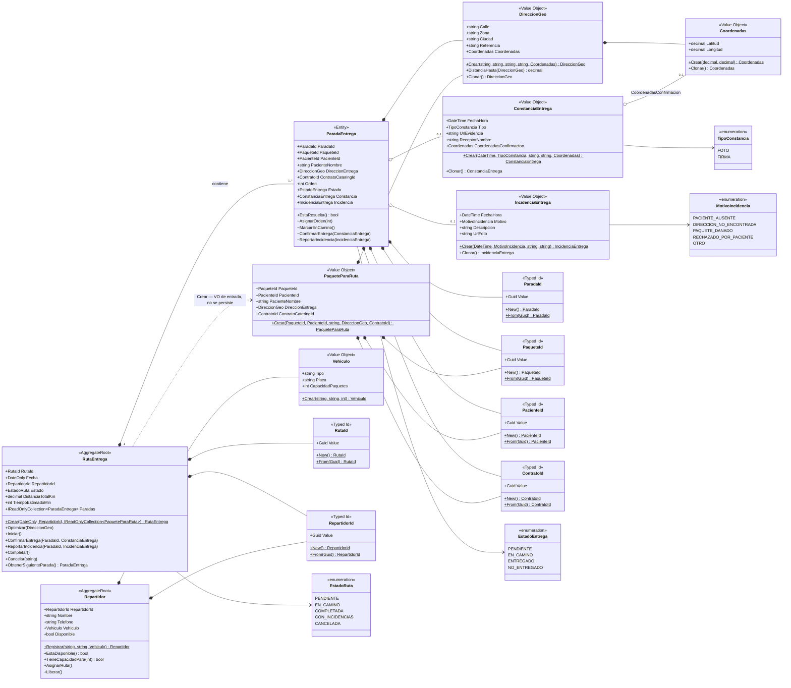
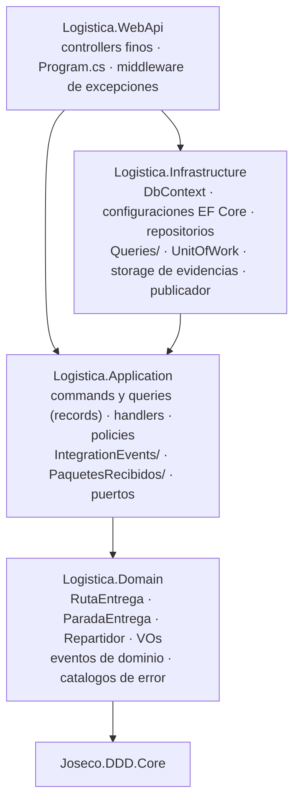

# ms-logistica-entrega

## 1. Qué es

`ms-logistica-entrega` es el microservicio de **BC6 — Logística de Entrega** del sistema
**NUR-TRICENTER**: recibe los lotes de paquetes ya armados y etiquetados, calcula la ruta
optimizada de cada repartidor por geolocalización, y registra la constancia o la incidencia
de cada entrega.

Es un **subdominio genérico** — optimización de rutas y gestión de repartidores es un
problema con soluciones de mercado (TMS, APIs de ruteo), por lo que se diseña con patrones
simples y estandarizados, sin acoplarse al resto del sistema más allá de eventos de
integración. Dentro de la cadena operativa es el **último eslabón**: recibe de BC5
(`PaquetesListosParaEntrega`) y no entrega a ningún BC posterior. Es, además, el **único
bounded context que retroalimenta el flujo**: publica `EntregaConfirmada` e
`IncidenciaEntregaRegistrada` hacia BC1 (para el historial clínico del paciente) y hacia BC4
(para la reposición de días imputables, RN-23), cerrando el ciclo que arrancó con la
evaluación nutricional del paciente.

## 2. Funcionalidades

Cobertura asignada por §6.9 del maestro (`docs/SISTEMA.md`): **HU-37 a HU-44**.

| HU | Historia | Estado |
|---|---|---|
| HU-37 | Asignar lotes de paquetes a repartidores para que conozcan su ruta del día. | Implementada |
| HU-38 | Geolocalizar automáticamente cada dirección de entrega para calcular rutas optimizadas. | Implementada — BC6 aporta la segunda mitad: el cálculo de la ruta (§12.4). La geocodificación en sí ocurre en BC4. |
| HU-39 | El repartidor recibe su listado de entregas del día con ruta optimizada. | Implementada |
| HU-40 | El repartidor registra la entrega de cada paquete (foto o firma) como constancia. | Implementada |
| HU-41 | El repartidor reporta una incidencia cuando no puede entregar un paquete. | Implementada |
| HU-42 | El administrador consulta el estado en tiempo real de todas las entregas del día. | Implementada |
| HU-43 ⚠ | El paciente recibe una notificación cuando su paquete fue entregado. | **Fuera de alcance** |
| HU-44 | El administrador consulta el historial de constancias para resolver reclamos. | Implementada |

**Por qué HU-43 está fuera de alcance (§4.2 de `docs/DESIGN.md`):** el maestro excluye las
notificaciones del alcance de todo el sistema (§6.10) — ningún microservicio notifica hoy al
paciente, al repartidor ni al administrador. Se documenta igual porque BC6 es quien la
habilita de forma concreta y verificable: `EntregaConfirmada` ya se publica con su contrato
definitivo (incluido `constancia.coordenadasConfirmacion`, presente aunque sea opcional), así
que un consumidor de notificaciones que se sume después no necesitaría ningún cambio aquí, solo
suscribirse al evento tal como ya se serializa. Lo que falta no es un dato ni un evento: es el
canal de salida (correo, SMS, push), que es una preocupación transversal y no un bounded
context de dominio.

## 3. Modelo de dominio

Diagrama de clases de `src/Logistica.Domain` — dos agregados (`RutaEntrega` con `ParadaEntrega`
como entidad hija, y `Repartidor`), sus Value Objects y enumeraciones. No incluye
infraestructura ni el read model `PaqueteRecibido`, que no es dominio (§5.2, §9.4 de
`docs/DESIGN.md`).



`ParadaEntrega` nunca se crea ni se muta desde fuera de `RutaEntrega` — su constructor y sus
métodos son `internal` (marcados con `~` arriba): toda operación sobre una parada entra por la
ruta (§5.2).

## 4. Invariantes

Cada invariante cita su código en el propio código fuente (`// I<n> (RN-xx)`), junto al
`Error`/`ErrorType` exacto del catálogo de `docs/DESIGN.md` §13. Las marcadas **★
orquestación** cruzan agregados o consultan repositorio y por eso no viven en `Domain`: se
implementan en `Logistica.Application` (fase siguiente de este microservicio).

| # | Regla de negocio | Dónde se hace cumplir |
|---|---|---|
| I1 | Una ruta debe tener al menos una parada. | `RutaEntrega.Crear` |
| I2 | El repartidor debe estar disponible y su vehículo tener capacidad suficiente para los paquetes asignados. | Disponibilidad: `Repartidor.AsignarRuta`. Capacidad ★: `CrearRutaCommandHandler` |
| I3 | Una ruta solo se optimiza si está `PENDIENTE`, y solo se inicia si está `PENDIENTE` y ya fue optimizada. | `RutaEntrega.Optimizar`, `RutaEntrega.Iniciar` |
| I4 | Solo se confirma o se reporta una parada si la ruta está `EN_CAMINO` y la parada no está resuelta. | `RutaEntrega.ConfirmarEntrega`/`ReportarIncidencia` (nivel ruta) y `ParadaEntrega` (nivel parada) |
| I5 | Una parada no puede tener constancia e incidencia a la vez: `ENTREGADO` exige constancia, `NO_ENTREGADO` exige incidencia. | `ParadaEntrega.ConfirmarEntrega`/`ReportarIncidencia` |
| I6 | Una ruta solo se completa cuando todas sus paradas están en estado terminal. | `RutaEntrega.Completar` |
| I7 | Si alguna parada terminó `NO_ENTREGADO`, la ruta se completa como `CON_INCIDENCIAS`; si todas terminaron `ENTREGADO`, como `COMPLETADA`. | `RutaEntrega.Completar` |
| I8 | El orden de las paradas es único y consecutivo desde 1 dentro de la ruta. | `RutaEntrega.Optimizar` (guard explícito) y `ParadaEntrega.AsignarOrden` |
| I9 ★ | Un paquete solo puede estar asignado a una ruta; al cancelar la ruta, sus paquetes no resueltos vuelven a `POR_ASIGNAR`. | `CrearRutaCommandHandler` + `ReponerPaquetesAlCancelarRutaPolicy` |
| I10 ★ | Todos los paquetes de una ruta corresponden a la misma fecha de entrega, y esa fecha es la de la ruta. | `CrearRutaCommandHandler` |
| I11 ★ | Un repartidor tiene como máximo una ruta activa (`PENDIENTE` o `EN_CAMINO`). | `CrearRutaCommandHandler` + `Repartidor.AsignarRuta` + índice único filtrado |
| I12 ★ | El endpoint de integración es idempotente: reprocesar el mismo `PaquetesListosParaEntrega` no duplica paquetes ni pisa su estado de asignación. | `IPaqueteRecibidoStore.UpsertAsync` |
| I13 | `Cancelar` solo se admite desde `PENDIENTE` o `EN_CAMINO`, con motivo obligatorio. | `RutaEntrega.Cancelar` |
| I14 | Toda parada conserva el `pacienteId` y el `contratoCateringId` del paquete que la originó, y ambos viajan sin transformación en `EntregaConfirmada` e `IncidenciaEntregaRegistrada`. | `PaqueteParaRuta` + constructor de `ParadaEntrega` |

## 5. Arquitectura

Cuatro proyectos en `src/`, con dependencias **en cadena y en una sola dirección**: todo
apunta hacia el dominio, nunca al revés (§17 `docs/DESIGN.md`, Fase 1). `Logistica.Domain`
no referencia nada de infraestructura, HTTP ni MediatR — solo `Joseco.DDD.Core`, salvo los
`record : DomainEvent` de sus propios eventos.



`Infrastructure` depende de `Application` (no al revés) porque los handlers de las **queries**
de lectura viven en `Infrastructure/Queries/` mientras que el `record` de cada query se declara
en `Application` — la única excepción consciente al reparto de capas (§12.8 del maestro,
justificada porque el mapeo a DTO necesita EF Core materializado, no traducido a SQL).

## 6. Endpoints de la API

Siete controllers, todos finos: arman el `command` o la `query`, lo envían por MediatR y
devuelven el resultado. El happy path responde siempre `200 OK`, incluidos los `POST` de
creación; cualquier otro código lo produce **exclusivamente** el middleware de excepciones al
traducir un `DomainException` (§11 y §13 `docs/DESIGN.md`).

| Caso de uso | HU | Método | Ruta |
|---|---|---|---|
| Registrar repartidor | soporte de HU-37 | `POST` | `/api/repartidores` |
| Listar repartidores (filtro `disponibles`) | soporte de HU-37, HU-39 | `GET` | `/api/repartidores` |
| Consultar paquetes por asignar | soporte de HU-37 | `GET` | `/api/paquetes` |
| Recibir el lote de BC5 (idempotente, I12) | HU-37 | `POST` | `/api/integracion/paquetes-listos` |
| Asignar un lote a un repartidor (crear ruta) | HU-37 | `POST` | `/api/rutas` |
| Optimizar el recorrido de la ruta | HU-38 | `POST` | `/api/rutas/{id}/optimizar` |
| Iniciar la ruta | HU-39 | `POST` | `/api/rutas/{id}/iniciar` |
| Completar la ruta | cierre de HU-40/HU-41 | `POST` | `/api/rutas/{id}/completar` |
| Cancelar la ruta | soporte de I13 | `POST` | `/api/rutas/{id}/cancelar` |
| Consultar el detalle de una ruta | HU-39 | `GET` | `/api/rutas/{id}` |
| Consultar la ruta del día de un repartidor | HU-39 | `GET` | `/api/rutas?repartidorId=&fecha=` |
| Ver el mapa del recorrido (HTML, no JSON) | HU-39 | `GET` | `/api/rutas/{id}/mapa` |
| Confirmar la entrega de una parada | HU-40 | `POST` | `/api/rutas/{rutaId}/paradas/{paradaId}/confirmar` |
| Reportar una incidencia en una parada | HU-41 | `POST` | `/api/rutas/{rutaId}/paradas/{paradaId}/incidencia` |
| Consultar el estado en vivo de las entregas del día | HU-42 | `GET` | `/api/entregas?fecha=` |
| Consultar el historial de constancias | HU-44 | `GET` | `/api/constancias?desde=&hasta=&pacienteId=` |
| Servir el archivo de evidencia subido | soporte de RN-16 | `GET` | `/evidencias/{archivo}` |

`confirmar` e `incidencia` son los **únicos dos** endpoints `multipart/form-data` del
microservicio; todos los demás son JSON. El detalle de cuerpos y códigos de error de cada uno
está en `docs/DESIGN.md` §11.

## 7. Eventos de integración

BC6 se comunica exclusivamente por eventos, publicados **in-process con MediatR** (no hay bus
de mensajería todavía — es un punto de corte deliberado, §10 del maestro).

**Entrante**

| Evento | Origen → Destino | Dispara | Idempotencia |
|---|---|---|---|
| `PaquetesListosParaEntrega` | BC5 → BC6 | `POST /api/integracion/paquetes-listos` | por `paqueteId` (I12) |

**Salientes**

| Evento | Origen → Destino | Se publica al… |
|---|---|---|
| `RutaOptimizadaGenerada` | BC6 → consumidor externo (hoy ninguno lo consume) | optimizar una ruta |
| `EntregaConfirmada` | BC6 → BC1 | confirmar una entrega |
| `IncidenciaEntregaRegistrada` | BC6 → BC1, BC4 | reportar una incidencia |

**Los tres payloads salientes son los de `docs/SISTEMA.md` §9.12, §9.13 y §9.14, campo por
campo, sin aplanar.** `EntregaConfirmada` lleva la constancia como objeto **anidado**, con
`coordenadasConfirmacion` presente en el contrato aunque su valor sea `null`.
`IncidenciaEntregaRegistrada` lleva `urlFoto`: son **diez** campos, no nueve. Cada uno de los
tres está cubierto por su propio test de contrato en `Logistica.Application.Tests`, incluidos
los casos de campo opcional en `null`.

**Contract testing (Pact).** Además de esos tests de serialización, `tests/Logistica.ContractTests`
verifica con **PactNet 5** el acuerdo real con las otras dos puntas del sistema (`docs/SISTEMA.md`
§13.5): como **consumidor** de `ms-produccion-alimentos` (`PaquetesListosParaEntrega`, message
pact real, pasa por el handler real) y como **proveedor** de `ms-pacientes`
(`EntregaConfirmada` + `IncidenciaEntregaRegistrada`) y `ms-catering`
(`IncidenciaEntregaRegistrada`) — estos dos últimos por **Pact HTTP** sobre un shim de solo test
(`tests/Logistica.ContractTests/Testing/PactProviderHost.cs`), porque PactNet 5.0.0/5.0.1 tiene
un bug abierto que bloquea la verificación de proveedor en modo mensaje
([pact-net#558](https://github.com/pact-foundation/pact-net/issues/558), ver `docs/INCOHERENCIAS.md`
INC-2). Los pactos de esos dos pares se autoran en este repositorio como "bootstrap" en nombre
del consumidor externo, hasta que ese repositorio implemente su propia suite. Ejecutar:
`dotnet test --filter Capa=Contrato`. Detalle completo, mapa de pares e interacciones, y la
evidencia de que el proceso de revisión con IA detecta incumplimientos reales:
`docs/testing/MAPA-CONTRACT-TESTS.md` y `docs/testing/validacion-entorno-contract-tests.md`.
Intercambio de pactos con los repositorios hermanos: `scripts/publicar-pacts.ps1`.

## 8. Algoritmo de optimización

`RutaEntrega.Optimizar(origen)` calcula el orden de visita con la heurística del
**vecino más cercano** sobre **distancia haversine**, implementada dentro del propio agregado:
determinista, sin llamadas de red ni dependencias externas (§12.4, RN-15, HU-38). Desde el
origen recibido en el comando, en cada paso elige la parada pendiente más cercana a la posición
actual, le asigna el siguiente número de orden y avanza; al terminar, verifica que los órdenes
resultantes sean exactamente `1..n` sin huecos ni repetidos (guard de I8) y calcula
`DistanciaTotalKm` y `TiempoEstimadoMin` a partir de una velocidad promedio y un tiempo fijo por
parada. **Lo que no hace, a propósito:** no calcula el óptimo exacto del problema del viajante
—inviable pasadas unas veinte paradas—, no aplica ninguna fase de mejora local como 2-opt, y no
llama a ningún servicio externo de ruteo (OSRM, Google Directions) que usaría calles reales,
sentidos de circulación y tráfico. Las tres decisiones están tomadas por el mismo motivo: una
llamada de red en el camino crítico de calcular una ruta introduce un punto de fallo externo,
un resultado no reproducible y una dependencia del dominio hacia un proveedor, a cambio de una
mejora que el enunciado no pide (determinar la ruta, no minimizarla de forma óptima). El
detalle completo, con las alternativas descartadas y su costo, está en §18.2 `docs/DESIGN.md`.

## 9. Puesta en marcha

```bash
# Levanta PostgreSQL (contenedor nur-tricenter-postgres, base logistica_db, puerto 5432)
docker compose up -d

# Compila la solucion
dotnet build

# Corre la suite de tests
dotnet test
```

La API queda en `http://localhost:5060/swagger` (`dotnet run --project src/Logistica.WebApi`).
En `Development` las migraciones se aplican automáticamente al arrancar.

### Correr la demo

```bash
docker compose up -d
dotnet run --project src/Logistica.WebApi
```

Con la API arriba, abrir `demo/demo.http` (extensión **REST Client** de VS Code) y correrlo
**de arriba a abajo, de una sola pasada, contra base limpia**: el orden de las peticiones es
parte de lo que demuestra — I11 no distingue un ensayo anterior de la demo, y en trozos el
lote de paquetes y las rutas que depende de él quedan inconsistentes.

**`GET /api/rutas/{id}/mapa` carga Leaflet desde el CDN `unpkg.com`.** Sin conexión a Internet
—o con esa CDN bloqueada— la página se sirve igual con `200 OK`, pero no dibuja nada: es la
desviación **D-14** de `docs/DESIGN.md` §19, aceptada porque el mapa es material de
demostración autocontenido y no toca el dominio.
