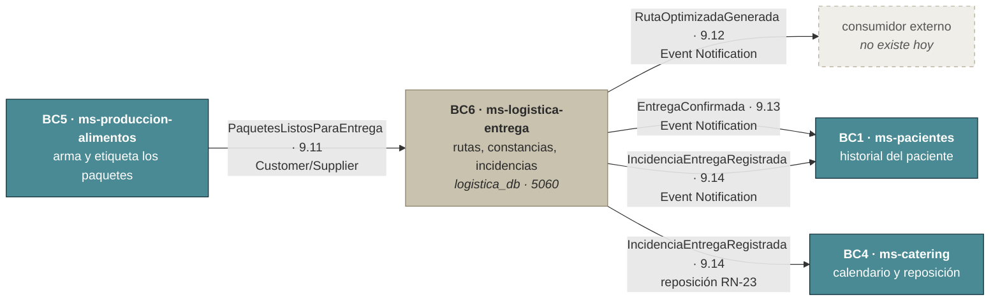
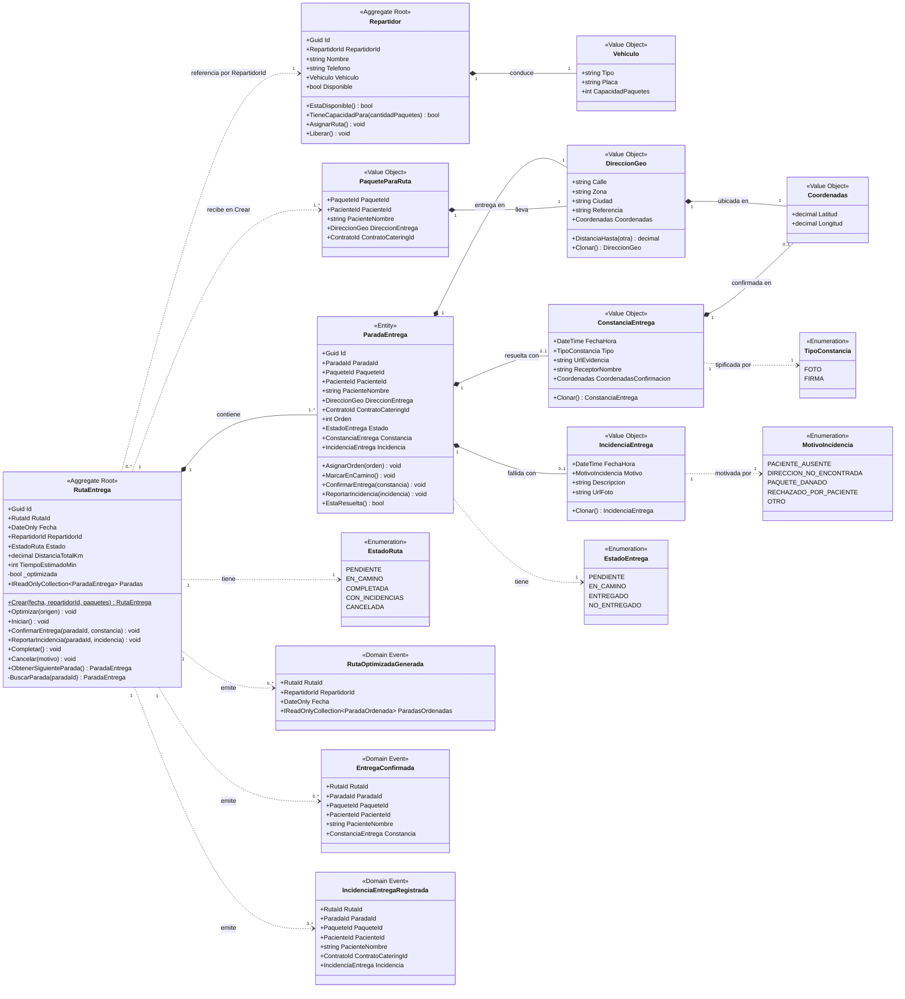
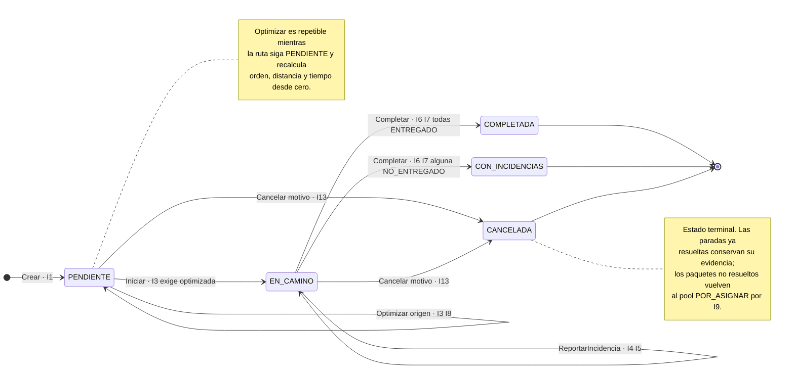
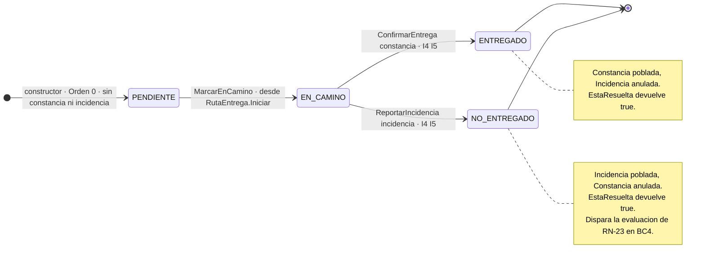
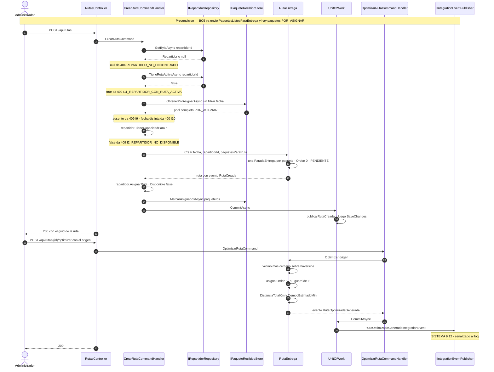
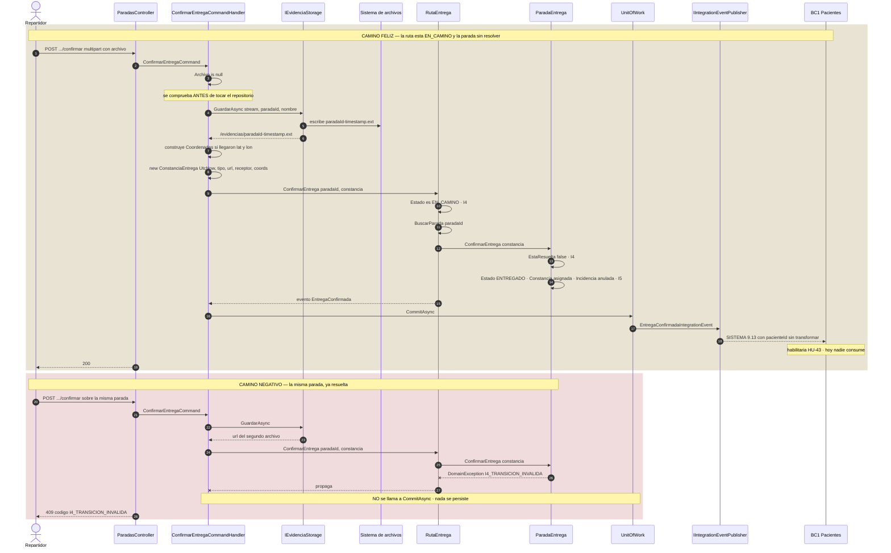
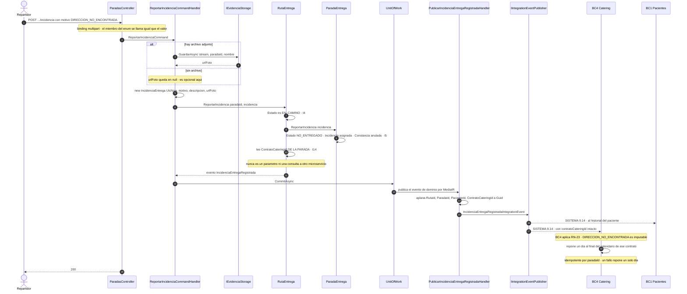
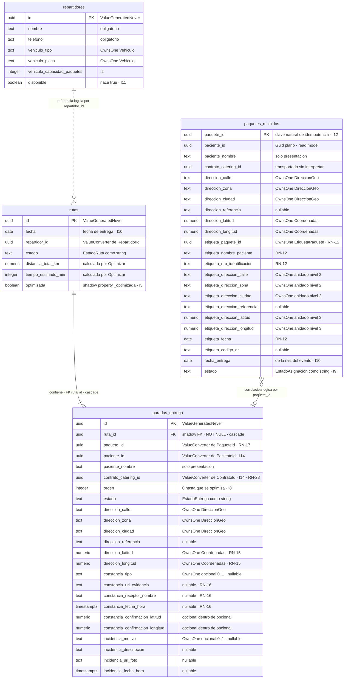

# ms-logistica-entrega — Diseño del microservicio


**Bounded Context:** BC6 — Logística de Entrega
**Aggregate Roots:** `RutaEntrega`, `Repartidor` · **Prefijo de invariantes:** `I`
**Base de datos:** `logistica_db` · **Puerto:** 5060 · **Historias:** HU-37 a HU-44

Este documento es la **especificación táctica vinculante** del microservicio: qué modela, qué garantiza, qué expone, cómo persiste y cómo se prueba. Un lector que tenga este documento y `docs/SISTEMA.md` en la mano reconstruye el microservicio desde cero sin preguntar nada.

Las decisiones de alcance sistémico —reglas de negocio `RN-xx` (§3 del maestro), contratos de los catorce eventos de integración (§9 del maestro), convenciones técnicas transversales (§12 del maestro), estrategia de pruebas (§13 del maestro) y plataforma local (§14 del maestro)— viven en `docs/SISTEMA.md` y **no se redefinen aquí**: se citan por número de sección y se detalla su aplicación local. Nada de lo que sigue puede contradecir al maestro; donde este documento parezca más específico, es un refinamiento, no una excepción.

Este documento es la **fusión definitiva** de los tres linajes documentales previos de BC6 y de las dos bases de código independientes. El árbitro de contenido es el código de `project/ms-logistica-entrega/` (146 archivos `.cs` en `src`, 32 en `tests`); sobre él se incorporan las correcciones posteriores de `NUR-TRICENTER/ms-logistica-entrega/` (91 `.cs`, 13 de tests). Donde el código realmente implementado se aparte de lo que aquí se especifica, la desviación queda registrada en **§19** con su severidad; no se silencia ni se adapta el documento al código.

---

## Índice

| § | Contenido |
|---|---|
| [1](#1-propósito) | Propósito |
| [2](#2-ubicación-en-el-sistema) | Ubicación en el sistema |
| [3](#3-lenguaje-ubicuo) | Lenguaje ubicuo |
| [4](#4-historias-de-usuario) | Historias de usuario |
| [5](#5-modelo-de-dominio) | Modelo de dominio |
| [6](#6-invariantes) | Invariantes |
| [7](#7-máquinas-de-estado) | Máquinas de estado |
| [8](#8-eventos-de-dominio-y-políticas) | Eventos de dominio y políticas |
| [9](#9-integración-con-otros-contextos) | Integración con otros contextos |
| [10](#10-diseño-cqrs) | Diseño CQRS |
| [11](#11-api-rest) | API REST |
| [12](#12-flujos-principales) | Flujos principales |
| [13](#13-catálogo-de-errores) | Catálogo de errores |
| [14](#14-persistencia) | Persistencia |
| [15](#15-plan-de-pruebas) | Plan de pruebas: unit, integración por flujos, contrato con Pact y cobertura |
| [16](#16-trazabilidad) | Trazabilidad |
| [17](#17-guía-de-reconstrucción) | Guía de reconstrucción |
| [18](#18-decisiones-de-diseño) | Decisiones de diseño |
| [19](#19-desviaciones-detectadas-entre-la-especificación-y-el-código) | Desviaciones detectadas |
| [20](#20-fuera-de-alcance) | Fuera de alcance |

---

## 1. Propósito

BC6 gestiona el **último eslabón de la cadena operativa**. Recibe los paquetes ya preparados y etiquetados por Producción, los agrupa en rutas asignadas a repartidores, calcula el orden del recorrido usando la geolocalización de las direcciones, y registra el **desenlace verificable** de cada entrega.

Es el microservicio que responde a las **dos peticiones explícitas de mejora** del caso de estudio. El enunciado termina con dos párrafos que son, literalmente, la especificación funcional de este contexto:

> «se plantea agregar la geolocalización a las direcciones y en base a eso, se pueda determinar las rutas de entrega. Asimismo, contar un mecanismo de seguimiento para contar con un respaldo de las entregas, ya que en muchas ocasiones, se han reportado de que el paciente no recibió su alimentación ya que no se tienen constancias de las entregas.»

El resto del microservicio existe para sostener esas dos frases.

| Frase del caso de estudio | Regla | Cómo se resuelve aquí |
|---|---|---|
| «se tiene personal especializado para ello, que recibe un conjunto de paquetes para entregar etiquetados con el nombre del paciente y datos de entrega, junto con un listado donde se listan los paquetes que debe entregar, en base a eso, el encargado realiza su ruta de entrega» | RN-13 | `RutaEntrega` agrupa los paquetes de una fecha para un `Repartidor` y expone el listado ordenado en `GET /api/rutas?repartidorId=&fecha=`, más una vista de mapa en `GET /api/rutas/{id}/mapa`. |
| «agregar la geolocalización a las direcciones y en base a eso, se pueda determinar las rutas de entrega» | RN-15 | Toda `ParadaEntrega` guarda una `DireccionGeo` con `Coordenadas` **obligatorias**; `RutaEntrega.Optimizar(origen)` calcula el orden del recorrido por distancia haversine con la heurística del vecino más cercano (§12.4, §18). |
| «contar un mecanismo de seguimiento para contar con un respaldo de las entregas … no se tienen constancias de las entregas» | RN-16 | Cada parada resuelta guarda una `ConstanciaEntrega` con **archivo real** —foto o firma—, nombre del receptor, fecha-hora y coordenadas de confirmación; o una `IncidenciaEntrega` con motivo tipificado, descripción y foto opcional. `GET /api/constancias` es la respuesta operativa a un reclamo (HU-44). |

### 1.1 Subdominio y su consecuencia de diseño

**Subdominio genérico** (§2.1 del maestro). La optimización de rutas y la gestión de repartidores son un problema resuelto por el mercado: existen TMS comerciales y APIs de ruteo que hacen esto mejor que cualquier implementación propia. Nur-Tricenter no compite por tener el mejor algoritmo de rutas; compite por el criterio clínico de BC2.

Esa clasificación tiene tres consecuencias concretas y verificables en el código:

1. **Patrones simples y estandarizados.** Dos agregados, un read model, un algoritmo determinista de 15 líneas dentro del agregado. No hay servicios de dominio, ni factorías, ni specification objects: nada que un reemplazo futuro tuviera que reproducir.
2. **Comunicación exclusivamente por eventos de integración** (§9 del maestro). BC6 no expone su modelo interno a nadie ni consulta el de nadie. Un tercero que reemplazara este microservicio solo tendría que consumir `PaquetesListosParaEntrega` y publicar `RutaOptimizadaGenerada`, `EntregaConfirmada` e `IncidenciaEntregaRegistrada` con los payloads congelados de §9.11–§9.14 del maestro.
3. **Ninguna regla de negocio de otro contexto vive aquí.** BC6 registra el motivo de una incidencia; **no decide** si es imputable a la empresa. Esa clasificación es RN-23 y pertenece a BC4 (§9.3, §18).

Es además el **único contexto que retroalimenta el flujo**: sus incidencias vuelven a BC4 para disparar la reposición de días, rompiendo la linealidad Contrato → Calendario → Producción → Entrega.

### 1.2 Tabla de identidad

| Elemento | Valor |
|---|---|
| **Bounded Context** | BC6 — Logística de Entrega |
| **Microservicio** | `ms-logistica-entrega` |
| **Subdominio** | Genérico |
| **Aggregate Roots** | `RutaEntrega` (con `ParadaEntrega` como entidad hija), `Repartidor` |
| **Read model** | `PaqueteRecibido` (no es agregado — §5.2, §9.4) |
| **Prefijo de invariantes** | `I` — I1 … I14 |
| **Base de datos** | `logistica_db` (PostgreSQL 16) |
| **Puerto** | 5060 |
| **Historias cubiertas** | HU-37, HU-38, HU-39, HU-40, HU-41, HU-42, HU-44 implementadas; **HU-43 fuera de alcance** (§4, §20) |
| **Reglas de negocio responsable** | RN-13, RN-16 |
| **Reglas de negocio participante** | RN-10, RN-12, RN-15, RN-17, RN-21, RN-23 |
| **Eventos consumidos** | `PaquetesListosParaEntrega` (BC5 → BC6, §9.11 del maestro) |
| **Eventos publicados** | `RutaOptimizadaGenerada` (§9.12), `EntregaConfirmada` (§9.13), `IncidenciaEntregaRegistrada` (§9.14) |
| **Tablas** | `rutas`, `paradas_entrega`, `repartidores`, `paquetes_recibidos` |

### 1.3 Responsabilidades y no-responsabilidades

**Hace:**

- Mantiene el catálogo de repartidores con su vehículo, su capacidad y su **disponibilidad**.
- Recibe de forma idempotente los paquetes anunciados por Producción y controla cuáles siguen sin asignar.
- Crea rutas, asigna paquetes a repartidores y **calcula el orden del recorrido** por distancia geográfica (RN-13, RN-15).
- Registra constancias de entrega con **evidencia real** y coordenadas de confirmación (RN-16).
- Registra incidencias con motivo tipificado y las propaga a BC1 y BC4 con `pacienteId` y `contratoCateringId` intactos (RN-16, RN-23).
- Expone el estado en vivo de las entregas del día y el historial de constancias para resolver reclamos (HU-42, HU-44).

**No hace:**

- No conoce planes, recetas, contratos, calendarios ni facturas.
- **No geocodifica.** Recibe direcciones con coordenadas ya resueltas por BC4 y las exige; convertir texto en coordenadas es responsabilidad del dueño de la libreta de direcciones (§4, nota de HU-38).
- **No clasifica los motivos de incidencia** como imputables o no imputables. Eso es RN-23 y vive en BC4.
- **No notifica a nadie.** Publica los eventos que harían posible la notificación (HU-43, §20).
- No decide qué se produce, para quién ni en qué cantidad.

---

## 2. Ubicación en el sistema



### 2.1 Dependencias entrantes

| Evento | Origen | Patrón DDD | Endpoint que lo recibe | Qué produce en BC6 |
|---|---|---|---|---|
| `PaquetesListosParaEntrega` (§9.11 del maestro) | BC5 — Producción de Alimentos | Customer/Supplier | `POST /api/integracion/paquetes-listos` | Un `PaqueteRecibido` por paquete, en estado `POR_ASIGNAR`, con paciente, dirección geocodificada, etiqueta estructurada, contrato de catering y la fecha del lote. |

Esa es la **lista completa de entradas**: BC6 consume **un único evento** y no hace ninguna llamada síncrona a ningún otro microservicio.

### 2.2 Dependencias salientes

| Evento | Destino | Patrón DDD | Qué habilita |
|---|---|---|---|
| `RutaOptimizadaGenerada` (§9.12 del maestro) | Consumidor externo | Event Notification | Que el repartidor reciba su ruta del día por un canal propio. Hoy nadie lo consume. |
| `EntregaConfirmada` (§9.13 del maestro) | BC1 — Pacientes | Event Notification | Que la constancia se incorpore al historial del paciente. Es el evento que habilitaría **HU-43** (§20). |
| `IncidenciaEntregaRegistrada` (§9.14 del maestro) | BC1 — Pacientes | Event Notification | Que la entrega fallida quede en el historial del paciente. |
| `IncidenciaEntregaRegistrada` (§9.14 del maestro) | **BC4 — Catering** | Event Notification | Que BC4 evalúe RN-23 y **reponga un día** al final del calendario si el motivo es imputable a la empresa. |

### 2.3 La cadena del `contratoCateringId` y del `pacienteId`

`contratoCateringId` nace en BC4 como identificador del contrato que originó el calendario. Viaja en `EntregasDelDiaConsolidadas` (§9.9) hasta BC5, de ahí en `PaquetesListosParaEntrega` (§9.11) hasta BC6, y BC6 lo devuelve a BC4 dentro de `IncidenciaEntregaRegistrada` (§9.14). Lo mismo ocurre con `pacienteId`.

**BC6 nunca interpreta ni resuelve ninguno de los dos: solo los transporta.** Es lo que permite a BC4 imputar la incidencia al contrato correcto y a BC1 imputarla al paciente correcto, sin una llamada síncrona y sin correlacionar por nombre. El desarrollo completo de por qué correlacionar por nombre es frágil está en §9.3.

### 2.4 Qué pasa si un vecino no existe todavía

Los contratos de §9 del maestro están **congelados**, así que este microservicio se construye y se demuestra sin que exista ninguno de sus vecinos:

- **Sin BC5.** El endpoint `POST /api/integracion/paquetes-listos` acepta el payload literal de §9.11 desde `demo/demo.http` o desde Swagger. No hay diferencia entre un lote enviado por BC5 y uno enviado a mano: el controller no sabe quién llama.
- **Sin BC1 ni BC4.** Los tres eventos salientes se publican a través de `IIntegrationEventPublisher`, cuya única implementación actual —`LoggingIntegrationEventPublisher`— serializa el evento a JSON y lo escribe en el log (§10 del maestro). Que nadie lo lea no cambia el comportamiento de BC6 ni la forma del payload.
- **Sin bus de mensajería.** No hay ninguno (§10 del maestro). La migración a RabbitMQ/MassTransit con patrón Outbox sustituye la implementación del puerto y reemplaza el endpoint de simulación por un consumer; ni el dominio ni la aplicación cambian.

La consecuencia práctica para la defensa es que BC6 se demuestra de punta a punta en solitario, y que **la idempotencia de I12 no es un adorno**: es la preparación real para una entrega *at-least-once* cuando el bus exista.

---

## 3. Lenguaje ubicuo

El dominio se escribe **en español**, con estos nombres exactos en clases, métodos, propiedades, eventos, códigos de error y nombres de test. No se traducen ni se abrevian (§15 del maestro).

### 3.1 Términos del maestro (§6.7)

| Término | Definición |
|---|---|
| **Repartidor** | Personal especializado encargado de transportar y entregar los paquetes a los pacientes. Tiene un vehículo con capacidad limitada y un estado de disponibilidad. |
| **Ruta de Entrega** | Secuencia optimizada de paradas que el repartidor sigue para entregar sus paquetes del día. |
| **Optimización de Ruta** | Cálculo de la secuencia de paradas que minimiza distancia y tiempo de recorrido (vecino más cercano sobre distancia haversine). |
| **Geolocalización** | Coordenadas asociadas a una dirección de entrega, insumo de la optimización (RN-15). |
| **Listado de Entrega** | Detalle de los paquetes asignados al repartidor con los datos de cada destinatario. |
| **Constancia de Entrega** | Registro que evidencia que el paquete fue recibido: tipo (foto/firma), evidencia, receptor, fecha/hora y coordenadas de confirmación (RN-16). |
| **Incidencia de Entrega** | Reporte de una entrega no efectuada, con un motivo — algunos imputables a la empresa (reponen día, RN-23), otros no (RN-21). |
| **Parada** | Unidad de la ruta correspondiente a un paquete/paciente concreto. |
| **Estado de Entrega** | Situación de una parada: pendiente, entregada o con incidencia. |

### 3.2 Términos internos, solo de este microservicio

| Término | Definición |
|---|---|
| **Vehículo** | Medio de transporte del repartidor, con capacidad finita de paquetes (`Vehiculo.CapacidadPaquetes`). **Existe por RN-27**, la regla derivada que acota la asignación: «el repartidor recibe un conjunto de paquetes» (RN-13) y ese conjunto no puede ser infinito. No se gestiona como flota (§20). |
| **Disponibilidad** | Condición del repartidor de no estar comprometido con ninguna ruta activa. Se consume al asignarle una ruta y se recupera al completarla o cancelarla. |
| **Paquete Recibido** | Registro local de un paquete anunciado por Producción, a la espera de ser asignado a una ruta. Es un **read model**, no un agregado (§5.2, §9.4). |
| **Estado de Asignación** | Situación logística de un paquete recibido: `POR_ASIGNAR` o `ASIGNADO`. Es local a BC6 y **no viaja en ningún contrato**. |
| **Origen del recorrido** | `DireccionGeo` desde la que parte el cálculo de la ruta —la sede o el depósito—. Viaja como parámetro del comando de optimización, no como configuración (§12.4, §18). |
| **Evidencia** | El archivo binario real —imagen de la foto o de la firma— que respalda una constancia o una incidencia. Se almacena en disco y se sirve por URL; el dominio solo conoce esa URL (§9.1, §18). |
| **Paquete para Ruta** | Value Object de entrada al agregado (`PaqueteParaRuta`): el tipo del dominio, completo y validado, con el que `RutaEntrega.Crear` recibe cada paquete. Después de crear la ruta no queda rastro de él. |
| **Parada Resuelta** | Parada que ya llegó a un estado terminal: `ENTREGADO` con constancia, o `NO_ENTREGADO` con incidencia. Lo determina `ParadaEntrega.EstaResuelta()`. |

### 3.3 Términos que se confunden entre sí

**`ConstanciaEntrega` vs. `Evidencia`.** La constancia es el **Value Object** con los metadatos verificables: tipo, URL, receptor, fecha-hora y coordenadas. La evidencia es el **archivo binario** en disco. La constancia vive en PostgreSQL; la evidencia, en el sistema de archivos. Confundirlos lleva al error de intentar guardar la imagen en una columna, que §18 descarta explícitamente.

**`Estado` de la ruta vs. `Estado` de la parada.** Son dos enumeraciones distintas con un valor de nombre idéntico. `EstadoRuta.EN_CAMINO` significa que el repartidor salió; `EstadoEntrega.EN_CAMINO` significa que esa parada concreta aún no se resolvió dentro de una ruta ya iniciada. Ambas se persisten como texto en columnas llamadas `estado`, en tablas distintas.

**`PaqueteRecibido` vs. `PaqueteParaRuta` vs. `ParadaEntrega`.** Son tres representaciones del mismo paquete en tres momentos: el read model alimentado por BC5, el VO de entrada al agregado, y la entidad hija dentro de la ruta. Solo la tercera tiene ciclo de vida propio dentro de BC6.

**`ContratoId` (tipo) vs. `contratoCateringId` (campo).** El tipo del dominio se llama `ContratoId`; el campo se llama siempre `ContratoCateringId` en la entidad y `contratoCateringId` en el cable, tal como fija la regla de nomenclatura de §9 del maestro. El nombre del tipo es genérico porque BC6 no tiene otro tipo de contrato con el que confundirlo.

**«Optimizar» no es «geocodificar».** HU-38 se enuncia como «geolocalizar automáticamente cada dirección de entrega para poder calcular rutas optimizadas». La primera mitad ocurre en BC4; BC6 implementa la segunda. Ver la nota de §4.

---

## 4. Historias de usuario

Cobertura asignada por §6.9 del maestro: **HU-37 a HU-44**. Los códigos no se renumeran, no se reutilizan y no se inventan.

| HU | Historia | Tipo | Realización | Estado |
|---|---|---|---|---|
| **HU-37** | Como administrador, quiero asignar lotes de paquetes a repartidores para que conozcan su ruta del día. | Command | `CrearRutaCommand` → `POST /api/rutas` | Implementada |
| **HU-38** | Como sistema, quiero geolocalizar automáticamente cada dirección de entrega para poder calcular rutas optimizadas. | Command | `OptimizarRutaCommand` → `POST /api/rutas/{id}/optimizar` | Implementada (segunda mitad — ver nota) |
| **HU-39** | Como repartidor, quiero recibir mi listado de entregas del día con ruta optimizada para organizar mi recorrido. | Query + Command | `GetRutaDelDiaQuery` → `GET /api/rutas?repartidorId=&fecha=`; `GetMapaRutaQuery` → `GET /api/rutas/{id}/mapa`; `IniciarRutaCommand` → `POST /api/rutas/{id}/iniciar` | Implementada |
| **HU-40** | Como repartidor, quiero registrar la entrega de cada paquete (foto o firma) como constancia de que fue recibido. | Command | `ConfirmarEntregaCommand` (multipart) → `POST /api/rutas/{rutaId}/paradas/{paradaId}/confirmar` | Implementada |
| **HU-41** | Como repartidor, quiero reportar una incidencia cuando no pueda entregar un paquete para que el sistema lo notifique. | Command | `ReportarIncidenciaCommand` (multipart) → `POST /api/rutas/{rutaId}/paradas/{paradaId}/incidencia` | Implementada |
| **HU-42** | Como administrador, quiero consultar el estado en tiempo real de todas las entregas del día para monitorear el servicio. | Query | `GetEstadoEntregasQuery` → `GET /api/entregas?fecha=` | Implementada |
| **HU-43** ⚠ | Como paciente, quiero recibir una notificación cuando mi paquete ha sido entregado para confirmar su recepción. | Evento publicado | `EntregaConfirmada` (§9.13 del maestro) | **Fuera de alcance** |
| **HU-44** | Como administrador, quiero consultar el historial de constancias de entregas para resolver reclamos de pacientes. | Query | `GetHistorialConstanciasQuery` → `GET /api/constancias` | Implementada |

### 4.1 HU-38 y el alcance real de la geolocalización

La **geocodificación** —convertir un texto de dirección en un par de coordenadas— ocurre en **BC4**, dueño de la `LibretaDirecciones` (§6.5 del maestro; RN-15 lo asigna a BC4 como responsable y a BC6 como participante). BC6 recibe las coordenadas ya resueltas dentro de `DireccionGeo` y las declara **obligatorias**: una dirección sin coordenadas es rechazada por el Value Object con `DIRECCION_COORDENADAS_REQUERIDAS` antes de tocar el modelo.

Lo que BC6 aporta a HU-38 es la segunda mitad de la historia, «para poder calcular rutas optimizadas», que es el algoritmo de §12.4. La historia se declara **implementada en BC6** porque el entregable verificable de la historia —una ruta cuyo orden depende de la geografía— está aquí; la mitad que falta no está sin hacer, está en otro microservicio.

### 4.2 HU-43 está fuera de alcance, y aun así se documenta

§6.10 del maestro excluye las notificaciones del alcance del sistema: **ningún microservicio notifica hoy** al paciente, al repartidor ni al administrador. HU-43 se documenta aquí porque BC6 es el microservicio que la habilita, y la forma en que la habilita es concreta y verificable:

`EntregaConfirmada` **ya se publica con su contrato definitivo** —el de §9.13 del maestro, campo por campo, incluido `constancia.coordenadasConfirmacion` como campo presente aunque su valor sea opcional—. Un consumidor de notificaciones que se añadiera mañana no necesitaría ningún cambio en BC6: se suscribiría al evento tal como hoy se serializa en el log. Lo mismo vale para `IncidenciaEntregaRegistrada`, que habilitaría la notificación del caso contrario.

Lo que falta para HU-43 no es un dato ni un evento: es un canal de salida —correo, SMS, push— y el consumidor que lo use. Eso es una preocupación transversal, no un bounded context de dominio (§20).

---

## 5. Modelo de dominio

### 5.1 Diagrama de clases



Tres lecturas que el diagrama hace explícitas y que se defienden abajo:

- `ParadaEntrega` es **composición** (`*--`) dentro de `RutaEntrega` con cardinalidad `1..*`: no existe fuera de su ruta y una ruta nunca tiene cero paradas (I1).
- `RutaEntrega` **no contiene** a `Repartidor`: la flecha es de dependencia (`..>`), por identificador (§5.2).
- `ConstanciaEntrega` e `IncidenciaEntrega` son composición con cardinalidad **`0..1`** cada una, y la exclusión mutua entre ambas —que el diagrama no puede dibujar— es I5, garantizada por el código de la entidad (§5.6).

### 5.2 Límites de los agregados

#### `RutaEntrega` — la raíz principal

`RutaEntrega` es raíz porque es **la unidad de consistencia transaccional de la operación de entrega**: el orden de las paradas, el estado del recorrido y el desenlace de cada punto tienen que cambiar juntos o no cambiar. Dentro de sus límites quedan:

| Dentro | Por qué |
|---|---|
| `ParadaEntrega` (colección `_paradas`) | Una parada no existe fuera de su ruta. Su clave foránea es la ruta, su ciclo de vida es el de la ruta (`OnDelete.Cascade`) y sus reglas de transición dependen del estado de ambas (I4). |
| `DireccionGeo` + `Coordenadas` de cada parada | Value Objects sin identidad, copiados al crear la parada. |
| `ConstanciaEntrega` / `IncidenciaEntrega` | Value Objects opcionales que registran el desenlace. Solo tienen sentido dentro de la parada que resuelven. |
| `DistanciaTotalKm`, `TiempoEstimadoMin`, `_optimizada` | Resultados del cálculo de `Optimizar`, que es estado de la ruta, no de ninguna parada individual. |

**Toda operación sobre una parada entra por la ruta**, nunca directamente sobre la parada, porque las reglas dependen de los dos niveles: la ruta valida su propio estado (`EN_CAMINO`) y luego delega en la parada, que valida el suyo (no resuelta). Un `ParadaEntregaRepository` no existe y no debe existir.

#### `Repartidor` — la segunda raíz

`Repartidor` es raíz porque su **ciclo de vida es independiente de cualquier ruta**: existe antes de tener rutas, sobrevive a todas ellas y sobrevive a la cancelación de todas ellas. Dentro de sus límites solo queda su `Vehiculo`, un Value Object que aporta la capacidad.

Su única pieza de estado mutable es `Disponible`, que modela una realidad física: una persona con un vehículo cargado no puede estar en dos rutas a la vez. Se consume con `AsignarRuta()`, que lanza `I2_REPARTIDOR_NO_DISPONIBLE` si ya estaba tomado, y se recupera con `Liberar()`, que es **idempotente** —liberar a alguien ya disponible no lanza—.

> **De dónde sale `Vehiculo`.** El enunciado no menciona vehículos, así que la capacidad no puede colgar de RN-13, que solo dice que el repartidor «recibe un conjunto de paquetes». Cuelga de **RN-27**, regla **derivada** añadida al maestro el 5-sep-2026 con el mismo criterio que RN-19, RN-20, RN-23 y RN-24: el equipo tuvo que decidir algo que el enunciado dejaba abierto, y lo escribió arriba antes de programarlo. Su alcance es deliberadamente mínimo — acotar la asignación, nada más: nómina, turnos, mantenimiento y gestión de flota siguen fuera de alcance (§6.10 del maestro y §20 de este documento). En la defensa, la respuesta a «¿dónde dice el cliente que un repartidor tiene capacidad?» es «no lo dice; es RN-27, y está marcada como derivada».

`EstaDisponible()` y `TieneCapacidadPara(n)` responden preguntas distintas y por eso son métodos distintos: el primero es un estado, el segundo una comparación pura contra `Vehiculo.CapacidadPaquetes` que no muta nada y puede consultarse desde Application antes de decidir.

#### Por qué `RutaEntrega` y `Repartidor` **no** son un solo agregado

Es la pregunta obvia: una ruta siempre tiene exactamente un repartidor, un repartidor tiene como máximo una ruta activa (I11), y las dos cosas se modifican juntas al crear la ruta. Parecen un agregado. No lo son, por tres razones en orden de peso:

1. **Regla de agregados.** Dos raíces distintas no se referencian por objeto. Si la ruta contuviera al repartidor, cargar una ruta cargaría y trackearía otro agregado completo, y una modificación del repartidor entraría en la misma transacción que la ruta sin que nadie lo hubiera decidido.
2. **Consistencia transaccional.** El límite del agregado es el límite de la transacción. La disponibilidad se coordina desde Application (I2, I11) y desde políticas (§8.2) precisamente **porque cruza agregados**; embeber el repartidor escondería ese cruce en vez de hacerlo explícito y auditable.
3. **Ciclos de vida distintos.** Un repartidor sobrevive a sus rutas. Si fuera una entidad hija, `OnDelete.Cascade` significaría que borrar una ruta borra a la persona, y su historial —cuántas rutas hizo, cuántas incidencias tuvo— desaparecería con la ruta más vieja.

El precio de la separación es que **la ruta no puede validar por sí sola «el repartidor está disponible»**. Ese precio se paga documentando I2 e I11 como invariantes de orquestación (§6.2), probándolas en Application (§15.2) y respaldando I11 con un índice único filtrado en base de datos (§14.3).

#### Por qué `ParadaEntrega` **no** es un agregado propio

También parece uno: tiene identidad (`ParadaId`), estado propio, transiciones propias y un evento por cada transición. Pero I4 exige comprobar el estado de la ruta **y** el de la parada en la misma operación. Separarlos obligaría a coordinar dos agregados en cada entrega —cargar la ruta para leer su estado, cargar la parada para mutarla, y garantizar que nada cambió entre medias—, sustituyendo una invariante local por un problema de consistencia distribuida dentro del mismo microservicio.

### 5.3 IDs tipados

Seis identificadores tipados, todos con la misma forma: `sealed record` con una propiedad `Guid Value`, constructor privado, `New()` y `From(Guid)` con validación centralizada en `TypedIdValidator.Validar`, que rechaza `Guid.Empty` con `ID_VACIO`.

| ID tipado | Envuelve | Dónde aparece | Origen del valor |
|---|---|---|---|
| `RutaId` | `Guid` | `RutaEntrega.RutaId` (computado), eventos | Generado por BC6 en `Crear` |
| `ParadaId` | `Guid` | `ParadaEntrega.ParadaId` (computado), eventos, nombre del archivo de evidencia | Generado por BC6 en el constructor de la parada |
| `RepartidorId` | `Guid` | `RutaEntrega.RepartidorId`, `Repartidor.RepartidorId` (computado) | Generado por BC6 al registrar el repartidor |
| `PaqueteId` | `Guid` | `ParadaEntrega.PaqueteId`, `PaqueteParaRuta` | **Externo**: viene de BC5, es el identificador de tracking de RN-17 |
| `PacienteId` | `Guid` | `ParadaEntrega.PacienteId`, `PaqueteParaRuta` | **Externo**: nace en BC1, viaja por toda la cadena |
| `ContratoId` | `Guid` | `ParadaEntrega.ContratoCateringId`, `PaqueteParaRuta` | **Externo**: nace en BC3/BC4, se transporta sin interpretar |

**Son `sealed record` de referencia, no `record struct`.** La consecuencia es que un id no inicializado es `null` y no `default`, y por eso `PaqueteParaRuta` puede comprobar `paqueteId is null` como validación real. Con un `record struct` esa comprobación sería imposible y habría que comparar contra `Guid.Empty` en cada uso.

**Los IDs de agregado y de entidad son propiedades computadas, no columnas.** `RutaEntrega.RutaId => RutaId.From(Id)`, `ParadaEntrega.ParadaId => ParadaId.From(Id)` y `Repartidor.RepartidorId => RepartidorId.From(Id)` se derivan de la clave primaria `Guid Id` heredada de `Entity`. La razón es de materialización: EF Core reconstruye las entidades persistidas con el constructor privado sin parámetros, que nunca ejecutaría una asignación, y un campo almacenado quedaría nulo al releer desde la base.

**Los IDs que llegan de fuera sí son columnas propias**, mapeadas con `HasConversion(id => id.Value, value => TipoId.From(value))`: `PaqueteId`, `PacienteId`, `ContratoId` en `ParadaEntrega`, y `RepartidorId` en `RutaEntrega`.

**Regla de consulta obligatoria (§12.5 del maestro).** En cualquier LINQ traducido a SQL se compara **el id tipado completo contra otro id tipado completo**, nunca `entidad.Id.Value == guidSuelto`. El `ValueConverter` está registrado sobre el tipo, no sobre el acceso a `.Value` después de la conversión, y la forma incorrecta lanza `InvalidOperationException` en tiempo de ejecución sin fallar al compilar ni en tests con repositorios *fake*. En BC6 la regla se aplica en dos sitios y ambos son código real:

```csharp
// RepartidorRepository.TieneRutaActivaAsync — correcto
.AnyAsync(r => r.RepartidorId == repartidorId && (r.Estado == EstadoRuta.PENDIENTE || r.Estado == EstadoRuta.EN_CAMINO), ct)

// GetRutaDelDiaHandler — se tipa el guid ANTES de entrar al Where
var repartidorId = RepartidorId.From(request.RepartidorId);
.FirstOrDefaultAsync(r => r.RepartidorId == repartidorId && r.Fecha == request.Fecha, ct)
```

**La misma trampa dentro de un `Select` con `EF.Property<T>`.** Cuando se navega una clave foránea sombra cuyo tipo CLR real es un id tipado —porque hereda el `ValueConverter` de la clave primaria a la que apunta—, `EF.Property<Guid>(p, "RutaId")` falla en tiempo de ejecución contra PostgreSQL con «no coercion operator». La forma correcta es `EF.Property<RutaId?>(p, "RutaId")` y desenvolver `.Value` **en memoria, después de `ToListAsync()`**. En BC6 la FK sombra `RutaId` de `paradas_entrega` se declara explícitamente como `Property<Guid>("RutaId")` porque la clave primaria de `rutas` es un `Guid` sin convertir, de modo que la trampa no se dispara hoy; la regla se documenta igualmente porque cualquier cambio que tipe la PK de `rutas` la activaría en silencio.

### 5.4 Value Objects

| VO | Campos | Qué valida | Error | Mapeo |
|---|---|---|---|---|
| `RutaId`, `ParadaId`, `RepartidorId`, `PaqueteId`, `PacienteId`, `ContratoId` | `Guid Value` | `From(guid)` rechaza `Guid.Empty`; `New()` genera uno válido | `ID_VACIO` | `ValueConverter` a una columna `uuid` |
| `Coordenadas` | `Latitud`, `Longitud` (`decimal`) | Latitud en `[-90, 90]`; longitud en `[-180, 180]` | `COORDENADAS_LATITUD_INVALIDA`, `COORDENADAS_LONGITUD_INVALIDA` | `OwnsOne` anidado dentro de `DireccionGeo` y de `ConstanciaEntrega` |
| `DireccionGeo` | `Calle`, `Zona`, `Ciudad`, `Referencia?`, `Coordenadas` | Calle, zona y ciudad no vacías; coordenadas no nulas (RN-15) | `DIRECCION_CALLE_REQUERIDA`, `DIRECCION_ZONA_REQUERIDA`, `DIRECCION_CIUDAD_REQUERIDA`, `DIRECCION_COORDENADAS_REQUERIDAS` | `OwnsOne`, 4 columnas + `OwnsOne(Coordenadas)` |
| `Vehiculo` | `Tipo`, `Placa`, `CapacidadPaquetes` | Tipo y placa no vacíos; capacidad `> 0` | `VEHICULO_TIPO_REQUERIDO`, `VEHICULO_PLACA_REQUERIDA`, `VEHICULO_CAPACIDAD_INVALIDA` | `OwnsOne`, 3 columnas |
| `ConstanciaEntrega` | `FechaHora`, `Tipo` (`TipoConstancia`), `UrlEvidencia`, `ReceptorNombre`, `CoordenadasConfirmacion?` | URL de evidencia y nombre del receptor no vacíos; coordenadas opcionales | `CONSTANCIA_URL_REQUERIDA`, `CONSTANCIA_RECEPTOR_REQUERIDO` | **`OwnsOne` opcional (0..1)**, 4 columnas + `OwnsOne` anidado opcional |
| `IncidenciaEntrega` | `FechaHora`, `Motivo` (`MotivoIncidencia`), `Descripcion`, `UrlFoto?` | Descripción no vacía; foto opcional | `INCIDENCIA_DESCRIPCION_REQUERIDA` | **`OwnsOne` opcional (0..1)**, 4 columnas |
| `PaqueteParaRuta` | `PaqueteId`, `PacienteId`, `PacienteNombre`, `DireccionEntrega`, `ContratoCateringId` | Los cinco obligatorios, ninguno nulo ni vacío | `PAQUETE_RUTA_*_REQUERIDO` | **No se persiste**: vive solo durante `Crear` |
| `EtiquetaPaquete` | `PaqueteId`, `NombrePaciente`, `NroIdentificacion`, `DireccionEntrega`, `Fecha`, `CodigoQR?` | Ninguna: es dato replicado de BC5, no del dominio | — | `OwnsOne` del read model, con `OwnsOne` anidado a dos niveles |

Todos son `sealed record` con setters privados y un constructor privado sin parámetros para que EF Core pueda materializarlos.

#### Los dos VO opcionales dentro de `ParadaEntrega`

`ConstanciaEntrega` e `IncidenciaEntrega` son el corazón de RN-16 y la pieza de modelado que más se discute. Ambos son **`0..1` dentro de la misma entidad y mutuamente excluyentes**: una parada resuelta tiene exactamente uno de los dos, nunca ninguno y nunca los dos.

La exclusión no se expresa en el tipo —C# no tiene uniones etiquetadas— sino en el comportamiento de la entidad, y por eso está codificada en las dos únicas operaciones que pueden crearlos:

```csharp
public void ConfirmarEntrega(ConstanciaEntrega constancia)
{
    if (EstaResuelta()) throw new DomainException(ParadaEntregaErrors.TransicionInvalida());   // I4
    if (constancia is null) throw new DomainException(ParadaEntregaErrors.ConstanciaRequerida()); // I5
    Estado = EstadoEntrega.ENTREGADO;
    Constancia = constancia;
    Incidencia = null;          // <-- la mitad que hace de I5 una garantía, no una convención
}
```

`ReportarIncidencia` es simétrico: asigna `Incidencia` y **anula `Constancia`**. Cada transición asigna un VO y anula el otro en la misma operación, de modo que ninguna secuencia de llamadas puede dejar los dos poblados. El guard `EstaResuelta()` cierra la otra mitad: una parada resuelta no admite una segunda resolución, así que la anulación nunca llega a destruir evidencia real.

**Su mapeo en EF Core (§12.3 del maestro).** Son owned types opcionales y **no necesitan configuración especial**: se declaran con `OwnsOne` y se les dan nombres de columna explícitos. EF Core trata una fila con **todas** las columnas del owned type en `null` como «sin instancia», que es exactamente el caso de una parada aún no resuelta. La consecuencia práctica es que las diez columnas de constancia e incidencia en `paradas_entrega` son **nullable**, y que una parada `PENDIENTE` es una fila con esas diez columnas vacías.

Hay un segundo nivel de opcionalidad dentro del primero: `ConstanciaEntrega.CoordenadasConfirmacion` es un `OwnsOne` opcional **dentro de** un `OwnsOne` opcional. Una entrega confirmada sin coordenadas —el repartidor no otorgó permiso de ubicación, o el GPS no fijó posición— es una fila con `constancia_tipo`, `constancia_url_evidencia`, `constancia_receptor_nombre` y `constancia_fecha_hora` pobladas y `constancia_confirmacion_latitud`/`_longitud` en `null`. El detalle completo de columnas está en §14.2.

#### `PaqueteParaRuta` es un VO de entrada al agregado, no una entidad

Existe para que `RutaEntrega.Crear` reciba **un tipo del dominio, completo y ya validado**, en vez de cinco parámetros sueltos o un DTO de Application. Cada instancia se traduce en una `ParadaEntrega` y después de `Crear` no queda rastro de ella: no tiene tabla, no tiene identidad y no se persiste.

Es la frontera exacta donde Application deja de manipular datos del read model y el dominio empieza a garantizar invariantes. Los cinco campos obligatorios se comprueban ahí, y de eso se sigue que **ninguna parada puede nacer sin `pacienteId` ni sin `contratoCateringId`**: esa es la mitad estructural de I14 y la razón por la que §9.3 puede afirmar que BC6 nunca los resuelve consultando a nadie.

#### `DireccionGeo` y el cálculo geográfico

`DireccionGeo.DistanciaHasta(otra)` implementa la fórmula haversine (§12.4) y es la **única pieza de cálculo geográfico del dominio**. Vive en el VO porque la distancia es una propiedad de las direcciones, no de las rutas: la ruta la usa, no la define.

#### `Clonar()` y la regla crítica de owned types

§12.3 del maestro es tajante: **una instancia de un owned type no puede compartirse entre dos dueños**. Asignar la misma referencia de VO a dos entidades hijas distintas corrompe silenciosamente el `SaveChanges` —las columnas quedan en `null` para todos los dueños menos uno— y el error no aparece hasta que PostgreSQL rechaza el `NOT NULL`. Ningún test unitario en memoria lo detecta.

`DireccionGeo` es el VO que cruza dueños en BC6: la misma dirección viaja del read model `PaqueteRecibido` a `PaqueteParaRuta` y de ahí a `ParadaEntrega`. Por eso expone `Clonar()`, que hace copia profunda incluyendo sus `Coordenadas`, y por eso **se clona dos veces** en ese trayecto:

1. En `CrearRutaCommandHandler`, al construir el `PaqueteParaRuta` desde el read model: `p.DireccionEntrega.Clonar()`.
2. En el constructor de `ParadaEntrega`: `DireccionEntrega = paquete.DireccionEntrega.Clonar()`.

La segunda clonación es la que **garantiza la regla desde el dominio**, sin confiar en que quien llame haya hecho lo correcto. La primera protege al read model de quedar enlazado a la ruta.

`ConstanciaEntrega` e `IncidenciaEntrega` **también exponen `Clonar()`** y sus métodos de asignación lo aplican, aunque hoy cada instancia se construya en el handler para un único dueño y nunca se reasigne. La razón es de defensa: son los dos VO que un refactor futuro tendría más motivos para copiar entre paradas —duplicar una constancia al reintentar una entrega, por ejemplo— y el momento de añadir el método es antes de que alguien lo necesite, no después de depurar un `NOT NULL` en producción. `Vehiculo` no lo lleva: pertenece a un único `Repartidor` durante toda su vida y nunca cruza dueños.

### 5.5 Enumeraciones

| Enum | Valores | Origen | Persistencia |
|---|---|---|---|
| `EstadoRuta` | `PENDIENTE`, `EN_CAMINO`, `COMPLETADA`, `CON_INCIDENCIAS`, `CANCELADA` | **Local** a BC6 | `HasConversion<string>()` → `text` |
| `EstadoEntrega` | `PENDIENTE`, `EN_CAMINO`, `ENTREGADO`, `NO_ENTREGADO` | **Local** a BC6 | `HasConversion<string>()` → `text` |
| `EstadoAsignacion` | `POR_ASIGNAR`, `ASIGNADO` | **Local**, del read model (vive en `Application`) | `HasConversion<string>()` → `text` |
| `TipoConstancia` | `FOTO`, `FIRMA` | **Compartido**, §8 del maestro. BC6 es el contexto propietario | `HasConversion<string>()` → `text` (nullable) |
| `MotivoIncidencia` | `PACIENTE_AUSENTE`, `DIRECCION_NO_ENCONTRADA`, `PAQUETE_DANADO`, `RECHAZADO_POR_PACIENTE`, `OTRO` | **Compartido**, §8 del maestro. BC6 es el contexto propietario | `HasConversion<string>()` → `text` (nullable) |

Los enums viajan **como string en mayúsculas, nunca como ordinal**, tanto en HTTP como en el JSON de los eventos de integración (§12.11 del maestro).

**Los miembros del enum se declaran en C# con el nombre exacto del contrato, en `SCREAMING_SNAKE_CASE`.** `MotivoIncidencia.DIRECCION_NO_ENCONTRADA` se escribe así en el código fuente, no `DireccionNoEncontrada`. Es una desviación deliberada de la convención de nomenclatura de C#, y la razón es concreta y verificada: los dos endpoints de entrega usan `multipart/form-data`, cuyo binding de enums **no pasa por `JsonStringEnumConverter`** sino por el model binder por defecto, que resuelve con `Enum.TryParse(..., ignoreCase: true)` contra el nombre del miembro. Un valor entrante `"DIRECCION_NO_ENCONTRADA"` contra un miembro `DireccionNoEncontrada` **no coincide ni ignorando mayúsculas**, porque el guion bajo no desaparece solo: el binding falla y la petición muere con una excepción no controlada (500) en el motivo compuesto más frecuente de todos.

Nombrar el miembro igual que el valor del contrato elimina la conversión: no hay dos representaciones que mantener sincronizadas, ni en el binding entrante, ni en la serialización saliente, ni en la columna de la base. Quien renombre estos enums a PascalCase **debe** introducir a la vez una conversión explícita de ida y vuelta entre el formato de cable y el enum de C# —del estilo `ToWire()` / `FromWire<TEnum>()`, insertando `_` en cada frontera de mayúscula— y aplicarla en el binding de los dos comandos multipart, en los tres traductores de eventos de integración y en los mapeadores de DTO de lectura. La alternativa correcta es no renombrarlos.

**No existe un estado `INCIDENCIA` en `EstadoEntrega`.** Una entrega fallida es `NO_ENTREGADO` con una `IncidenciaEntrega` adjunta. Un quinto valor sería redundante con la presencia del VO y abriría la puerta a combinaciones inconsistentes: `INCIDENCIA` sin incidencia, `NO_ENTREGADO` con constancia.

**Ninguna invariante de BC6 depende de un valor concreto de `MotivoIncidencia`.** La clasificación entre motivos imputables y no imputables a la empresa (RN-23) es de **BC4**. Aquí el motivo se registra tal como lo reporta el repartidor y se transmite sin interpretar. Si BC6 filtrara, BC4 no podría cambiar su política de reposición sin desplegar BC6.

### 5.6 Métodos de negocio

Esta tabla es la demostración de que el modelo **no es anémico**: cada método hace cumplir al menos una invariante y la mayoría emite un evento de dominio.

#### `RutaEntrega`

| Método | Qué hace | Invariantes que hace cumplir | Evento que emite |
|---|---|---|---|
| `static Crear(fecha, repartidorId, paquetes)` | Exige al menos un `PaqueteParaRuta`. Crea la ruta en `PENDIENTE` y una `ParadaEntrega` por paquete, cada una `PENDIENTE` con `Orden = 0`. | **I1** (al menos una parada), **I14** estructural (cada parada nace con `PacienteId` y `ContratoCateringId`) | `RutaCreada` |
| `Optimizar(origen)` | Exige `Estado == PENDIENTE`. Recorre las paradas por vecino más cercano desde `origen`, asigna órdenes `1..n`, recalcula `DistanciaTotalKm` y `TiempoEstimadoMin`, marca `_optimizada` y verifica la secuencia resultante. | **I3** (solo desde `PENDIENTE`), **I8** (orden `1..n` único y consecutivo, con guard explícito) | `RutaOptimizadaGenerada` |
| `Iniciar()` | Exige `Estado == PENDIENTE` **y** `_optimizada`. Pasa toda parada `PENDIENTE` a `EN_CAMINO` y la ruta a `EN_CAMINO`. | **I3** (`I3_RUTA_NO_PENDIENTE`, `I3_RUTA_NO_OPTIMIZADA`) | `RutaIniciada` |
| `ConfirmarEntrega(paradaId, constancia)` | Exige `Estado == EN_CAMINO`. Busca la parada **dentro de sus propios límites** y delega en ella. | **I4** (estado de la ruta), **I14** (propaga `PacienteId` al evento) | `EntregaConfirmada` |
| `ReportarIncidencia(paradaId, incidencia)` | Simétrico al anterior. Incluye en el evento el `ContratoCateringId` **de la parada**, nunca un parámetro. | **I4**, **I14** (propaga `PacienteId` y `ContratoCateringId`) | `IncidenciaEntregaRegistrada` |
| `Completar()` | Exige que **todas** las paradas estén resueltas. Determina el estado final según el desenlace del conjunto. | **I6** (ninguna parada sin resolver), **I7** (`CON_INCIDENCIAS` si alguna `NO_ENTREGADO`, `COMPLETADA` si todas `ENTREGADO`) | `RutaCompletada` |
| `Cancelar(motivo)` | Exige `PENDIENTE` o `EN_CAMINO` y motivo no vacío. Recoge los `PaqueteId` de las paradas **no resueltas** y los adjunta al evento. | **I13** (estado cancelable + motivo obligatorio) | `RutaCancelada` |
| `ObtenerSiguienteParada()` | Consulta pura: la parada no resuelta de menor `Orden`, o `null`. Ayuda operativa al repartidor, no una transición. | — | — |
| `BuscarParada(paradaId)` (privado) | Localiza la parada dentro de la colección; lanza si el id no pertenece a esta ruta. | Precondición del comando sobre el agregado → `PARADA_NO_ENCONTRADA` como `Validation`, **nunca `NotFound`** (§12.1 del maestro) | — |

**`Completar()` no comprueba explícitamente que la ruta esté `EN_CAMINO`, y no necesita hacerlo.** Una parada solo puede resolverse desde `ConfirmarEntrega`/`ReportarIncidencia`, que exigen `EN_CAMINO`; una ruta `PENDIENTE` con al menos una parada —siempre, por I1— tiene por fuerza paradas sin resolver y cae en I6. Se documenta porque es una garantía **derivada, no verificada**: quien añada un camino nuevo para resolver paradas debe reintroducir la comprobación explícita.

**`Cancelar()` no toca el estado de sus paradas.** Las ya resueltas conservan su constancia o su incidencia como evidencia histórica —eso es RN-16— y las no resueltas quedan `PENDIENTE`/`EN_CAMINO` dentro de una ruta terminal, mientras sus paquetes vuelven al pool por I9.

#### `ParadaEntrega`

| Método | Qué hace | Invariantes | Evento |
|---|---|---|---|
| `AsignarOrden(orden)` | Fija la posición en el recorrido. Rechaza cualquier orden `< 1`. | **I8** (mitad local) | — |
| `MarcarEnCamino()` | Pasa la parada a `EN_CAMINO`. Lo invoca `RutaEntrega.Iniciar()` sobre las paradas `PENDIENTE`. | — | — |
| `ConfirmarEntrega(constancia)` | Exige que la parada **no** esté resuelta y que la constancia no sea nula. Pasa a `ENTREGADO`, asigna la constancia y **anula la incidencia**. | **I4** (estado de la parada), **I5** (exclusión mutua) | — (lo emite la ruta) |
| `ReportarIncidencia(incidencia)` | Simétrico. Pasa a `NO_ENTREGADO`, asigna la incidencia y **anula la constancia**. | **I4**, **I5** | — (lo emite la ruta) |
| `EstaResuelta()` | `true` si el estado es `ENTREGADO` o `NO_ENTREGADO`. Es el predicado sobre el que se apoyan I4, I6, I7, I9 y I13. | — | — |

Los eventos los emite **la ruta**, no la parada, porque el hecho de negocio es «esta ruta entregó este paquete», no «esta parada cambió de estado»: el consumidor externo necesita el `RutaId` en el payload y la parada no lo conoce.

#### `Repartidor`

| Método | Qué hace | Invariantes | Evento |
|---|---|---|---|
| `EstaDisponible()` | Consulta pura del estado. | — | — |
| `TieneCapacidadPara(cantidadPaquetes)` | Comparación pura contra `Vehiculo.CapacidadPaquetes`. No muta nada, por eso Application puede consultarla antes de decidir. | **I2** (mitad de capacidad) | — |
| `AsignarRuta()` | Consume la disponibilidad. Lanza si ya estaba tomado. | **I2** (mitad de disponibilidad), refuerzo de **I11** | — |
| `Liberar()` | Devuelve la disponibilidad. **Idempotente**: liberar a alguien ya disponible no lanza. | **I11** | — |

`Liberar()` es idempotente a propósito. Lo invocan dos políticas distintas (§8.2) que reaccionan a dos eventos distintos, y una ruta cancelada tras haber sido completada —o cualquier reproceso futuro— no debe reventar por intentar liberar dos veces a la misma persona.

### 5.7 Decisiones de modelado que se prestan a discusión

**«¿Por qué el algoritmo de optimización está dentro del agregado y no en un servicio de dominio?»**
Porque el orden de las paradas **es estado del agregado** y su cálculo es una regla de negocio, no un detalle técnico. Sacarlo a un servicio externo obligaría a exponer las paradas mutables para que alguien las reordenara desde fuera, rompiendo el encapsulamiento sobre el que descansa I8. Con la lógica dentro, `_paradas` nunca sale del agregado y la secuencia `1..n` se verifica en el mismo lugar donde se produce. Además, el algoritmo es una **función pura sobre datos ya cargados en memoria**: no hace red, no hace I/O, no consulta repositorios. No hay nada en él que justifique salir del dominio.

**«¿Por qué el origen del recorrido viaja en el comando y no está en configuración?»**
Porque una sede fija en `appsettings.json` sería una pieza de infraestructura no modelada que el dominio tendría que ir a buscar. Como parámetro explícito de `Optimizar(origen)`, quien llama decide desde dónde parte la ruta, una misma ruta puede recalcularse desde otro origen mientras siga `PENDIENTE`, y el agregado sigue sin conocer configuración alguna. El coste es que el cliente HTTP tiene que enviar la dirección de partida en cada llamada; es un coste que se paga una vez por ruta.

**«¿Por qué la distancia total no incluye el retorno al origen?»**
Porque el repartidor termina su jornada en la última entrega y no vuelve al depósito con el vehículo cargado. Cerrar el circuito inflaría el `TiempoEstimadoMin` que el propio repartidor usa para planificarse, con un tramo que nadie recorre. La consecuencia es que la métrica **no** es la longitud de un ciclo hamiltoniano, y no debe compararse con la de un solver de TSP clásico sin corregir ese tramo.

**«¿Por qué `_optimizada` es un campo privado con shadow property y no una propiedad pública?»**
Porque I3 —«una ruta no se inicia sin haber sido optimizada»— debe seguir en pie **después de releer el agregado desde la base**, y porque no es información que el cliente deba poder fijar. Un `bool` público con setter permitiría marcar una ruta como optimizada sin haberla optimizado. La derivación alternativa —«está optimizada si todas las paradas tienen `Orden >= 1`»— se usa **solo** en el DTO de lectura (§10.2), donde no sostiene ninguna invariante.

**«¿Por qué `PaqueteRecibido` no es un agregado?»**
Porque el paquete es de **BC5**, no de BC6. Modelarlo como agregado aquí implicaría declarar reglas de negocio sobre algo que este contexto no gobierna y abriría la puerta a que alguien intentara «corregir» un paquete desde BC6. Es un read model según §12.9 del maestro: se alimenta exclusivamente por evento, no hereda de `AggregateRoot` ni de `Entity`, no emite eventos de dominio y no se accede por `IRepository<T>`. La única «regla» que BC6 aplica sobre él es de asignación logística —está o no comprometido con una ruta—, y por eso `EstadoAsignacion` es local y no viaja en ningún contrato.

**«¿Por qué la parada guarda `PacienteNombre` si ya guarda `PacienteId`?»**
Porque el listado de entrega que el repartidor lleva en la mano necesita un nombre, y consultar a BC1 por cada parada sería una llamada síncrona entre microservicios en el camino crítico de la operación. El nombre es **presentación**; la correlación es siempre por `PacienteId` (§9.3).

**«¿Por qué hay una `DireccionGeo` en la parada si la etiqueta del paquete ya trae otra?»**
Porque son dos datos distintos con dos dueños distintos en el tiempo. La etiqueta es la que BC5 imprimió y pegó al paquete; la de la parada es la que BC6 usa para rutear. Hoy coinciden porque ambas vienen del mismo `PaqueteRecibido`, pero la etiqueta es un dato histórico congelado —lo que dice el papel— y la de la parada es operativa. Fusionarlas obligaría a decidir cuál gana si alguna vez difieren.

---

## 6. Invariantes

Prefijo `I` (§6.1 del maestro). Los códigos no se reutilizan ni se renumeran.

### 6.1 Tabla de invariantes

| # | Invariante | Dónde se hace cumplir | RN | Código de error | `ErrorType` → HTTP |
|---|---|---|---|---|---|
| **I1** | Una ruta debe tener al menos una parada. | `RutaEntrega.Crear` — **Domain** | RN-13 | `I1_RUTA_SIN_PARADAS` | `Validation` → 400 |
| **I2** | El repartidor debe estar disponible y su vehículo tener capacidad suficiente para los paquetes asignados. | Disponibilidad: `Repartidor.AsignarRuta()` — **Domain**. Capacidad: `CrearRutaCommandHandler` vía `TieneCapacidadPara(n)` — **Application** | **RN-27**, RN-13 | `I2_REPARTIDOR_NO_DISPONIBLE` (mismo código, ambos caminos) | `Conflict` → 409 |
| **I3** | Una ruta solo se optimiza si está `PENDIENTE`, y solo se inicia si está `PENDIENTE` **y** ya fue optimizada. | `RutaEntrega.Optimizar()`, `RutaEntrega.Iniciar()` — **Domain** | RN-13, RN-15 | `I3_RUTA_NO_PENDIENTE`, `I3_RUTA_NO_OPTIMIZADA` | `Conflict` → 409 |
| **I4** | Solo se confirma o se reporta una parada si la ruta está `EN_CAMINO` y la parada no está resuelta. | Estado de la ruta en `RutaEntrega.ConfirmarEntrega`/`ReportarIncidencia`; estado de la parada en `ParadaEntrega` — **Domain, en ambos niveles** | RN-16 | `I4_TRANSICION_INVALIDA` | `Conflict` → 409 |
| **I5** | Una parada no puede tener constancia e incidencia a la vez. `ENTREGADO` exige constancia; `NO_ENTREGADO` exige incidencia. | `ParadaEntrega.ConfirmarEntrega` / `ReportarIncidencia` — **Domain**. Cada transición asigna un VO y **anula el otro** en la misma operación | RN-16 | `I5_CONSTANCIA_REQUERIDA`, `I5_INCIDENCIA_REQUERIDA` | `Validation` → 400 |
| **I6** | Una ruta solo se completa cuando **todas** sus paradas están en estado terminal. | `RutaEntrega.Completar()` — **Domain** | RN-16 | `I6_PARADAS_PENDIENTES` | `Conflict` → 409 |
| **I7** | Si alguna parada terminó `NO_ENTREGADO`, la ruta se completa como `CON_INCIDENCIAS`; si todas terminaron `ENTREGADO`, como `COMPLETADA`. | `RutaEntrega.Completar()` — **Domain** | RN-16 | — (no lanza: **determina** el estado final) | — |
| **I8** | El orden de las paradas es único y consecutivo desde 1 dentro de la ruta. | `RutaEntrega.Optimizar()` — **Domain**, con **guard explícito** al final del cálculo. `ParadaEntrega.AsignarOrden` rechaza además cualquier orden `< 1` | RN-13, RN-15 | `I8_ORDEN_PARADAS_INVALIDO` | `Validation` → 400 |
| **I9** | Un paquete solo puede estar asignado a una ruta. Al cancelar la ruta, sus paquetes no resueltos vuelven a `POR_ASIGNAR`. | Unicidad: `CrearRutaCommandHandler` contra el pool `POR_ASIGNAR` — **Application**. Reposición: `ReponerPaquetesAlCancelarRutaPolicy` — **Application** | RN-17 | `I9_PAQUETE_YA_ASIGNADO` | `Conflict` → 409 |
| **I10** | Todos los paquetes de una ruta corresponden a la misma fecha de entrega, y esa fecha es la de la ruta. | `CrearRutaCommandHandler` — **Application** | RN-10 | `I10_PAQUETES_FECHA_DISTINTA` | `Validation` → 400 |
| **I11** | Un repartidor tiene como máximo **una ruta activa** (`PENDIENTE` o `EN_CAMINO`). | `CrearRutaCommandHandler` vía `IRepartidorRepository.TieneRutaActivaAsync` — **Application**, reforzado por `Repartidor.AsignarRuta()` — **Domain**, respaldado por índice único filtrado — **Infrastructure**. Liberación por políticas al completar o cancelar | **RN-27** | `I11_REPARTIDOR_CON_RUTA_ACTIVA` | `Conflict` → 409 |
| **I12** | El endpoint de integración es idempotente: recibir el mismo `PaquetesListosParaEntrega` no duplica paquetes ni pisa su estado de asignación. Upsert por `paqueteId`. | `IPaqueteRecibidoStore.UpsertAsync` — **Infrastructure** | §10.5 del maestro, RN-17 | — (no lanza: el duplicado se **ignora**) | — |
| **I13** | `Cancelar` solo se admite desde `PENDIENTE` o `EN_CAMINO`, con motivo obligatorio. | `RutaEntrega.Cancelar()` — **Domain** | RN-13 | `I13_RUTA_NO_CANCELABLE`, `I13_MOTIVO_REQUERIDO` | `Conflict` → 409 / `Validation` → 400 |
| **I14** | Toda parada conserva el `pacienteId` y el `contratoCateringId` del paquete que la originó, y ambos viajan **sin transformación** en `EntregaConfirmada` e `IncidenciaEntregaRegistrada`. | Estructuralmente en `PaqueteParaRuta` y en el constructor de `ParadaEntrega` — **Domain**. En la traducción, `PublicarEntregaConfirmadaHandler` y `PublicarIncidenciaEntregaRegistradaHandler` — **Application** | RN-16, RN-23 | `PAQUETE_RUTA_PACIENTE_ID_REQUERIDO`, `PAQUETE_RUTA_CONTRATO_CATERING_REQUERIDO` | `Validation` → 400 |

### 6.2 Qué invariantes son de orquestación

**I2 (mitad de capacidad), I9, I10, I11 e I12 son invariantes de orquestación**: cruzan agregados o requieren consultar un repositorio y, por definición, **no pueden vivir dentro de `RutaEntrega`**.

- **I2 (capacidad)** compara el número de paquetes contra la capacidad del vehículo de **otro agregado**. La ruta no tiene al repartidor, solo su id.
- **I9** exige saber si un paquete ya está comprometido con alguna otra ruta: es una pregunta sobre el pool completo de paquetes recibidos, no sobre esta ruta.
- **I10** exige comparar la fecha del lote de cada paquete contra la fecha de la ruta; los paquetes viven en el read model, no en el agregado.
- **I11** exige saber si el repartidor tiene otra ruta activa: es una consulta sobre la tabla `rutas` entera.
- **I12** es una propiedad del adaptador de persistencia del read model, no del dominio.

**Su catálogo de `Error` se declara igualmente en `Domain`** —en `RutaErrors`— y esto es deliberado: permite reutilizar exactamente el mismo `Error`, con el mismo código y el mismo `ErrorType`, desde ambas capas, en vez de duplicar la definición en Application y arriesgarse a que los mensajes diverjan. §12.1 del maestro lo autoriza expresamente: «es válido que un `*Errors` declare errores que solo se lanzan desde handlers de Application».

La consecuencia es la que hay que tener presente en la defensa: **el agregado por sí solo no garantiza estas cinco invariantes**. Quien audite únicamente la capa de dominio no debe darlas por cerradas. Por eso §15.2 exige un test de Application por cada una, y por eso I11 lleva además respaldo físico en base de datos (§14.3).

### 6.3 Tres notas sobre invariantes concretas

**I8 necesita un guard explícito, no basta con que el bucle sea correcto.** El orden `1..n` emerge del bucle de `Optimizar()`, pero eso lo convierte en una **propiedad emergente**, no en una invariante verificada: cualquier refactor del algoritmo podría romperla sin que nadie se entere. Al terminar el cálculo, el método comprueba que los órdenes asignados, ordenados, son exactamente `Enumerable.Range(1, _paradas.Count)`, y lanza `I8_ORDEN_PARADAS_INVALIDO` si no. Cuesta una comparación de listas por optimización y protege de todo refactor futuro.

**I2 usa un mismo código para dos causas distintas.** `I2_REPARTIDOR_NO_DISPONIBLE` lo lanza tanto `Repartidor.AsignarRuta()` —el repartidor ya está tomado— como `CrearRutaCommandHandler` —el vehículo no da abasto—, ambos con `ErrorType.Conflict` → 409. Son **dos caminos de la misma invariante operativa**: «este repartidor no puede tomar esta ruta». El mensaje del `Error` los distingue para quien lea la respuesta. Separar el código obligaría a numerar dos invariantes para una sola regla de negocio.

**I9 e I10 se distinguen con una única consulta.** `ObtenerPorAsignarAsync` devuelve **todos** los paquetes `POR_ASIGNAR` sin filtrar por fecha, deliberadamente. Con ese diccionario, un `paqueteId` **ausente** significa que ya está asignado o que no existe → I9; un `paqueteId` **presente pero con otra fecha** → I10. Filtrar por fecha en la consulta convertiría el segundo caso en el primero y devolvería el error equivocado, que es exactamente el tipo de detalle que hace inútil un mensaje de error.

---

## 7. Máquinas de estado

Las dos entidades con ciclo de vida son `RutaEntrega` y `ParadaEntrega`. `Repartidor` tiene un único `bool` mutable y se documenta al final.

### 7.1 Ciclo de vida de `RutaEntrega`



`COMPLETADA`, `CON_INCIDENCIAS` y `CANCELADA` son **estados terminales**: ninguna transición sale de ellos. `COMPLETADA` y `CON_INCIDENCIAS` se distinguen por I7 y no por el comando: el mismo `Completar()` produce uno u otro según el desenlace del conjunto de paradas, y ese es el punto — el operador no elige el resultado, lo determinan los hechos registrados.

### 7.2 Ciclo de vida de `ParadaEntrega`



`ENTREGADO` y `NO_ENTREGADO` son **terminales de la parada**: `EstaResuelta()` devuelve `true` para ambos y ninguna transición posterior se admite. Reintentar sobre una parada resuelta es `I4_TRANSICION_INVALIDA` → 409, y esa es la garantía que hace que una constancia registrada no pueda ser sobrescrita después: la evidencia de RN-16 es inmutable una vez creada.

Las dos transiciones terminales son **exhaustivas y excluyentes**: no hay ningún camino que lleve a `ENTREGADO` sin constancia ni a `NO_ENTREGADO` sin incidencia, porque cada método exige el VO correspondiente antes de tocar el estado (I5).

**El estado `EN_CAMINO` de la parada no lo dispara el repartidor**, sino `RutaEntrega.Iniciar()`, que recorre las paradas `PENDIENTE` y las marca en bloque. Modela el hecho de que el repartidor salió con todo el lote, no que se dirige a una parada concreta; para eso está `ObtenerSiguienteParada()`, que es una consulta y no una transición.

### 7.3 Entidades sin máquina de estados

**`Repartidor` no tiene máquina de estados**, solo el `bool Disponible`, que alterna entre dos valores sin orden ni terminalidad: `AsignarRuta()` lo pone en `false`, `Liberar()` en `true`, y `Liberar()` es idempotente. Modelarlo como enumeración de estados sugeriría transiciones que no existen —no hay un estado «de baja», «en descanso» ni «con vehículo averiado»— porque §6.10 del maestro deja la gestión de recursos humanos y de flota fuera del alcance del sistema.

**Los Value Objects son inmutables por definición y no tienen ciclo de vida.** `ConstanciaEntrega`, `IncidenciaEntrega`, `DireccionGeo`, `Coordenadas`, `Vehiculo` y `PaqueteParaRuta` son `sealed record` con setters privados: se construyen validados o no se construyen. Una constancia no «cambia»; si hubiera que corregirla habría que crear otra, y hoy I4 lo impide a propósito.

**`PaqueteRecibido` tiene un `EstadoAsignacion` de dos valores que sí es un ciclo**, pero pertenece al read model y no al dominio: `POR_ASIGNAR → ASIGNADO` al entrar en una ruta (I9), y `ASIGNADO → POR_ASIGNAR` al cancelarse esa ruta. No hay estado terminal porque un paquete puede pasar por el ciclo varias veces el mismo día si su ruta se cancela repetidamente.

---

## 8. Eventos de dominio y políticas

### 8.1 Eventos de dominio

Internos al microservicio. Los agregados los registran con `AddDomainEvent`; `UnitOfWork.CommitAsync` los recoge del `ChangeTracker`, los limpia y los publica por MediatR **antes de `SaveChangesAsync`** (§12.6 del maestro).

| Evento | Quién lo emite | Payload | Quién reacciona |
|---|---|---|---|
| `RutaCreada` | `RutaEntrega.Crear` | `RutaId`, `RepartidorId`, `Fecha`, `PaqueteIds[]` | Nadie hoy. Es el registro del hecho. |
| `RutaOptimizadaGenerada` | `RutaEntrega.Optimizar` | `RutaId`, `RepartidorId`, `Fecha`, `ParadasOrdenadas[]` (`ParadaId`, `Orden`, `PaqueteId`, `PacienteId`, `PacienteNombre`, `DireccionEntrega`) | `PublicarRutaOptimizadaGeneradaHandler` → evento de integración §9.12 |
| `RutaIniciada` | `RutaEntrega.Iniciar` | `RutaId`, `RepartidorId` | Nadie hoy. |
| `EntregaConfirmada` | `RutaEntrega.ConfirmarEntrega` | `RutaId`, `ParadaId`, `PaqueteId`, `PacienteId`, `PacienteNombre`, `Constancia` (`ConstanciaEntrega`) | `PublicarEntregaConfirmadaHandler` → evento de integración §9.13 |
| `IncidenciaEntregaRegistrada` | `RutaEntrega.ReportarIncidencia` | `RutaId`, `ParadaId`, `PaqueteId`, `PacienteId`, `PacienteNombre`, **`ContratoCateringId`**, `Incidencia` (`IncidenciaEntrega`) | `PublicarIncidenciaEntregaRegistradaHandler` → evento de integración §9.14 |
| `RutaCompletada` | `RutaEntrega.Completar` | `RutaId`, `RepartidorId`, `EstadoFinal` (`EstadoRuta`) | `LiberarRepartidorAlCompletarRutaPolicy` |
| `RutaCancelada` | `RutaEntrega.Cancelar` | `RutaId`, `RepartidorId`, `Motivo`, `PaqueteIdsNoResueltos[]` | `LiberarRepartidorAlCancelarRutaPolicy`, `ReponerPaquetesAlCancelarRutaPolicy` |

Todos son `record : DomainEvent` con **tipos del dominio** —IDs tipados y Value Objects—, no primitivos: son contrato interno del microservicio y no necesitan aplanarse. El aplanamiento ocurre solo al traducir a evento de integración (§8.3).

**`RutaCancelada` lleva los paquetes no resueltos dentro del propio evento** para que la política que los repone **no tenga que volver a consultar el agregado**. El hecho ocurrido lleva consigo todo lo que sus consecuencias necesitan; es la diferencia entre una política que reacciona a un hecho y una que va a preguntar por él.

### 8.2 Políticas

Reaccionan a eventos de dominio vía `INotificationHandler<T>`, **no desde los handlers de comando**.

| Política | Reacciona a | Efecto | Invariante que sostiene |
|---|---|---|---|
| `LiberarRepartidorAlCompletarRutaPolicy` | `RutaCompletada` | Carga el repartidor por id y ejecuta `Liberar()` | I11 |
| `LiberarRepartidorAlCancelarRutaPolicy` | `RutaCancelada` | Carga el repartidor por id y ejecuta `Liberar()` | I11 |
| `ReponerPaquetesAlCancelarRutaPolicy` | `RutaCancelada` | Marca `POR_ASIGNAR` los `PaqueteIdsNoResueltos` del evento | I9 |

`CompletarRutaCommandHandler` y `CancelarRutaCommandHandler` **solo transicionan el estado de la ruta**. La liberación del repartidor y la reposición de los paquetes son **consecuencias del hecho, no del comando**: si mañana una ruta se cancelara desde otro camino —un job de expiración nocturno, por ejemplo—, las consecuencias seguirían ocurriendo sin duplicar una línea de código.

Las dos políticas de liberación lanzan `REPARTIDOR_NO_ENCONTRADO` si el repartidor de la ruta ya no existe. Es `ErrorType.NotFound` y por tanto 404, aunque el cliente no haya pedido ese repartidor: es una referencia interna que el sistema debería garantizar, y el diseño prefiere **fallar ruidosamente** antes que dejar a un repartidor inexistente marcado como ocupado para siempre.

**Advertencia del orden de `CommitAsync` (§12.6 del maestro).** Las tres políticas se ejecutan **antes** de `SaveChangesAsync`. Las dos de liberación mutan una entidad `Repartidor` que el mismo `DbContext` ya está trackeando, de modo que su cambio entra en el mismo `SaveChanges` y la transacción es atómica: no existe un instante en el que la ruta esté completada y el repartidor siga ocupado.

`ReponerPaquetesAlCancelarRutaPolicy` es distinta y hay que decirlo explícitamente: escribe sobre `PaqueteRecibidoStore`, que **no es un agregado** y persiste sus propios cambios de inmediato con su propio `SaveChangesAsync` (§14.4). No participa de la atomicidad del `UnitOfWork`. Es una consecuencia aceptada del hecho de que el read model no forma parte del modelo transaccional del dominio, y la mitigación es la de siempre en este sistema: la operación es idempotente —marcar `POR_ASIGNAR` un paquete ya `POR_ASIGNAR` no hace daño—, así que un reproceso converge al estado correcto.

Ninguna política de BC6 necesita **leer** algo recién guardado, que es el caso que este orden de commit no soporta. Si apareciera esa necesidad, la solución no sería reordenar el commit sino mover el efecto al patrón Outbox de la fase futura.

### 8.3 Traducción a eventos de integración

Tres handlers separados traducen un evento de dominio al contrato congelado de §9 del maestro y lo publican por `IIntegrationEventPublisher`.

| Handler | Evento de dominio | Evento de integración | Contrato |
|---|---|---|---|
| `PublicarRutaOptimizadaGeneradaHandler` | `RutaOptimizadaGenerada` | `RutaOptimizadaGeneradaIntegrationEvent` | §9.12 del maestro |
| `PublicarEntregaConfirmadaHandler` | `EntregaConfirmada` | `EntregaConfirmadaIntegrationEvent` | §9.13 del maestro |
| `PublicarIncidenciaEntregaRegistradaHandler` | `IncidenciaEntregaRegistrada` | `IncidenciaEntregaRegistradaIntegrationEvent` | §9.14 del maestro |

La traducción **aplana los tipos del dominio a primitivos y DTO** —`RutaId` → `Guid`, `DireccionGeo` → `DireccionGeoDto`, `Coordenadas` → `CoordenadasDto`— mediante `DomainToIntegrationMapper`.

**La separación entre evento de dominio y evento de integración es deliberada y es la decisión que protege a los vecinos.** El evento de dominio es interno y puede cambiar libremente con cada refactor; el de integración es un contrato con BC1 y BC4 y está **congelado** (§15 del maestro). Sin esa separación, renombrar una propiedad de `ConstanciaEntrega` rompería a BC1 sin que nadie lo notara hasta la integración.

`RutaCreada`, `RutaIniciada`, `RutaCompletada` y `RutaCancelada` **no se traducen**: son hechos internos que ningún otro contexto necesita conocer. Publicarlos «por si acaso» convertiría en contrato público algo que hoy puede cambiarse sin coste.

---

## 9. Integración con otros contextos

### 9.1 Publicados

#### `RutaOptimizadaGenerada` — BC6 → consumidor externo (§9.12 del maestro)

**Cuándo se publica exactamente:** cada vez que `RutaEntrega.Optimizar(origen)` termina con éxito, es decir, después de asignar los órdenes `1..n`, calcular distancia y tiempo, y **pasar el guard de I8**. Una ruta re-optimizada emite un segundo evento con el nuevo orden; ningún consumidor debe asumir que llega uno solo por ruta.

| Campo | Tipo | De dónde sale |
|---|---|---|
| `rutaId` | guid | `RutaEntrega.RutaId.Value` |
| `repartidorId` | guid | `RutaEntrega.RepartidorId.Value` |
| `fecha` | date | `RutaEntrega.Fecha` |
| `paradas[]` | `ParadaOrdenada[]` | Las paradas del agregado, **ordenadas por `Orden`** |
| `paradas[].paradaId` | guid | `ParadaEntrega.ParadaId.Value` |
| `paradas[].orden` | int | `ParadaEntrega.Orden` — el resultado del algoritmo |
| `paradas[].paqueteId` | guid | `ParadaEntrega.PaqueteId.Value` — heredado de BC5 |
| `paradas[].pacienteId` | guid | `ParadaEntrega.PacienteId.Value` — heredado de BC5, **sin transformar** |
| `paradas[].pacienteNombre` | string | `ParadaEntrega.PacienteNombre` — presentación |
| `paradas[].direccionEntrega` | `DireccionGeo` | `ParadaEntrega.DireccionEntrega`, con coordenadas **anidadas** |

#### `EntregaConfirmada` — BC6 → BC1 (§9.13 del maestro)

**Cuándo se publica exactamente:** cuando `RutaEntrega.ConfirmarEntrega(paradaId, constancia)` completa con éxito, es decir, después de que la ruta haya verificado que está `EN_CAMINO` (I4), la parada haya verificado que no está resuelta (I4) y haya asignado la constancia anulando la incidencia (I5). **Nunca se publica una entrega sin evidencia**: el archivo ya está en disco cuando el evento se emite, porque el handler guarda primero y construye el VO después (§12.2).

| Campo | Tipo | De dónde sale |
|---|---|---|
| `rutaId` | guid | `RutaEntrega.RutaId.Value` |
| `paradaId` | guid | `ParadaEntrega.ParadaId.Value` — **clave de idempotencia** (§9.15 del maestro) |
| `paqueteId` | guid | `ParadaEntrega.PaqueteId.Value` |
| `pacienteId` | guid | `ParadaEntrega.PacienteId.Value` — heredado, sin transformar (I14) |
| `pacienteNombre` | string | `ParadaEntrega.PacienteNombre` — presentación |
| `constancia.tipo` | `TipoConstancia` | `ConstanciaEntrega.Tipo` — `FOTO` o `FIRMA`, string en mayúsculas |
| `constancia.urlEvidencia` | string | `ConstanciaEntrega.UrlEvidencia` — la URL devuelta por `IEvidenciaStorage`, servida como archivo estático |
| `constancia.receptorNombre` | string | `ConstanciaEntrega.ReceptorNombre` — quién recibió el paquete |
| `constancia.fechaHora` | datetime | `ConstanciaEntrega.FechaHora` — `DateTime.UtcNow` en el momento de confirmar |
| `constancia.coordenadasConfirmacion` | `{latitud, longitud}`? | `ConstanciaEntrega.CoordenadasConfirmacion`, o `null`. **El campo existe siempre en el DTO** aunque su valor sea opcional (§9 del maestro) |

#### `IncidenciaEntregaRegistrada` — BC6 → BC1 y BC4 (§9.14 del maestro)

**Cuándo se publica exactamente:** cuando `RutaEntrega.ReportarIncidencia(paradaId, incidencia)` completa con éxito. Es el evento que dispara la evaluación de **RN-23** en BC4.

| Campo | Tipo | De dónde sale |
|---|---|---|
| `rutaId` | guid | `RutaEntrega.RutaId.Value` |
| `paradaId` | guid | `ParadaEntrega.ParadaId.Value` — **clave de idempotencia del conteo de BC4** |
| `paqueteId` | guid | `ParadaEntrega.PaqueteId.Value` |
| `pacienteId` | guid | `ParadaEntrega.PacienteId.Value` — **heredado del paquete, nunca resuelto** (I14) |
| `pacienteNombre` | string | `ParadaEntrega.PacienteNombre` — presentación **exclusivamente** |
| `contratoCateringId` | guid | `ParadaEntrega.ContratoCateringId.Value` — **heredado del paquete, nunca resuelto** (I14) |
| `motivo` | `MotivoIncidencia` | `IncidenciaEntrega.Motivo` — string en mayúsculas, **sin interpretar** |
| `descripcion` | string | `IncidenciaEntrega.Descripcion` — texto del repartidor, obligatorio |
| `fechaHora` | datetime | `IncidenciaEntrega.FechaHora` — `DateTime.UtcNow` al reportar |
| `urlFoto` | string? | `IncidenciaEntrega.UrlFoto`, o `null`. El campo existe siempre en el DTO de **ambos** consumidores |

### 9.2 Consumidos

#### `PaquetesListosParaEntrega` — BC5 → BC6 (§9.11 del maestro)

**Endpoint:** `POST /api/integracion/paquetes-listos`. El cuerpo es **exactamente** el contrato de §9.11, sin envoltorio ni metadatos añadidos.

```json
{
  "fecha": "2026-08-25",
  "paquetes": [
    {
      "paqueteId": "53d3bd47-82ca-4fe3-b4ff-ee8f0a528e48",
      "pacienteId": "55f79517-b62a-4255-ad31-a5493104b1ed",
      "pacienteNombre": "Ana Rojas",
      "direccionEntrega": {
        "calle": "Av. Banzer #345",
        "zona": "Equipetrol",
        "ciudad": "Santa Cruz de la Sierra",
        "referencia": "Edificio Torre Sur, piso 4",
        "coordenadas": { "latitud": -17.7654, "longitud": -63.1821 }
      },
      "contratoCateringId": "2166c3eb-f819-47c9-81db-d25fc9ff03e6",
      "etiqueta": {
        "paqueteId": "53d3bd47-82ca-4fe3-b4ff-ee8f0a528e48",
        "nombrePaciente": "Ana Rojas",
        "nroIdentificacion": "8912345",
        "direccionEntrega": { "…": "misma estructura que arriba" },
        "fecha": "2026-08-25",
        "codigoQR": null
      }
    }
  ]
}
```

| Campo | Tipo | Obligatorio | Qué hace BC6 con él |
|---|---|---|---|
| `fecha` | date | Sí | Se copia a `PaqueteRecibido.FechaEntrega`. Está en la **raíz**, no en cada paquete, y es la que I10 compara contra la fecha de la ruta. |
| `paquetes[].paqueteId` | guid | Sí | Clave primaria del read model y **clave de idempotencia** (I12). Es el identificador de tracking de RN-17. |
| `paquetes[].pacienteId` | guid | **Sí — se rechaza `Guid.Empty`** | Se guarda y se propaga sin transformar hasta los eventos salientes (I14). |
| `paquetes[].pacienteNombre` | string | Sí | Se guarda para el listado del repartidor y la presentación. |
| `paquetes[].direccionEntrega` | `DireccionGeo` | Sí | Se materializa como VO del dominio; **las coordenadas son obligatorias** (RN-15) y se validan al construirlo. |
| `paquetes[].contratoCateringId` | guid | **Sí — se rechaza `Guid.Empty`** | Se guarda y se devuelve intacto a BC4 en la incidencia (I14, RN-23). |
| `paquetes[].etiqueta` | `Etiqueta` | Sí | Se replica completa como `EtiquetaPaquete`. Es un **objeto estructurado**, no una cadena (RN-12). |

**Qué hace el handler, paso a paso.** `ProcesarPaquetesListosCommandHandler` recorre `Contrato.Paquetes` y, por cada uno:

1. Rechaza con `PAQUETE_LISTO_PACIENTE_ID_REQUERIDO` si `pacienteId == Guid.Empty`.
2. Rechaza con `PAQUETE_LISTO_CONTRATO_CATERING_REQUERIDO` si `contratoCateringId == Guid.Empty`.
3. Materializa la `DireccionGeo` y sus `Coordenadas` como Value Objects del dominio, que validan por su cuenta rango de latitud/longitud y campos de texto no vacíos.
4. Materializa la `EtiquetaPaquete`, incluida su propia dirección anidada.
5. Construye un `PaqueteRecibido` con `FechaEntrega` tomada de la **raíz** del evento y `Estado = POR_ASIGNAR`.
6. Invoca `IPaqueteRecibidoStore.UpsertAsync`, que aplica I12.

**Qué rechaza.** `pacienteId` o `contratoCateringId` vacíos (400), coordenadas fuera de rango (400 `COORDENADAS_*`), dirección con calle, zona o ciudad vacías (400 `DIRECCION_*`). Que BC5 los envíe siempre correctos **no exime a BC6 de comprobarlo**: es la defensa en profundidad de §12.5 del maestro, la misma razón por la que todos los endpoints de integración son idempotentes.

**Un lote se procesa paquete a paquete.** Los ya conocidos se ignoran, los nuevos se insertan; un reenvío parcial —el mismo lote más un paquete añadido— converge al estado correcto. La validación se aplica por paquete, de modo que un `pacienteId` vacío en el tercer elemento aborta el lote entero con 400 y deja insertados los dos primeros; es aceptable porque el reenvío completo del lote corregido es idempotente sobre esos dos.

### 9.3 Correlación e idempotencia

| Evento | Dirección | Clave de idempotencia | Cómo se implementa |
|---|---|---|---|
| `PaquetesListosParaEntrega` | Entrante | `paqueteId` | `UpsertAsync` consulta si el `paqueteId` ya existe y, si existe, **no hace nada**: ni inserta ni actualiza. Responde 200 igual que la primera vez. |
| `RutaOptimizadaGenerada` | Saliente | — | No aplica: es un consumidor externo inexistente. Un consumidor futuro debería usar `rutaId` + el orden completo, sabiendo que puede llegar más de uno por ruta. |
| `EntregaConfirmada` | Saliente | `paradaId` | Estructural: una parada se resuelve **una sola vez** (I4). BC6 no puede emitir dos `EntregaConfirmada` para el mismo `paradaId`. |
| `IncidenciaEntregaRegistrada` | Saliente | `paradaId` | Estructural, por la misma razón. Es la clave con la que **BC4 cuenta las incidencias** para RN-23 sin arriesgarse a reponer dos días por el mismo fallo. |

#### I12: por qué la idempotencia **ignora** el duplicado y no aplica *last-write-wins*

La semántica elegida es *ignorar el duplicado*, no *last-write-wins*, y la razón es concreta y verificable:

Entre el primer envío y el reenvío, el paquete puede haber pasado a `ASIGNADO` y estar dentro de una ruta ya optimizada, quizá ya `EN_CAMINO`. Un upsert que sobrescribiera el registro lo devolvería a `POR_ASIGNAR` y **permitiría asignarlo a una segunda ruta, violando I9 sin que nadie lanzara un error**. Un evento de integración reenviado —lo será, cuando exista un bus con entrega *at-least-once*— no puede deshacer una decisión operativa posterior.

La contrapartida es que una corrección de datos enviada por BC5 sobre un paquete ya conocido **no se aplica**. Es aceptable porque los paquetes son inmutables una vez armados: BC5 no corrige un paquete, emite otro con otro `paqueteId`.

#### Por qué correlacionar por nombre es frágil

BC6 propaga **`pacienteId`** hasta la parada de entrega y de ahí hasta los eventos salientes. `pacienteNombre` viaja también, pero **exclusivamente para presentación**: el listado que el repartidor lee, la fila del panel de estado, el encabezado del historial de constancias.

Correlacionar por nombre es frágil por cinco razones acumulativas, y cada una basta por sí sola para romper la trazabilidad que RN-16 exige:

1. **Los nombres no son únicos.** Dos pacientes pueden llamarse igual. Si BC4 contara incidencias por nombre para aplicar RN-23, repondría días al paciente equivocado — y el paciente afectado, que sí sufrió la falla, se quedaría sin su día.
2. **Los nombres cambian.** Un matrimonio, una corrección de un error de tipeo en el alta, una tilde que alguien añade. El identificador no cambia nunca; el nombre sí, y la correlación se rompe en silencio a partir de ese día.
3. **Los nombres se escriben de formas distintas.** «Ana Rojas», «ANA ROJAS», «Ana  Rojas» con doble espacio, «Rojas, Ana». Cualquier correlación por nombre necesita normalización, y toda normalización es una heurística que acierta casi siempre — que es otra manera de decir que falla a veces, sin avisar.
4. **La corrupción es silenciosa.** Un identificador equivocado no encuentra nada y falla ruidosamente; un nombre equivocado encuentra **a otra persona** y sigue adelante. En RN-23, eso significa un día repuesto a quien no le corresponde y un reclamo sin resolver del que sí.
5. **Rompe el aislamiento del bounded context.** Si BC4 dependiera del formato del nombre que emite BC6, cambiar cómo BC6 muestra un nombre sería un cambio de contrato. El identificador es un contrato explícito; el formato del nombre sería un contrato accidental.

Por eso `pacienteId` y `contratoCateringId` son **obligatorios en el evento entrante** —`Guid.Empty` se rechaza con 400 antes de tocar el store—, obligatorios en `PaqueteParaRuta`, obligatorios en `ParadaEntrega`, y viajan sin transformación hasta el evento saliente. Es exactamente lo que numera I14, y es la única invariante de BC6 que no protege un estado sino **una cadena de custodia de identificadores**.

**BC6 tampoco los resuelve consultando a otro microservicio.** No hay ninguna llamada a BC4 para «averiguar a qué contrato pertenece este paquete». Una consulta síncrona acoplaría BC6 a la disponibilidad de BC4 en el camino crítico de una operación de negocio: si BC4 estuviera caído, el repartidor no podría reportar una incidencia. El dato viaja con el paquete desde su origen precisamente para que eso no ocurra.

### 9.4 Read models

| Read model | Qué replica | Quién lo alimenta | Por qué no se consulta al origen |
|---|---|---|---|
| `PaqueteRecibido` | El paquete anunciado por BC5: identificadores, nombre del paciente, dirección geocodificada, etiqueta estructurada completa, contrato de catering y fecha del lote | **Exclusivamente** el evento `PaquetesListosParaEntrega`, por upsert idempotente | §12.9 del maestro: un microservicio que necesita datos de otro contexto mantiene una réplica local de solo lectura y **nunca consulta al microservicio de origen**. Aquí la razón adicional es operativa: la creación de una ruta ocurre al inicio del día y no puede depender de que BC5 esté levantado |

`PaqueteRecibido` **no es un agregado**. Vive entre `Application` —`Logistica.Application/PaquetesRecibidos/`, donde están el record, el enum `EstadoAsignacion` y el puerto `IPaqueteRecibidoStore`— e `Infrastructure` —su configuración EF Core, su tabla y `PaqueteRecibidoStore`—. No hereda de `AggregateRoot` ni de `Entity`, no tiene invariantes de dominio propias, no emite eventos de dominio y **no se accede por `IRepository<T>`**. Su corrección depende enteramente de la idempotencia del evento que lo alimenta.

| Campo | Tipo | Notas |
|---|---|---|
| `PaqueteId` | `Guid` | Clave primaria y clave natural de idempotencia. Identificador de tracking de RN-17 |
| `PacienteId` | `Guid` | `Guid` plano: el read model no usa IDs tipados |
| `PacienteNombre` | `string` | Solo presentación |
| `DireccionEntrega` | `DireccionGeo` | VO del dominio, ya geocodificado por BC4 |
| `ContratoCateringId` | `Guid` | Se transporta sin interpretar |
| `Etiqueta` | `EtiquetaPaquete` | Objeto estructurado de BC5 (RN-12) |
| `FechaEntrega` | `DateOnly` | Tomada de la **raíz** del evento. Discrimina a qué ruta puede pertenecer (I10) |
| `Estado` | `EstadoAsignacion` | `POR_ASIGNAR` al llegar; `ASIGNADO` al entrar en una ruta; vuelve a `POR_ASIGNAR` si la ruta se cancela (I9) |

`PaqueteRecibido` y `EtiquetaPaquete` son `record` inmutables con propiedades `init`. El cambio de `Estado` **no se hace reasignando la propiedad** sino actualizando el valor trackeado con `Entry(paquete).CurrentValues.SetValues(...)`, coherente con que el read model sea una proyección y no un objeto con comportamiento.

El puerto expone seis operaciones, cada una con una razón de existir:

| Método | Para qué |
|---|---|
| `UpsertAsync(paquete, ct)` | I12: si el `paqueteId` ya existe, no hace nada |
| `ObtenerPorAsignarAsync(ct)` | Todos los `POR_ASIGNAR` **sin filtrar por fecha**, para que `CrearRutaCommandHandler` distinga I9 de I10 en una sola consulta (§6.3) |
| `ObtenerPorIdsAsync(ids, ct)` | Lectura puntual por conjunto de identificadores |
| `MarcarAsignadosAsync(ids, ct)` | I9: al crear la ruta |
| `MarcarPorAsignarAsync(ids, ct)` | I9: al cancelarla, desde la política |
| `ConsultarAsync(fecha, estado?, ct)` | Alimenta `GetPaquetesRecibidosQuery` |

---

## 10. Diseño CQRS

Una **carpeta por caso de uso** en `Application`, con el Command y su Handler juntos. Las queries son la excepción: el `record` vive en `Application` y su `IRequestHandler` en **`Infrastructure/Queries/`** (§12.8 del maestro), porque necesita LINQ y EF Core directos.

### 10.1 Commands

| Command | Handler | Agregado que toca | HU | Invariantes que valida el handler | Evento resultante |
|---|---|---|---|---|---|
| `RegistrarRepartidorCommand` | `RegistrarRepartidorCommandHandler` | `Repartidor` (crea) | soporte | Ninguna de orquestación: las validaciones son del constructor de `Repartidor` y de `Vehiculo` | — |
| `ProcesarPaquetesListosCommand` | `ProcesarPaquetesListosCommandHandler` | **Ninguno** — read model | integración | Obligatoriedad de `pacienteId` y `contratoCateringId`; delega **I12** en el store | — |
| `CrearRutaCommand` | `CrearRutaCommandHandler` | `RutaEntrega` (crea) + `Repartidor` (muta) | HU-37 | **I2** (capacidad), **I9**, **I10**, **I11**. Delega I1 e I14 en el dominio | `RutaCreada` |
| `OptimizarRutaCommand` | `OptimizarRutaCommandHandler` | `RutaEntrega` | HU-38 | Ninguna: I3 e I8 viven íntegras en el agregado | `RutaOptimizadaGenerada` |
| `IniciarRutaCommand` | `IniciarRutaCommandHandler` | `RutaEntrega` | HU-39 | Ninguna: I3 vive en el agregado | `RutaIniciada` |
| `ConfirmarEntregaCommand` | `ConfirmarEntregaCommandHandler` | `RutaEntrega` | HU-40 | **Evidencia obligatoria** (`EVIDENCIA_ARCHIVO_REQUERIDO`). Delega I4 e I5 en el dominio | `EntregaConfirmada` |
| `ReportarIncidenciaCommand` | `ReportarIncidenciaCommandHandler` | `RutaEntrega` | HU-41 | Ninguna: el archivo es opcional aquí. Delega I4, I5 e I14 en el dominio | `IncidenciaEntregaRegistrada` |
| `CompletarRutaCommand` | `CompletarRutaCommandHandler` | `RutaEntrega` | cierre de HU-39 | Ninguna: I6 e I7 en el agregado; **I11 por política** | `RutaCompletada` |
| `CancelarRutaCommand` | `CancelarRutaCommandHandler` | `RutaEntrega` | soporte | Ninguna: I13 en el agregado; **I9 e I11 por políticas** | `RutaCancelada` |

Cada handler resuelve su agregado por repositorio y lanza `RUTA_NO_ENCONTRADA` o `REPARTIDOR_NO_ENCONTRADO` —ambos `NotFound` → 404— si no existe, invoca **un único método del agregado** y confirma con `IUnitOfWork.CommitAsync`. Los comandos son `internal sealed record`: no forman parte de la API pública del ensamblado, se envían por MediatR desde el controller del mismo proceso.

**Entradas de los comandos que merecen comentario:**

- `OptimizarRutaCommand` lleva el **origen del recorrido desplegado en campos primitivos** —`Calle`, `Zona`, `Ciudad`, `Referencia?`, `Latitud`, `Longitud`— y el handler construye la `DireccionGeo` y las `Coordenadas`. Las validaciones de rango de coordenada y de texto obligatorio ocurren, por tanto, **en el dominio**, no en el comando.
- `ConfirmarEntregaCommand` y `ReportarIncidenciaCommand` llevan un `Stream? Archivo` y un `string? NombreArchivo`. Son los dos únicos comandos que transportan un stream, y la razón es que la evidencia es un archivo real (§18). El handler lo entrega a `IEvidenciaStorage` y solo después construye el Value Object con la URL resultante.
- `ConfirmarEntregaCommandHandler` comprueba `request.Archivo is null` **antes de cargar el agregado**: no tiene sentido ir a la base de datos para rechazar la petición.

### 10.2 Queries

Todas usan `AsNoTracking()` y devuelven **DTOs, nunca entidades de dominio** (§12.8 del maestro).

| Query | Handler (`Infrastructure/Queries/`) | Entrada | DTO que devuelve | HU |
|---|---|---|---|---|
| `GetRepartidoresQuery` | `GetRepartidoresHandler` | `SoloDisponibles?` | `RepartidorDto[]` | soporte |
| `GetPaquetesRecibidosQuery` | `GetPaquetesRecibidosHandler` | `Fecha`, `Estado?` | `PaqueteRecibidoDto[]` | soporte |
| `GetRutaByIdQuery` | `GetRutaByIdHandler` | `RutaId` | `RutaDetalleDto` | soporte |
| `GetRutaDelDiaQuery` | `GetRutaDelDiaHandler` | `RepartidorId`, `Fecha` | `RutaDetalleDto` con paradas ordenadas | **HU-39** |
| `GetEstadoEntregasQuery` | `GetEstadoEntregasHandler` | `Fecha` | `EstadoEntregaDto[]` de todas las paradas del día | **HU-42** |
| `GetHistorialConstanciasQuery` | `GetHistorialConstanciasHandler` | `Desde`, `Hasta`, `PacienteId?`, `PacienteNombre?` | `HistorialConstanciaDto[]` de paradas resueltas | **HU-44** |
| `GetMapaRutaQuery` | `GetMapaRutaHandler` | `RutaId` | `string` con la página HTML del recorrido | HU-39 (demo) |

**Composición de los DTO principales:**

- `RutaDetalleDto`: `RutaId`, `RepartidorId`, `Fecha`, `Estado`, `Optimizada`, `DistanciaTotalKm`, `TiempoEstimadoMin`, `Paradas[]`.
- `ParadaDetalleDto`: `ParadaId`, `Orden`, `PaqueteId`, `PacienteId`, `PacienteNombre`, `DireccionEntrega` (`DireccionGeoDto`), `Estado`, `Constancia?` (`ConstanciaEntregaDto`), `Incidencia?` (`IncidenciaEntregaDto`).
- `HistorialConstanciaDto`: `RutaId`, `ParadaId`, `PaqueteId`, `PacienteId`, `PacienteNombre`, `Fecha`, `Estado`, `Constancia?`, `Incidencia?`.
- `EstadoEntregaDto`: `RutaId`, `RepartidorId`, `ParadaId`, `PaqueteId`, `PacienteNombre`, `Estado`.

**`Optimizada` en el DTO es derivada, no leída.** El flag `_optimizada` es un campo privado mapeado como shadow property y no es accesible desde la consulta. El DTO lo deriva como «hay paradas y todas tienen `Orden >= 1`», que es cierto exactamente cuando `Optimizar` corrió. Es **información de presentación**: la garantía de I3 sigue viniendo del campo persistido, que sí se lee al materializar el agregado para un comando.

**`GetEstadoEntregasQuery` devuelve lista vacía si no hay rutas ese día.** No es un 404: la ausencia de rutas es un resultado válido de la pregunta «qué se está entregando hoy», y devolver 404 obligaría a todo cliente a tratar el caso normal como un error.

**`GetHistorialConstanciasQuery` filtra prioritariamente por `PacienteId`.** El filtro por nombre existe como comodidad de la mesa de reclamos —el administrador tiene delante a alguien que dice su nombre, no su GUID—, es una coincidencia parcial sin distinguir mayúsculas, y **no es la correlación oficial**: la respuesta a un reclamo formal se busca por identificador, por las cinco razones de §9.3. La query valida además `Desde <= Hasta` y lanza `RANGO_FECHAS_INVALIDO` (400) si no.

**Los mapeos a DTO se aplican después de materializar.** `QueryDtoMapper` opera sobre entidades ya traídas por `ToListAsync()`/`FirstOrDefaultAsync()`, **nunca dentro de un `Select()` traducido por EF Core**: el acceso a `.Value` de un id convertido y `enum.ToString()` no se traducen a SQL de forma confiable, y ese es el mismo error de §12.5 del maestro manifestado en la proyección en vez de en el filtro.

**Las consultas sobre `RutaEntrega` cargan la colección con `Include("_paradas")` por string**, no por lambda, porque el backing field es privado.

---

## 11. API REST

Convenciones de §12.10 del maestro: controllers **finos** —arman el command o la query, lo envían por MediatR y devuelven el resultado—, rutas en plural y minúsculas, y el happy path responde siempre **`200 OK`, incluidos los POST de creación**. Los códigos distintos de 200 los produce **exclusivamente** el middleware al traducir un `DomainException` (§13). No hay CORS configurado.

Siete controllers, todos en `Logistica.WebApi/Controllers/`.

### 11.1 Repartidores — `RepartidoresController`

| Método | Ruta | Cuerpo | Respuesta 200 | Errores posibles |
|---|---|---|---|---|
| `POST` | `/api/repartidores` | `{ nombre, telefono, tipoVehiculo, placa, capacidadPaquetes }` | `guid` del repartidor creado | **400** `REPARTIDOR_NOMBRE_REQUERIDO`, `REPARTIDOR_TELEFONO_REQUERIDO`, `VEHICULO_TIPO_REQUERIDO`, `VEHICULO_PLACA_REQUERIDA`, `VEHICULO_CAPACIDAD_INVALIDA` |
| `GET` | `/api/repartidores?disponibles=true` | — | `RepartidorDto[]` | — (lista vacía si no hay ninguno) |

El repartidor **nace disponible**. El parámetro `disponibles` es opcional: omitido devuelve todos, `true` filtra a los que no tienen ruta activa.

### 11.2 Paquetes recibidos — `PaquetesController`

| Método | Ruta | Cuerpo | Respuesta 200 | Errores posibles |
|---|---|---|---|---|
| `GET` | `/api/paquetes?fecha=2026-08-25&estado=POR_ASIGNAR` | — | `PaqueteRecibidoDto[]` | — |

`fecha` es obligatoria; `estado` es opcional y acepta `POR_ASIGNAR` o `ASIGNADO` **como string en mayúsculas**. Es la consulta que el administrador usa antes de crear una ruta, para saber qué queda por asignar.

### 11.3 Rutas — `RutasController`

| Método | Ruta | Cuerpo | Respuesta 200 | Errores posibles |
|---|---|---|---|---|
| `POST` | `/api/rutas` | `{ fecha, repartidorId, paqueteIds[] }` | `guid` de la ruta | **400** `I1_RUTA_SIN_PARADAS`, `I10_PAQUETES_FECHA_DISTINTA` · **404** `REPARTIDOR_NO_ENCONTRADO` · **409** `I2_REPARTIDOR_NO_DISPONIBLE`, `I9_PAQUETE_YA_ASIGNADO`, `I11_REPARTIDOR_CON_RUTA_ACTIVA` |
| `POST` | `/api/rutas/{id}/optimizar` | `{ calle, zona, ciudad, referencia?, latitud, longitud }` | vacío | **400** `COORDENADAS_LATITUD_INVALIDA`, `COORDENADAS_LONGITUD_INVALIDA`, `DIRECCION_*_REQUERIDA`, `I8_ORDEN_PARADAS_INVALIDO` · **404** `RUTA_NO_ENCONTRADA` · **409** `I3_RUTA_NO_PENDIENTE` |
| `POST` | `/api/rutas/{id}/iniciar` | — | vacío | **404** `RUTA_NO_ENCONTRADA` · **409** `I3_RUTA_NO_PENDIENTE`, `I3_RUTA_NO_OPTIMIZADA` |
| `POST` | `/api/rutas/{id}/completar` | — | vacío | **404** `RUTA_NO_ENCONTRADA`, `REPARTIDOR_NO_ENCONTRADO` (desde la política) · **409** `I6_PARADAS_PENDIENTES` |
| `POST` | `/api/rutas/{id}/cancelar` | `{ motivo }` | vacío | **400** `I13_MOTIVO_REQUERIDO` · **404** `RUTA_NO_ENCONTRADA`, `REPARTIDOR_NO_ENCONTRADO` · **409** `I13_RUTA_NO_CANCELABLE` |
| `GET` | `/api/rutas/{id}` | — | `RutaDetalleDto` | **404** `RUTA_NO_ENCONTRADA` |
| `GET` | `/api/rutas?repartidorId={guid}&fecha=2026-08-25` | — | `RutaDetalleDto` con paradas ordenadas por `Orden` | **404** `RUTA_NO_ENCONTRADA` si ese repartidor no tiene ruta ese día |
| `GET` | `/api/rutas/{id}/mapa` | — | `text/html` con el recorrido dibujado | **404** `RUTA_NO_ENCONTRADA` |

**El origen del recorrido va en el cuerpo de `optimizar`, no en la ruta ni en configuración** (§5.7). El cuerpo es una dirección completa porque el dominio exige una `DireccionGeo` válida, no un par de coordenadas sueltas: la misma validación que protege a las paradas protege al origen.

**El mapa devuelve `text/html`, no JSON.** Es una página autocontenida con Leaflet y teselas de OpenStreetMap servidas desde CDN, sin claves de API: cabecera con ruta, repartidor, fecha, estado, distancia total y tiempo estimado; un marcador circular numerado con el `Orden` de cada parada, con popup de paciente, dirección y estado; y una polilínea que une las paradas en orden. Si la ruta aún no fue optimizada, todas las paradas tienen `Orden = 0` y se dibujan en orden de inserción: **el mapa es una lectura, no valida I3**. Es material de demostración de RN-15 y de README; no toca el dominio.

### 11.4 Paradas — `ParadasController`

Ruta base `api/rutas/{rutaId:guid}/paradas/{paradaId:guid}`. Son los **dos únicos endpoints `multipart/form-data`** del microservicio; todos los demás son JSON.

| Método | Ruta | Cuerpo (`multipart/form-data`) | Respuesta 200 | Errores posibles |
|---|---|---|---|---|
| `POST` | `…/confirmar` | `tipo` (`FOTO` \| `FIRMA`), `archivo` (file, **obligatorio**), `receptorNombre`, `latitud?`, `longitud?` | vacío | **400** `EVIDENCIA_ARCHIVO_REQUERIDO`, `CONSTANCIA_RECEPTOR_REQUERIDO`, `COORDENADAS_*_INVALIDA`, `PARADA_NO_ENCONTRADA`, `I5_CONSTANCIA_REQUERIDA` · **404** `RUTA_NO_ENCONTRADA` · **409** `I4_TRANSICION_INVALIDA` |
| `POST` | `…/incidencia` | `motivo` (`MotivoIncidencia`), `descripcion`, `archivo?` (file, **opcional**) | vacío | **400** `INCIDENCIA_DESCRIPCION_REQUERIDA`, `PARADA_NO_ENCONTRADA`, `I5_INCIDENCIA_REQUERIDA` · **404** `RUTA_NO_ENCONTRADA` · **409** `I4_TRANSICION_INVALIDA` |

**La diferencia entre ambos es la obligatoriedad del archivo, y es una decisión de negocio, no una omisión.** Confirmar **exige** evidencia: una constancia sin prueba no resolvería el reclamo que RN-16 existe para resolver. Reportar la acepta **opcional**: si el paciente estaba ausente puede no haber literalmente nada que fotografiar, y bloquear el reporte por eso empujaría al repartidor a inventar una evidencia o, peor, a no reportar (§18).

El controller abre el stream del `IFormFile` con `request.Archivo?.OpenReadStream()` y lo pasa al command junto con el nombre original; el handler delega en `IEvidenciaStorage` y **solo entonces** construye el Value Object con la URL resultante.

**Dos trampas del binding multipart que la implementación resuelve explícitamente:**

1. **`decimal?` y la cultura del hilo.** El binding de formularios usa `CultureInfo.CurrentCulture`. En un host con cultura regional de coma decimal —`es-BO`, por ejemplo—, `-17.7654` se interpreta como un número fuera de rango en vez de como la latitud enviada, y el error aparece al cliente como una coordenada inválida que él no envió. `Program.cs` fija `CultureInfo.InvariantCulture` como cultura por defecto del hilo **en la primera línea del arranque**, antes de construir el `WebApplicationBuilder`.
2. **Los enums en `SCREAMING_SNAKE_CASE`.** El binding multipart de un enum **no pasa por `JsonStringEnumConverter`** sino por el model binder por defecto, que resuelve con `Enum.TryParse(..., ignoreCase: true)` contra el nombre del miembro. Por eso los miembros de `TipoConstancia` y `MotivoIncidencia` se declaran en C# con el nombre exacto del contrato (§5.5): un `motivo=DIRECCION_NO_ENCONTRADA` entrante coincide literalmente. Con miembros en PascalCase, ese valor —el motivo compuesto más frecuente— fallaría con una excepción no controlada y **500**.

### 11.5 Estado de entregas — `EntregasController`

| Método | Ruta | Cuerpo | Respuesta 200 | Errores posibles |
|---|---|---|---|---|
| `GET` | `/api/entregas?fecha=2026-08-25` | — | `EstadoEntregaDto[]`, una fila por parada de todas las rutas del día | — (lista vacía si no hay rutas ese día) |

Es HU-42. Devuelve el estado en vivo: ruta, repartidor, parada, paquete, nombre del paciente y estado de la entrega.

### 11.6 Constancias — `ConstanciasController`

| Método | Ruta | Cuerpo | Respuesta 200 | Errores posibles |
|---|---|---|---|---|
| `GET` | `/api/constancias?desde=&hasta=&pacienteId=&pacienteNombre=` | — | `HistorialConstanciaDto[]` de las paradas resueltas del período | **400** `RANGO_FECHAS_INVALIDO` |

Es HU-44 y la respuesta operativa a un reclamo. `desde` y `hasta` son obligatorias; `pacienteId` y `pacienteNombre` son filtros opcionales (§10.2).

### 11.7 Evidencias — archivos estáticos

| Método | Ruta | Respuesta 200 | Errores posibles |
|---|---|---|---|
| `GET` | `/evidencias/{archivo}` | El archivo de evidencia (imagen) | **404** del pipeline de archivos estáticos, sin cuerpo `{codigo, mensaje}` |

`UseStaticFiles` con un `PhysicalFileProvider` apuntando a `<ContentRootPath>/evidencias` y `RequestPath = "/evidencias"`. Es exactamente la ruta que devuelve `IEvidenciaStorage` y la que viaja en `constancia.urlEvidencia` y en `incidencia.urlFoto` de los eventos de integración.

**La carpeta se resuelve con `IHostEnvironment.ContentRootPath` en los dos lugares donde aparece**: en `LocalEvidenciaStorage`, al escribir, y en `Program.cs`, al crear el directorio y montar el proveedor de archivos. Mezclar una ruta relativa —que depende del directorio desde el que se ejecutó `dotnet run`— con una absoluta hace que coincidan solo por casualidad, y el fallo se manifiesta como evidencias que se guardan correctamente pero devuelven 404 al consultarlas: exactamente el síntoma que RN-16 no puede permitirse.

### 11.8 Integración — `IntegracionController`

Ruta base `api/integracion`. §10 del maestro fija que este microservicio expone **un solo** endpoint de integración entrante.

| Método | Ruta | Cuerpo | Respuesta 200 | Errores posibles |
|---|---|---|---|---|
| `POST` | `/api/integracion/paquetes-listos` | El contrato **literal** de §9.11 del maestro (§9.2) | vacío | **400** `PAQUETE_LISTO_PACIENTE_ID_REQUERIDO`, `PAQUETE_LISTO_CONTRATO_CATERING_REQUERIDO`, `COORDENADAS_*_INVALIDA`, `DIRECCION_*_REQUERIDA` |

**Es idempotente (I12)**: reenviar el mismo lote responde 200 igual que la primera vez y no duplica ni pisa nada (§9.3).

El cuerpo se enlaza directamente al record `PaquetesListosParaEntrega` declarado en `Application/IntegrationEvents/`: **el DTO del endpoint y el contrato del evento son el mismo tipo**, de modo que no hay una traducción intermedia donde un campo pueda perderse en silencio.

### 11.9 Formato del cuerpo de error

Todo `DomainException` se traduce una sola vez, en `ExceptionHandlingMiddleware`, a este cuerpo:

```json
{ "codigo": "I11_REPARTIDOR_CON_RUTA_ACTIVA", "mensaje": "El repartidor ya tiene una ruta activa" }
```

La traducción de `Error.Type` a HTTP es la de §12.1 del maestro:

| `ErrorType` | HTTP |
|---|---|
| `Validation`, `Failure` | 400 |
| `NotFound` | 404 |
| `Conflict` | 409 |
| `Problem` | 422 (no se usa en BC6) |

**El middleware captura `DomainException` y, como única excepción documentada, `ArgumentException`, que traduce a 400 con este mismo formato.**

> **Y `ArgumentException` → 400** (§12.1 del maestro, INC-S2). Es la **única** excepción nativa que el middleware traduce, y existe por una razón concreta: `Joseco.DDD.Core.Abstractions.Entity(Guid id)` lanza `ArgumentException` con `Guid.Empty` y el paquete no se puede modificar. Sin esa rama, un identificador vacío sale como **HTTP 500 sin cuerpo**. No es una licencia para dejar de lanzar `DomainException` desde el código propio: §12.1.1 del maestro exige `TryParse` en toda conversión, precisamente para que esta rama nunca tenga que actuar sobre código nuestro.
 Cualquier otra excepción cae al manejo por defecto de ASP.NET Core y **no** lleva este formato: no hay catch-all. La consecuencia práctica es que una respuesta sin `{codigo, mensaje}` significa siempre un fallo no previsto por el diseño, y eso es información: un 500 sin cuerpo estructurado es un bug, nunca una regla de negocio.

**Swagger** queda expuesto en `/swagger` solo en `Development`, junto con la aplicación automática de migraciones (§12.12 del maestro).

---

## 12. Flujos principales

Los tres flujos que se demuestran en la defensa. El tercero incluye el camino que retroalimenta a BC4, y el segundo incluye un **camino negativo** completo: una invariante que rechaza.

### 12.1 Asignación de lote y optimización de la ruta — HU-37 + HU-38



**El orden de las comprobaciones en `CrearRutaCommandHandler` es deliberado**: repartidor existe → sin ruta activa → paquetes disponibles y de la fecha correcta → capacidad → creación. Se valida de lo más barato y más externo a lo más específico, para que **el error devuelto sea siempre la causa raíz y no una consecuencia**. Si se comprobara la capacidad antes que la existencia de los paquetes, un lote con un paquete ya asignado y un repartidor pequeño devolvería «sin capacidad» cuando el problema real es otro.

### 12.2 Confirmación de entrega con constancia — HU-40, con camino negativo



**Dos cosas que este diagrama hace explícitas y que hay que poder defender.**

La primera: el archivo se guarda **antes** de que el dominio valide. En el camino negativo eso deja un archivo huérfano en disco, escrito para una constancia que nunca existió. Es una consecuencia aceptada y no un descuido: la alternativa —validar el estado primero, guardar después— exigiría cargar el agregado, comprobar, guardar el archivo y volver a comprobar, porque entre ambas comprobaciones el estado pudo cambiar. Un archivo huérfano de unos kilobytes es más barato que una transacción distribuida entre PostgreSQL y el sistema de archivos, y el prefijo `{paradaId}-` los hace localizables para una limpieza posterior.

La segunda: **la evidencia de una entrega ya confirmada es inmutable**. El segundo intento no sobrescribe la constancia: la rechaza. Eso es lo que convierte a `GET /api/constancias` en una prueba y no en un registro editable, y es exactamente lo que el caso de estudio pedía cuando decía que «no se tienen constancias de las entregas».

### 12.3 Incidencia que repone un día en BC4 — HU-41 + RN-23



**Lo que este flujo demuestra es precisamente lo que BC6 *no* hace.** No decide si `DIRECCION_NO_ENCONTRADA` es imputable a la empresa; no busca el contrato del paciente; no consulta a BC4 para nada. Registra el motivo tal como lo reportó el repartidor y devuelve el `contratoCateringId` que ya traía consigo desde `PaquetesListosParaEntrega`. La decisión de reponer es de BC4 y RN-23, y por eso BC4 puede cambiar mañana qué motivos son imputables sin que BC6 se entere ni se despliegue.

**La idempotencia de la reposición descansa en `paradaId`** (§9.15 del maestro). BC6 garantiza estructuralmente que no puede emitir dos `IncidenciaEntregaRegistrada` con el mismo `paradaId`, porque I4 impide resolver dos veces la misma parada. Es la razón por la que BC4 puede contar incidencias sin deduplicar por su cuenta.


### 12.4 El algoritmo de optimización de ruta, paso a paso — RN-15, HU-38, I8

El mecanismo que hay detrás del paso «optimizar» de §12.1. Es **la heurística del vecino más cercano (*nearest neighbour*) sobre distancia haversine**, implementada **dentro del agregado** en `RutaEntrega.Optimizar(origen)`. Determinista, sin dependencias externas y sin ninguna llamada de red.

#### Distancia entre dos puntos

`DireccionGeo.DistanciaHasta(otra)` implementa la fórmula haversine sobre una esfera de radio `R = 6371 km`:

```
φ₁ = rad(lat₁)              φ₂ = rad(lat₂)
Δφ = rad(lat₂ − lat₁)       Δλ = rad(lon₂ − lon₁)

a = sin²(Δφ/2) + cos(φ₁) · cos(φ₂) · sin²(Δλ/2)
d = 2R · asin(√a)                                   → kilómetros
```

Las coordenadas se guardan como `decimal` —precisión exacta para persistir— y se convierten a `double` para la trigonometría, devolviendo el resultado de nuevo como `decimal`. La forma `2R·asin(√a)` se prefiere a la equivalente `2R·atan2(√a, √(1−a))` por ser más corta y numéricamente estable para las distancias urbanas que maneja el sistema.

#### El cálculo del recorrido

```
requiere: Estado == PENDIENTE                                    // I3

actual         ← origen                   (DireccionGeo del comando)
pendientes     ← copia de _paradas
orden          ← 1
distanciaTotal ← 0

mientras pendientes no esté vacío:
    p ← la parada de pendientes con menor actual.DistanciaHasta(p.DireccionEntrega)
    p.AsignarOrden(orden)                                        // rechaza orden < 1
    distanciaTotal += actual.DistanciaHasta(p.DireccionEntrega)
    actual ← p.DireccionEntrega
    orden  += 1
    quitar p de pendientes

verificar que los órdenes asignados son exactamente 1..n sin repetir   // guard de I8

DistanciaTotalKm  ← distanciaTotal
TiempoEstimadoMin ← redondear( distanciaTotal / VELOCIDAD_PROMEDIO_KMH · 60
                               + MINUTOS_POR_PARADA · cantidadDeParadas )
_optimizada ← true                                               // sostiene I3
emitir RutaOptimizadaGenerada con las paradas ordenadas por Orden
```

#### Ficha técnica del algoritmo

| Aspecto | Definición |
|---|---|
| **Entrada** | La colección `_paradas` del agregado —cada una con su `DireccionGeo` y sus `Coordenadas` obligatorias— más un `origen` de tipo `DireccionGeo` que llega como parámetro del comando |
| **Punto de partida** | El `origen` **explícito**: la sede o el depósito desde donde el repartidor sale. **No** es la primera parada de la colección, y esa distinción importa: partir de la primera parada haría que el resultado dependiera del orden de inserción de los paquetes, que es arbitrario (§19) |
| **Criterio de selección** | En cada paso, la parada **aún no visitada** cuya distancia haversine al punto actual sea mínima. El punto actual es el origen en la primera iteración y la última parada asignada en las siguientes |
| **Criterio de desempate** | El del `OrderBy` de LINQ, que es **estable**: ante dos distancias idénticas gana la parada que aparezca antes en `_paradas`. Es determinista y por eso los tests son reproducibles |
| **Salida** | `Orden = 1..n` asignado a cada parada, `DistanciaTotalKm` y `TiempoEstimadoMin` recalculados, `_optimizada = true`, y un `RutaOptimizadaGenerada` con las paradas ya ordenadas |
| **Complejidad temporal** | **O(n²)** — `n` iteraciones del bucle, y en cada una un recorrido lineal de las pendientes buscando el mínimo. Con `n ≤ 20`, que es el tamaño real de una ruta urbana de reparto, son como mucho 400 evaluaciones de haversine: microsegundos |
| **Complejidad espacial** | **O(n)** — una lista de pendientes que se vacía |
| **Determinismo** | Total. Sin aleatoriedad, sin red, sin reloj, sin estado externo. La misma entrada produce siempre la misma salida, que es lo que permite el test de Santa Cruz |
| **Repetibilidad** | `Optimizar` puede ejecutarse varias veces mientras la ruta siga `PENDIENTE`, típicamente con otro origen, y **recalcula desde cero**: reasigna el orden de todas las paradas sin conservar nada de la ejecución anterior. Cada ejecución emite su propio evento. Una vez iniciada la ruta, el orden queda congelado por I3 |

**Constantes reales del agregado:**

| Constante | Valor | Dónde vive | Significado |
|---|---|---|---|
| `VelocidadPromedioKmh` | `30m` | `RutaEntrega` | Velocidad media de circulación urbana asumida |
| `MinutosPorParada` | `5` | `RutaEntrega` | Tiempo fijo de servicio en cada parada: estacionar, entregar, registrar la constancia |
| `RadioTierraKm` | `6371.0` | `DireccionGeo` | Radio medio terrestre |

**Qué se recalcula y qué no.** Cada ejecución recalcula las tres cosas: el orden de todas las paradas, la distancia total y el tiempo estimado. La **distancia total es la suma del tramo `origen → primera parada` más todos los tramos entre paradas consecutivas**, y **no incluye el retorno al origen**, porque el repartidor termina su jornada en la última entrega y no vuelve al depósito con el vehículo cargado (§5.7). El tiempo suma el traslado y el servicio de todas las paradas.

#### Ejemplo verificable con coordenadas reales

Es el caso del test `Optimizar_con_paradas_reales_de_Santa_Cruz_produce_el_orden_esperado`, y es el que se demuestra en la defensa:

| Punto | Coordenadas | Orden de inserción | **Orden calculado** |
|---|---|---|---|
| Plaza 24 de Septiembre (origen) | `-17.7833, -63.1821` | — | — |
| Aeropuerto Viru Viru | `-17.6448, -63.1354` | 1.º | **3** |
| Parque Urbano Germán Busch | `-17.7476, -63.1614` | 2.º | **2** |
| Terminal Bimodal | `-17.7719, -63.1636` | 3.º | **1** |

Resultado: `DistanciaTotalKm ≈ 16.8` y `TiempoEstimadoMin = 49`.

El orden de inserción es **exactamente el inverso** del resultado, y eso es deliberado: el test solo pasa si el algoritmo elige de verdad por distancia y no por el orden en que llegaron los paquetes. El aeropuerto queda tan lejos del centro que nunca puede ser el más cercano hasta que no queda otra opción, que es también la ilustración de la limitación conocida de la heurística.

#### Qué se descartó y por qué

**Se descartó resolver el TSP de forma exacta.** El problema es formalmente un *Travelling Salesman Problem* abierto. Resolverlo de forma exacta con programación dinámica de **Held-Karp** cuesta `O(2ⁿ · n²)` en tiempo y `O(2ⁿ · n)` en memoria: para 15 paradas son ya decenas de millones de estados, y pasadas unas 20 se vuelve inviable en una petición HTTP. La alternativa exacta por **programación lineal entera** con un solver externo tiene el mismo problema por otra vía: introduce una dependencia de librería —o de servicio— **dentro del dominio**, que es justamente lo que §5.7 argumenta que no debe ocurrir. Y el beneficio es marginal: para rutas urbanas de 5 a 20 paradas, la diferencia práctica entre el vecino más cercano y el óptimo son unos pocos minutos de recorrido, sobre un tiempo estimado que ya asume una velocidad media plana de 30 km/h.

**Se descartó una API externa de ruteo** —OSRM, OpenRouteService, Google Directions—, que además consideraría **calles reales, sentidos de circulación y tráfico**, cosa que la distancia en línea recta ignora por completo. Es la alternativa que produciría mejores rutas y hay que reconocerlo. Se descarta por cuatro costes concretos: introduce **una llamada de red en el camino crítico** de una operación de negocio —si el proveedor está caído, no se puede rutear el día—; exige **una clave de API** y por tanto un secreto que gestionar y una cuenta que facturar; convierte un cálculo determinista en uno **no reproducible**, porque la respuesta depende del tráfico del momento y los tests numéricos dejarían de poder verificarse a mano; y **acopla el dominio a un servicio externo**, obligando a sacar el algoritmo del agregado o a inyectar un cliente HTTP en él.

**Se descartó una heurística de mejora local** del tipo 2-opt aplicada sobre el resultado del vecino más cercano, que corregiría precisamente la limitación conocida —un último tramo largo hacia una parada que quedó «atrás»— a cambio de otro `O(n²)` por iteración. Se descarta por alcance: el enunciado pide «determinar las rutas de entrega» a partir de la geolocalización, no minimizarlas de forma óptima, y añadir una segunda fase de optimización complica el test numérico verificable a mano que hoy es la mejor garantía de que el algoritmo funciona.

**Limitación conocida y aceptada.** El vecino más cercano puede dejar para el final una parada que quedó atrás, produciendo un último tramo largo. El caso de Santa Cruz lo ilustra —el aeropuerto queda de último y ese tramo domina la distancia total— sin que importe operativamente: la ruta sigue siendo recorrible y el orden sigue teniendo sentido geográfico, que es lo que RN-15 pide.

**Y la razón de fondo por la que la heurística puede vivir dentro del agregado con confianza:** es **determinista**, y por tanto testeable con casos numéricos concretos verificables a mano. Un algoritmo que solo se pudiera comprobar «a ojo» no tendría sitio en una capa de dominio que se defiende con tests.

---

## 13. Catálogo de errores

Nomenclatura `<INVARIANTE>_<SLUG_EN_MAYUSCULAS>` (§12.1 del maestro). Todos se lanzan como `DomainException(Error)` y el middleware traduce el `ErrorType` a HTTP una sola vez (§11.9).

**Regla de `ErrorType` aplicada aquí, que es la pregunta más probable de la defensa.** `PARADA_NO_ENCONTRADA` la lanza el propio agregado `RutaEntrega` cuando el `paradaId` recibido no corresponde a ninguna parada **dentro de sus límites**: es una **precondición del comando sobre el agregado**, no una búsqueda de repositorio, y por eso es `Validation` → **400**, nunca `NotFound`. `RUTA_NO_ENCONTRADA` y `REPARTIDOR_NO_ENCONTRADO` sí son búsquedas de la **raíz** del agregado por repositorio, y por eso son `NotFound` → **404**. §12.1 del maestro fija esta distinción y advierte de no copiar el `ErrorType` de un código «parecido».

### 13.1 Errores de invariantes numeradas

| Código | Mensaje | `ErrorType` | HTTP | Dónde se lanza | Invariante |
|---|---|---|---|---|---|
| `I1_RUTA_SIN_PARADAS` | La ruta debe tener al menos una parada | `Validation` | 400 | `RutaEntrega.Crear` — **Domain** | I1 |
| `I2_REPARTIDOR_NO_DISPONIBLE` | El repartidor no esta disponible | `Conflict` | 409 | `Repartidor.AsignarRuta` — **Domain** | I2 |
| `I2_REPARTIDOR_NO_DISPONIBLE` | El vehiculo del repartidor no tiene capacidad para los paquetes asignados | `Conflict` | 409 | `CrearRutaCommandHandler` — **Application** | I2 |
| `I3_RUTA_NO_PENDIENTE` | La ruta debe estar pendiente para realizar esta operacion | `Conflict` | 409 | `RutaEntrega.Optimizar`, `RutaEntrega.Iniciar` — **Domain** | I3 |
| `I3_RUTA_NO_OPTIMIZADA` | La ruta debe estar optimizada antes de iniciarse | `Conflict` | 409 | `RutaEntrega.Iniciar` — **Domain** | I3 |
| `I4_TRANSICION_INVALIDA` | La ruta debe estar en camino para confirmar o reportar una entrega | `Conflict` | 409 | `RutaEntrega.ConfirmarEntrega`, `RutaEntrega.ReportarIncidencia` — **Domain** | I4 |
| `I4_TRANSICION_INVALIDA` | La parada ya esta resuelta y no admite una nueva transicion | `Conflict` | 409 | `ParadaEntrega.ConfirmarEntrega`, `ParadaEntrega.ReportarIncidencia` — **Domain** | I4 |
| `I5_CONSTANCIA_REQUERIDA` | La constancia de entrega es obligatoria para confirmar la entrega | `Validation` | 400 | `ParadaEntrega.ConfirmarEntrega` — **Domain** | I5 |
| `I5_INCIDENCIA_REQUERIDA` | La incidencia es obligatoria para reportar la entrega | `Validation` | 400 | `ParadaEntrega.ReportarIncidencia` — **Domain** | I5 |
| `I6_PARADAS_PENDIENTES` | La ruta no puede completarse porque tiene paradas sin resolver | `Conflict` | 409 | `RutaEntrega.Completar` — **Domain** | I6 |
| `I8_ORDEN_PARADAS_INVALIDO` | El orden calculado para las paradas no forma una secuencia valida | `Validation` | 400 | `RutaEntrega.Optimizar` (guard final) — **Domain** | I8 |
| `I8_ORDEN_PARADAS_INVALIDO` | El orden de la parada debe ser mayor o igual a 1 | `Validation` | 400 | `ParadaEntrega.AsignarOrden` — **Domain** | I8 |
| `I9_PAQUETE_YA_ASIGNADO` | Uno o mas paquetes ya estan asignados a otra ruta | `Conflict` | 409 | `CrearRutaCommandHandler` — **Application** | I9 |
| `I10_PAQUETES_FECHA_DISTINTA` | Todos los paquetes de la ruta deben corresponder a la misma fecha de entrega | `Validation` | 400 | `CrearRutaCommandHandler` — **Application** | I10 |
| `I11_REPARTIDOR_CON_RUTA_ACTIVA` | El repartidor ya tiene una ruta activa | `Conflict` | 409 | `CrearRutaCommandHandler` — **Application** | I11 |
| `I13_RUTA_NO_CANCELABLE` | La ruta solo puede cancelarse desde pendiente o en camino | `Conflict` | 409 | `RutaEntrega.Cancelar` — **Domain** | I13 |
| `I13_MOTIVO_REQUERIDO` | El motivo de cancelacion es obligatorio | `Validation` | 400 | `RutaEntrega.Cancelar` — **Domain** | I13 |

**I7 e I12 no tienen código de error y eso es correcto.** I7 no rechaza nada: **decide** el estado final entre `COMPLETADA` y `CON_INCIDENCIAS`. I12 tampoco: el duplicado se **ignora** y la respuesta es 200, porque una idempotencia que devolviera error obligaría al emisor a distinguir «ya lo tenía» de «falló», que es justo lo que la idempotencia existe para evitar.

### 13.2 Errores de búsqueda y de lectura

| Código | Mensaje | `ErrorType` | HTTP | Dónde se lanza | Invariante |
|---|---|---|---|---|---|
| `RUTA_NO_ENCONTRADA` | No se encontro la ruta solicitada | `NotFound` | 404 | Los seis handlers de comando sobre rutas — **Application**; `GetRutaByIdHandler`, `GetRutaDelDiaHandler`, `GetMapaRutaHandler` — **Infrastructure/Queries** | — (búsqueda de raíz) |
| `REPARTIDOR_NO_ENCONTRADO` | No se encontro el repartidor solicitado | `NotFound` | 404 | `CrearRutaCommandHandler` y las dos políticas de liberación — **Application** | — (búsqueda de raíz) |
| `PARADA_NO_ENCONTRADA` | La parada indicada no pertenece a esta ruta | `Validation` | **400** | `RutaEntrega.BuscarParada` — **Domain** | — (precondición del comando) |
| `RANGO_FECHAS_INVALIDO` | La fecha 'desde' no puede ser posterior a la fecha 'hasta' | `Validation` | 400 | `GetHistorialConstanciasHandler` — **Infrastructure/Queries** | — |
| `EVIDENCIA_ARCHIVO_REQUERIDO` | El archivo de evidencia es obligatorio para confirmar la entrega | `Validation` | 400 | `ConfirmarEntregaCommandHandler` — **Application** | RN-16 |
| `PAQUETE_LISTO_PACIENTE_ID_REQUERIDO` | El pacienteId del paquete es obligatorio | `Validation` | 400 | `ProcesarPaquetesListosCommandHandler` — **Application** | I14 |
| `PAQUETE_LISTO_CONTRATO_CATERING_REQUERIDO` | El contratoCateringId del paquete es obligatorio | `Validation` | 400 | `ProcesarPaquetesListosCommandHandler` — **Application** | I14 |

`REPARTIDOR_NO_ENCONTRADO` lanzado **desde una política** produce un 404 en una petición donde el cliente no pidió ningún repartidor —`POST /api/rutas/{id}/completar`—. Es deliberado (§8.2): es una referencia interna rota y el diseño prefiere fallar ruidosamente antes que dejar a alguien inexistente marcado como ocupado para siempre.

### 13.3 Errores de validación de Value Objects

| Código | Mensaje | `ErrorType` | HTTP | Dónde se lanza |
|---|---|---|---|---|
| `ID_VACIO` | El identificador no puede estar vacio | `Validation` | 400 | `TypedIdValidator.Validar`, desde cualquier `From(Guid)` — **Domain** |
| `COORDENADAS_LATITUD_INVALIDA` | La latitud debe estar entre -90 y 90 grados | `Validation` | 400 | `Coordenadas` — **Domain** |
| `COORDENADAS_LONGITUD_INVALIDA` | La longitud debe estar entre -180 y 180 grados | `Validation` | 400 | `Coordenadas` — **Domain** |
| `DIRECCION_CALLE_REQUERIDA` | La calle es obligatoria | `Validation` | 400 | `DireccionGeo` — **Domain** |
| `DIRECCION_ZONA_REQUERIDA` | La zona es obligatoria | `Validation` | 400 | `DireccionGeo` — **Domain** |
| `DIRECCION_CIUDAD_REQUERIDA` | La ciudad es obligatoria | `Validation` | 400 | `DireccionGeo` — **Domain** |
| `DIRECCION_COORDENADAS_REQUERIDAS` | Las coordenadas son obligatorias | `Validation` | 400 | `DireccionGeo` — **Domain** (RN-15) |
| `VEHICULO_TIPO_REQUERIDO` | El tipo de vehiculo es obligatorio | `Validation` | 400 | `Vehiculo` — **Domain** |
| `VEHICULO_PLACA_REQUERIDA` | La placa del vehiculo es obligatoria | `Validation` | 400 | `Vehiculo` — **Domain** |
| `VEHICULO_CAPACIDAD_INVALIDA` | La capacidad de paquetes debe ser mayor a cero | `Validation` | 400 | `Vehiculo` — **Domain** |
| `CONSTANCIA_URL_REQUERIDA` | La URL de la evidencia es obligatoria | `Validation` | 400 | `ConstanciaEntrega` — **Domain** (RN-16) |
| `CONSTANCIA_RECEPTOR_REQUERIDO` | El nombre del receptor es obligatorio | `Validation` | 400 | `ConstanciaEntrega` — **Domain** (RN-16) |
| `INCIDENCIA_DESCRIPCION_REQUERIDA` | La descripcion de la incidencia es obligatoria | `Validation` | 400 | `IncidenciaEntrega` — **Domain** |
| `REPARTIDOR_NOMBRE_REQUERIDO` | El nombre del repartidor es obligatorio | `Validation` | 400 | `Repartidor` — **Domain** |
| `REPARTIDOR_TELEFONO_REQUERIDO` | El telefono del repartidor es obligatorio | `Validation` | 400 | `Repartidor` — **Domain** |
| `REPARTIDOR_VEHICULO_REQUERIDO` | El vehiculo del repartidor es obligatorio | `Validation` | 400 | `Repartidor` — **Domain** |
| `PAQUETE_RUTA_PAQUETE_ID_REQUERIDO` | El id del paquete es obligatorio | `Validation` | 400 | `PaqueteParaRuta` — **Domain** |
| `PAQUETE_RUTA_PACIENTE_ID_REQUERIDO` | El id del paciente es obligatorio | `Validation` | 400 | `PaqueteParaRuta` — **Domain** (I14) |
| `PAQUETE_RUTA_PACIENTE_NOMBRE_REQUERIDO` | El nombre del paciente es obligatorio | `Validation` | 400 | `PaqueteParaRuta` — **Domain** |
| `PAQUETE_RUTA_DIRECCION_REQUERIDA` | La direccion de entrega es obligatoria | `Validation` | 400 | `PaqueteParaRuta` — **Domain** |
| `PAQUETE_RUTA_CONTRATO_CATERING_REQUERIDO` | El id del contrato de catering es obligatorio | `Validation` | 400 | `PaqueteParaRuta` — **Domain** (I14) |

**Los mensajes se declaran sin tildes en el código** —`"El repartidor no esta disponible"`— y así viajan en el cuerpo de la respuesta. Es una decisión de portabilidad de la codificación de los archivos fuente, no un descuido ortográfico; la prosa de este documento sí las lleva.

**Los errores catalogados en `RutaErrors` que solo se lanzan desde Application** —`I9`, `I10`, `I11`, la mitad de capacidad de `I2`, `EVIDENCIA_ARCHIVO_REQUERIDO`, `RANGO_FECHAS_INVALIDO`, `RUTA_NO_ENCONTRADA`— están declarados en Domain para **reutilizar el mismo `Error` desde ambas capas**, no porque el agregado los garantice (§6.2 y §12.1 del maestro).

---

## 14. Persistencia

PostgreSQL 16, base `logistica_db`, EF Core 10 con `Npgsql.EntityFrameworkCore.PostgreSQL`. **Cuatro tablas y ninguna columna `jsonb`.**

### 14.1 Diagrama entidad-relación



**Solo hay una clave foránea real en toda la base: `paradas_entrega.ruta_id → rutas.id`.** Las otras dos relaciones del diagrama son **lógicas y están dibujadas con línea discontinua a propósito**:

- `repartidores → rutas` no es una FK porque `RutaEntrega` y `Repartidor` son **dos agregados distintos**. Declarar una FK entre ellos invitaría a que EF Core creara una navegación y a que alguien escribiera `ruta.Repartidor.Nombre`, que es exactamente lo que §5.2 prohíbe. La integridad de esa referencia la sostiene el handler, que carga el repartidor por repositorio antes de crear la ruta.
- `paquetes_recibidos → paradas_entrega` no es una FK porque el read model **no es dueño de nada**: es una réplica de un dato de BC5 y la parada guarda su propia copia de todo lo que necesita. Si mañana el read model se purgara para liberar espacio, las rutas históricas y sus constancias seguirían siendo legibles y completas.

### 14.2 Tablas

#### 14.2.1 `rutas` — agregado `RutaEntrega`

| Columna | Tipo SQL | Nulable | Comentario |
|---|---|---|---|
| `id` | `uuid` | No | PK. `ValueGeneratedNever()`; el `Guid` lo genera el cliente en `Crear` |
| `fecha` | `date` | No | `DateOnly`. Es la fecha contra la que I10 compara los paquetes |
| `repartidor_id` | `uuid` | No | `HasConversion(id => id.Value, value => RepartidorId.From(value))`. **No** es FK (§14.1) |
| `estado` | `text` | No | `EstadoRuta` con `HasConversion<string>()`: `PENDIENTE`, `EN_CAMINO`, `COMPLETADA`, `CON_INCIDENCIAS`, `CANCELADA` |
| `distancia_total_km` | `numeric` | No | `decimal`. Cero antes de optimizar; recalculada desde cero en cada optimización |
| `tiempo_estimado_min` | `integer` | No | `int`. Cero antes de optimizar |
| `optimizada` | `boolean` | No | **Shadow property** `Property<bool>("_optimizada")` sobre el campo privado. Sostiene I3 al releer el agregado desde la base |

`RutaEntrega.RutaId` **no tiene columna**: es la propiedad computada `=> RutaId.From(Id)` (§5.3).

#### 14.2.2 `paradas_entrega` — entidad hija `ParadaEntrega`

| Columna | Tipo SQL | Nulable | Comentario |
|---|---|---|---|
| `id` | `uuid` | No | PK. `ValueGeneratedNever()`. Es el `ParadaId` que viaja en los eventos y prefija el archivo de evidencia |
| `ruta_id` | `uuid` | No | **FK sombra** hacia `rutas.id`, configurada desde `RutaEntregaConfig` con `HasForeignKey("RutaId")`; aquí solo se le da nombre de columna. `OnDelete.Cascade` |
| `paquete_id` | `uuid` | No | `ValueConverter` de `PaqueteId`. Identificador de tracking de RN-17, heredado de BC5 |
| `paciente_id` | `uuid` | No | `ValueConverter` de `PacienteId`. **I14**: heredado del paquete, nunca resuelto |
| `paciente_nombre` | `text` | No | Presentación exclusivamente (§9.3) |
| `contrato_catering_id` | `uuid` | No | `ValueConverter` de `ContratoId`. **I14, RN-23**: es el dato que vuelve a BC4 |
| `orden` | `integer` | No | `0` hasta que se optimiza; `1..n` después (I8) |
| `estado` | `text` | No | `EstadoEntrega` con `HasConversion<string>()`: `PENDIENTE`, `EN_CAMINO`, `ENTREGADO`, `NO_ENTREGADO` |
| `direccion_calle` | `text` | No | `OwnsOne(DireccionEntrega)` |
| `direccion_zona` | `text` | No | `OwnsOne(DireccionEntrega)` |
| `direccion_ciudad` | `text` | No | `OwnsOne(DireccionEntrega)` |
| `direccion_referencia` | `text` | **Sí** | Único campo opcional de la dirección |
| `direccion_latitud` | `numeric` | No | `OwnsOne` anidado sobre `Coordenadas`. **RN-15**: sin esto no hay optimización |
| `direccion_longitud` | `numeric` | No | Ídem |
| `constancia_tipo` | `text` | **Sí** | `OwnsOne` **opcional**. `TipoConstancia` como string: `FOTO` o `FIRMA` |
| `constancia_url_evidencia` | `text` | **Sí** | La URL relativa devuelta por `IEvidenciaStorage`. **RN-16** |
| `constancia_receptor_nombre` | `text` | **Sí** | Quién recibió el paquete — puede no ser el paciente. **RN-16** |
| `constancia_fecha_hora` | `timestamp with time zone` | **Sí** | `DateTime` en UTC |
| `constancia_confirmacion_latitud` | `numeric` | **Sí** | `OwnsOne` anidado **opcional dentro de opcional** |
| `constancia_confirmacion_longitud` | `numeric` | **Sí** | Ídem |
| `incidencia_motivo` | `text` | **Sí** | `OwnsOne` **opcional**. `MotivoIncidencia` como string, sin interpretar |
| `incidencia_descripcion` | `text` | **Sí** | Texto libre del repartidor; obligatorio si hay incidencia |
| `incidencia_url_foto` | `text` | **Sí** | Evidencia fotográfica opcional de la incidencia |
| `incidencia_fecha_hora` | `timestamp with time zone` | **Sí** | `DateTime` en UTC |

**Las diez columnas de constancia e incidencia son nulables, y esa nulabilidad es la que codifica el `0..1`.** Una parada `PENDIENTE` es una fila con las diez vacías; una `ENTREGADO`, con las seis de constancia pobladas —o cuatro, si no hubo coordenadas— y las cuatro de incidencia vacías; una `NO_ENTREGADO`, al revés. **La base de datos por sí sola no impide poblar ambos bloques**: esa exclusión es I5 y la garantiza el código de `ParadaEntrega` (§5.4). Un `CHECK` que la expresara físicamente es la mejora natural y queda registrada en §19.

#### 14.2.3 `repartidores` — agregado `Repartidor`

| Columna | Tipo SQL | Nulable | Comentario |
|---|---|---|---|
| `id` | `uuid` | No | PK. `ValueGeneratedNever()` |
| `nombre` | `text` | No | Validado no vacío en el constructor |
| `telefono` | `text` | No | Validado no vacío en el constructor |
| `vehiculo_tipo` | `text` | No | `OwnsOne(Vehiculo)` |
| `vehiculo_placa` | `text` | No | `OwnsOne(Vehiculo)`. **No tiene índice único**: dos vehículos con la misma placa no violan ninguna invariante declarada |
| `vehiculo_capacidad_paquetes` | `integer` | No | `> 0` validado en el VO. Es el tope que compara `TieneCapacidadPara` (I2) |
| `disponible` | `boolean` | No | Nace en `true`. Se consume con `AsignarRuta()`, se recupera con `Liberar()` |

#### 14.2.4 `paquetes_recibidos` — read model `PaqueteRecibido`

| Columna | Tipo SQL | Nulable | Comentario |
|---|---|---|---|
| `paquete_id` | `uuid` | No | PK. `ValueGeneratedNever()`. **Clave natural y de idempotencia (I12)**; el valor lo elige BC5 |
| `paciente_id` | `uuid` | No | `Guid` **plano**: el read model no usa IDs tipados porque no es dominio |
| `paciente_nombre` | `text` | No | Presentación |
| `contrato_catering_id` | `uuid` | No | `Guid` plano, transportado sin interpretar |
| `direccion_calle` / `_zona` / `_ciudad` | `text` | No | `OwnsOne(DireccionGeo)` |
| `direccion_referencia` | `text` | **Sí** | |
| `direccion_latitud` / `_longitud` | `numeric` | No | `OwnsOne(Coordenadas)` |
| `etiqueta_paquete_id` | `uuid` | No | `OwnsOne(EtiquetaPaquete)`. **RN-12** |
| `etiqueta_nombre_paciente` | `text` | No | **RN-12** |
| `etiqueta_nro_identificacion` | `text` | No | **RN-12**: el número de identificación del paciente, distinto del `paqueteId` |
| `etiqueta_direccion_calle` / `_zona` / `_ciudad` | `text` | No | `OwnsOne` anidado, **segundo nivel** |
| `etiqueta_direccion_referencia` | `text` | **Sí** | |
| `etiqueta_direccion_latitud` / `_longitud` | `numeric` | No | `OwnsOne` anidado, **tercer nivel** |
| `etiqueta_fecha` | `date` | No | **RN-12** |
| `etiqueta_codigo_qr` | `text` | **Sí** | Opcional en el contrato de §9.11 |
| `fecha_entrega` | `date` | No | Tomada de la **raíz** del evento, no de cada paquete. Discrimina a qué ruta puede pertenecer (I10) |
| `estado` | `text` | No | `EstadoAsignacion` como string: `POR_ASIGNAR` o `ASIGNADO` (I9) |

**La etiqueta se mapea columna por columna, con tres niveles de anidamiento, y no como `jsonb`.** Es la única estructura de BC6 que llega a tres niveles —`EtiquetaPaquete → DireccionEntrega → Coordenadas`— y aun así no cumple el criterio de §12.4 del maestro para `OwnsMany(...).ToJson()`: ese criterio exige que el detalle «siempre se lea y escriba completo y nunca se consulte suelto», y aquí los campos sí se consultan sueltos (`GET /api/paquetes?fecha=&estado=` filtra por dos de ellos). Una columna `jsonb` solo añadiría opacidad y un `->>` en cada filtro.

### 14.3 Índices y restricciones

| Índice / restricción | Tabla | Columnas | Tipo | Justificación |
|---|---|---|---|---|
| `PK_rutas` | `rutas` | `id` | PK | Identidad del agregado |
| `PK_paradas_entrega` | `paradas_entrega` | `id` | PK | Identidad de la entidad hija |
| `PK_repartidores` | `repartidores` | `id` | PK | Identidad del agregado |
| `PK_paquetes_recibidos` | `paquetes_recibidos` | `paquete_id` | PK | **Respalda una invariante: I12.** La unicidad de `paqueteId` es lo que hace que el upsert idempotente pueda decidir en una sola consulta |
| `FK_paradas_entrega_rutas_ruta_id` | `paradas_entrega` | `ruta_id` → `rutas.id` | FK, `ON DELETE CASCADE` | **Respalda el límite del agregado:** una parada no puede existir sin su ruta |
| `IX_paradas_entrega_ruta_id` | `paradas_entrega` | `ruta_id` | Índice plano | **Acelera una consulta.** Creado por la relación. Es el índice que usa cada `Include("_paradas")`, es decir, prácticamente toda operación del microservicio |
| `UX_rutas_repartidor_activa` | `rutas` | `repartidor_id` **filtrado** por `estado IN ('PENDIENTE','EN_CAMINO')` | **Único filtrado** | **Respalda una invariante: I11.** La validación en `CrearRutaCommandHandler` da el mensaje de error correcto; el índice cubre la condición de carrera entre dos peticiones concurrentes que consulten `TieneRutaActivaAsync` a la vez y ambas obtengan `false` |
| `IX_rutas_fecha` | `rutas` | `fecha` | Índice plano | **Acelera una consulta.** `GetEstadoEntregasQuery` (HU-42) y `GetHistorialConstanciasQuery` (HU-44) filtran por fecha o por rango de fechas sobre esta tabla |
| `IX_paquetes_recibidos_fecha_entrega_estado` | `paquetes_recibidos` | `fecha_entrega`, `estado` | Índice plano compuesto | **Acelera una consulta.** `ObtenerPorAsignarAsync` se ejecuta en cada creación de ruta y `GetPaquetesRecibidosQuery` filtra por ambas columnas. Sin él, la operación más frecuente del día hace un *seq scan* sobre todo el histórico de paquetes |

**Por qué I11 sí lleva índice único filtrado y las demás invariantes no.** §12.5 del maestro exige respaldo físico para toda invariante del tipo «máximo un X activo por Y». I11 es exactamente eso: máximo una ruta activa por repartidor. Y a diferencia del caso de BC4 —donde «vigente» se define contra la fecha actual y no es expresable como filtro estático—, aquí el predicado es **inmutable y evaluable por fila**: `estado IN ('PENDIENTE','EN_CAMINO')` es una comparación sobre una columna de la propia fila, que es justo lo que un índice parcial de PostgreSQL admite.

Las otras invariantes de orquestación no encajan en el patrón: I9 —«un paquete en una sola ruta»— ya está garantizada por la PK de `paquetes_recibidos` más la transición de `estado`, porque un paquete `ASIGNADO` sale del pool que consulta el handler; I10 e I2 son comparaciones de valores, no reglas de unicidad, y ningún índice puede expresarlas.

**Lo que ningún índice puede respaldar y hay que decir en voz alta.** I5 —la exclusión mutua entre constancia e incidencia— **no** está respaldada físicamente. Su expresión natural sería una restricción `CHECK` sobre `paradas_entrega` del tipo «no puede haber a la vez `constancia_tipo` e `incidencia_motivo` poblados», y añadirla es la mejora registrada en §19. Hoy la garantiza exclusivamente el código de `ParadaEntrega`, lo que basta mientras **toda** escritura pase por el agregado —y pasa, porque no existe ningún repositorio de paradas— pero no protege de una corrección manual en la base ni de un futuro proceso de importación.

### 14.4 Reglas transversales aplicadas

#### Colecciones dentro de un agregado — §12.2 del maestro

La única colección del microservicio es `RutaEntrega._paradas`, y se configura con las **tres** instrucciones obligatorias, en `RutaEntregaConfig`:

```csharp
builder.Ignore(r => r.Paradas);                          // 1. ignorar la propiedad publica
builder.HasMany(typeof(ParadaEntrega), "_paradas")       // 2. mapear el backing field, POR STRING
       .WithOne()
       .HasForeignKey("RutaId")
       .IsRequired()
       .OnDelete(DeleteBehavior.Cascade);
builder.Navigation("_paradas").HasField("_paradas");     // 3. enlazar navegacion y campo
```

Nunca `HasMany(x => x.Paradas)`, que exigiría exponer un setter público y rompería el encapsulamiento sobre el que descansan I4, I5 e I8.

**El `Ignore` de la propiedad pública no es opcional.** EF Core descubre `Paradas` por convención y le asigna `_paradas` como backing field; la navegación explícita por string choca entonces con ella y el modelo falla **en tiempo de diseño** con «cannot use field `_paradas` because it is already used by `Paradas`». Es un fallo de `dotnet ef migrations add`, no de ejecución, y por eso se detecta en la fase 4 (§17).

Los tres tipos que heredan de `Entity`/`AggregateRoot` ignoran además la colección `DomainEvents` —`builder.Ignore(r => r.DomainEvents)` en `RutaEntregaConfig`, `ParadaEntregaConfig` y `RepartidorConfig`—: es el mecanismo de publicación por MediatR, no persistencia.

#### Value Objects — §12.3 del maestro

| Categoría del maestro | Aplicación en BC6 | Línea concreta del mapeo |
|---|---|---|
| **VO de un solo valor** → `ValueConverter` directo | Los seis IDs tipados y los tres enums | `HasConversion(id => id.Value, value => PaqueteId.From(value))`; `HasConversion<string>()` para los enums |
| **VO de varios campos** → `OwnsOne` | `DireccionGeo` + `Coordenadas`, `Vehiculo`, `EtiquetaPaquete` | `builder.OwnsOne(p => p.DireccionEntrega, direccion => { … direccion.OwnsOne(d => d.Coordenadas, …); })` |
| **VO opcionales 0..1** → `OwnsOne` **sin configuración especial** | `ConstanciaEntrega` e `IncidenciaEntrega` en `ParadaEntrega` | `builder.OwnsOne(p => p.Constancia, constancia => { … })` y `builder.OwnsOne(p => p.Incidencia, incidencia => { … })` |

El maestro lo dice literalmente y BC6 es el microservicio donde se aplica: *«VO opcionales (`ConstanciaEntrega` e `IncidenciaEntrega` en `ParadaEntrega`, ambos 0..1): sin configuración especial. EF Core trata una fila con todas las columnas del owned type en `null` como "sin instancia"»*. No hay `IsRequired(false)`, ni una tabla aparte, ni una discriminadora: **la ausencia se codifica como columnas nulas** y EF Core devuelve `null` en la propiedad al materializar.

La consecuencia que hay que tener presente es que **el owned type opcional no puede tener ninguna columna `NOT NULL`**: si `constancia_receptor_nombre` fuera obligatoria, toda parada sin resolver violaría la restricción. Por eso las diez columnas de §14.2.2 son nulables aunque el Value Object valide esos mismos campos como obligatorios **cuando existe**. La obligatoriedad vive en el constructor del VO, no en el esquema.

**La regla crítica de owned types y `Clonar()`.** §12.3 del maestro prohíbe compartir una instancia de owned type entre dos dueños: hacerlo deja las columnas en `null` para todos menos uno y el error solo aparece cuando PostgreSQL rechaza el `NOT NULL`, sin que ningún test en memoria lo detecte. En BC6 el VO que cruza dueños es `DireccionGeo`, y se clona **dos veces** en su trayecto del read model a la parada (§5.4). `ConstanciaEntrega` e `IncidenciaEntrega` exponen también `Clonar()` y sus asignaciones lo aplican.

#### Estructuras profundamente anidadas — §12.4 del maestro

**No se usa `OwnsMany(...).ToJson()` en este microservicio.** El criterio del maestro es que el detalle «siempre se lea y escriba completo y nunca se consulte suelto», y BC6 no tiene ninguna estructura así: la única de tres niveles es `EtiquetaPaquete` y sus campos sí se filtran sueltos (§14.2.4). `jsonb` queda reservado para BC2 y BC5.

#### Claves primarias e índices — §12.5 del maestro

**`ValueGeneratedNever()` en las cuatro tablas.** Todos los `Guid` los genera el cliente: `Guid.NewGuid()` en `RutaEntrega.Crear` y en el constructor de `ParadaEntrega`, `Guid.NewGuid()` en `RegistrarRepartidorCommandHandler`, y el `paqueteId` que envía BC5 en el caso del read model.

Sin `ValueGeneratedNever()`, EF Core puede tratar una parada nueva añadida a la colección de una ruta ya trackeada como `Modified` en vez de `Added`, y lanzar `DbUpdateConcurrencyException` por un `UPDATE` que afecta cero filas. En BC6 el escenario es real: `RutaEntrega.Crear` añade `n` paradas de golpe a un agregado que después se persiste.

**Índice único filtrado como respaldo físico**: aplicado a I11 (§14.3).

**IDs tipados en LINQ**: la regla completa y sus dos manifestaciones están en §5.3. En BC6 se aplica en `RepartidorRepository.TieneRutaActivaAsync` y en `GetRutaDelDiaHandler`, ambos comparando el id tipado completo.

#### Unidad de trabajo y eventos de dominio — §12.6 del maestro

`UnitOfWork.CommitAsync` recorre el `ChangeTracker` filtrando por `Entry<Entity>()`, recoge los `DomainEvents` de las entidades que tengan alguno, **los limpia**, **los publica por `IPublisher` de MediatR** y **solo entonces** llama a `SaveChangesAsync`. La limpieza antes de publicar es lo que evita que un evento se emita dos veces si una política vuelve a tocar la misma entidad.

Las políticas de liberación mutan un `Repartidor` que el mismo `DbContext` ya trackea, de modo que su cambio entra en el mismo `SaveChanges` (§8.2).

**`PaqueteRecibidoStore` es la excepción consciente**: al no ser un agregado, no participa del `UnitOfWork` y persiste sus propios cambios de inmediato con su propio `SaveChangesAsync`. Está documentado en el propio código y sus consecuencias, en §8.2.

#### Repositorios — §12.7 del maestro

`IRepository<T>` de `Joseco.DDD.Core` solo define `GetByIdAsync` y `AddAsync`. Los métodos adicionales de BC6 son exactamente tres interfaces:

| Interfaz | Métodos propios | Para qué |
|---|---|---|
| `IRutaEntregaRepository : IRepository<RutaEntrega>` | **Ninguno** | I9 se resuelve contra el store de paquetes recibidos, no contra las rutas. No se declara un método que nadie necesita |
| `IRepartidorRepository : IRepository<Repartidor>` | `TieneRutaActivaAsync(repartidorId, ct)` | **I11** |
| `IPaqueteRecibidoStore` (**no** hereda de `IRepository<T>`) | Seis métodos (§9.4) | Read model: no es un agregado y no debe presentarse como tal |

`RutaEntregaRepository.GetByIdAsync` carga la colección con **`Include("_paradas")` por string**, no por lambda, porque el backing field es privado; todas las queries de lectura hacen lo mismo y añaden `AsNoTracking()`.

#### Serialización y migraciones — §12.11 y §12.12 del maestro

`JsonStringEnumConverter` se registra en **los dos lugares independientes** que el maestro exige: en `AddJsonOptions` de `Program.cs`, para el binding HTTP entrante y la respuesta saliente, y en el `JsonSerializerOptions` de `LoggingIntegrationEventPublisher` —junto con `PropertyNamingPolicy = JsonNamingPolicy.CamelCase`—, para el JSON del evento en el log. Sin el primero, un cuerpo `{"estado":"POR_ASIGNAR"}` se rechazaría con 400 antes de llegar al handler.

Una única migración inicial, `InitialStructure`, **aplicada automáticamente al arrancar y solo en `Development`**, resolviendo el migrador desde un scope antes de configurar el pipeline HTTP (`app.ApplyMigrations()` dentro del bloque `IsDevelopment()`).

---

## 15. Plan de pruebas

> **Módulo 4 (Testing) — cómo se lee este plan.** Sigue el §13 del maestro reescrito (INC-S36): unit en §15.1–15.3, integración por flujos en §15.4, contrato con Pact en §15.5, cobertura en §15.6, y lo que sigue fuera en §15.7. Las tablas de §15.1–15.3 son la **especificación** de la suite de unit tests: al regenerarla con `/unit-tests` cada fila debe quedar cubierta; el nombre del test puede cambiar, el código de invariante o de error que afirma, no. Aserciones con `Assert` de xUnit (INC-S38). Donde este apartado diga «sin PostgreSQL ni Testcontainers», vale para los niveles unit, no para §15.4.

Alineado con §13 del maestro. **Dos capas**, xUnit con `Assert` de xUnit (INC-S38), **123 casos** implementados. Cada test es trazable a una invariante de §6 o a un camino negativo de §12. No se levanta PostgreSQL ni Testcontainers.

### 15.1 Domain — obligatorio

Tests unitarios puros, sin repositorio ni base de datos, sobre los agregados y los Value Objects. **Una fila por invariante**, como exige §13.1 del maestro: una invariante sin test es visible por ausencia.

| Invariante | Test | Qué afirma |
|---|---|---|
| **I1** | `RutaEntregaInvariantesTests.Crear_con_lista_vacia_lanza_I1_RUTA_SIN_PARADAS` | `Crear` con cero paquetes lanza `DomainException` con código `I1_RUTA_SIN_PARADAS` |
| **I1** | `RutaEntregaInvariantesTests.Crear_con_paquetes_nace_pendiente_con_una_parada_por_paquete` | Caso positivo: `n` paquetes producen exactamente `n` paradas, todas `PENDIENTE` con `Orden = 0`, y la ruta nace `PENDIENTE` |
| **I2** | `RepartidorTests.AsignarRuta_sobre_no_disponible_lanza_I2_REPARTIDOR_NO_DISPONIBLE` | Asignar una segunda ruta a un repartidor ya tomado lanza `I2_REPARTIDOR_NO_DISPONIBLE` con `ErrorType.Conflict` |
| **I2** | `RepartidorTests.TieneCapacidadPara_cantidad_igual_a_la_capacidad_es_true` y `…_cantidad_mayor_a_la_capacidad_es_false` | El límite es inclusivo: `n == capacidad` cabe, `n == capacidad + 1` no |
| **I3** | `RutaEntregaOptimizacionTests.Optimizar_sobre_ruta_no_pendiente_lanza_I3_RUTA_NO_PENDIENTE` | Optimizar una ruta ya iniciada lanza `I3_RUTA_NO_PENDIENTE` |
| **I3** | `RutaEntregaInvariantesTests.Iniciar_sobre_ruta_no_optimizada_lanza_I3_RUTA_NO_OPTIMIZADA` | **Ningún repartidor sale a la calle sin un orden calculado** |
| **I3** | `RutaEntregaInvariantesTests.Iniciar_sobre_ruta_no_pendiente_lanza_I3_RUTA_NO_PENDIENTE` | Iniciar dos veces la misma ruta lanza |
| **I4** | `RutaEntregaInvariantesTests.ConfirmarEntrega_sobre_ruta_no_en_camino_lanza_I4_TRANSICION_INVALIDA` | El nivel de la **ruta**: confirmar sobre una ruta `PENDIENTE` lanza |
| **I4** | `RutaEntregaInvariantesTests.ReportarIncidencia_sobre_ruta_no_en_camino_lanza_I4_TRANSICION_INVALIDA` | Simétrico para incidencias |
| **I4** | `ParadaEntregaTests.ConfirmarEntrega_sobre_parada_ya_resuelta_lanza_I4_TRANSICION_INVALIDA` | El nivel de la **parada**: una parada resuelta no admite segunda resolución. Es la garantía de inmutabilidad de la evidencia |
| **I5** | `ParadaEntregaTests.ConfirmarEntrega_con_constancia_pasa_a_ENTREGADO_y_deja_incidencia_nula` | Confirmar asigna la constancia **y anula la incidencia** en la misma operación |
| **I5** | `ParadaEntregaTests.ReportarIncidencia_con_incidencia_pasa_a_NO_ENTREGADO_y_deja_constancia_nula` | Simétrico: reportar asigna la incidencia y anula la constancia |
| **I5** | `RutaEntregaInvariantesTests.ConfirmarEntrega_sobre_ruta_en_camino_deja_Incidencia_en_null_I5` y `ReportarIncidencia_…_deja_Constancia_en_null_I5` | La exclusión mutua se comprueba también entrando por el agregado, no solo por la entidad |
| **I5** | `ParadaEntregaTests.ConfirmarEntrega_con_constancia_nula_lanza_I5_CONSTANCIA_REQUERIDA` y `ReportarIncidencia_con_incidencia_nula_lanza_I5_INCIDENCIA_REQUERIDA` | `ENTREGADO` exige constancia; `NO_ENTREGADO` exige incidencia |
| **I6** | `RutaEntregaInvariantesTests.Completar_con_paradas_pendientes_lanza_I6_PARADAS_PENDIENTES` | Completar con una sola parada sin resolver lanza |
| **I7** | `RutaEntregaInvariantesTests.Completar_con_todas_ENTREGADO_da_COMPLETADA_I7` | Estado final `COMPLETADA` cuando no hubo fallos |
| **I7** | `RutaEntregaInvariantesTests.Completar_con_una_NO_ENTREGADO_da_CON_INCIDENCIAS_I7` | **Una sola** parada fallida basta para `CON_INCIDENCIAS`. El operador no elige el resultado |
| **I8** | `RutaEntregaOptimizacionTests.Optimizar_con_tres_paradas_asigna_ordenes_1_a_n_sin_repetir_I8` | Los órdenes forman exactamente la secuencia `1..n` sin repetición |
| **I8** | `ParadaEntregaTests.AsignarOrden_menor_a_uno_lanza_I8_ORDEN_PARADAS_INVALIDO` | La mitad local: ningún orden `< 1` |
| **I13** | `RutaEntregaInvariantesTests.Cancelar_con_motivo_vacio_lanza_I13_MOTIVO_REQUERIDO` | El motivo es obligatorio |
| **I13** | `RutaEntregaInvariantesTests.Cancelar_ruta_ya_CANCELADA_lanza_I13_RUTA_NO_CANCELABLE` y `Cancelar_ruta_COMPLETADA_lanza_I13_RUTA_NO_CANCELABLE` | Los estados terminales no se cancelan |
| **I13** | `RutaEntregaInvariantesTests.Cancelar_desde_pendiente_pasa_a_CANCELADA_y_emite_RutaCancelada_con_todos_los_paquetes` | El evento lleva los `PaqueteId` de las paradas no resueltas, que es lo que la política de reposición necesita |
| **I14** | `RutaEntregaInvariantesTests.ReportarIncidencia_conserva_PacienteId_y_ContratoCateringId_en_el_evento_I14` | **El test más importante para RN-23:** los dos identificadores salen del evento **idénticos** a los que entraron en el paquete |
| **I14** | `PaqueteParaRutaTests.PacienteId_nulo_lanza_PAQUETE_RUTA_PACIENTE_ID_REQUERIDO` y `ContratoCateringId_nulo_lanza_PAQUETE_RUTA_CONTRATO_CATERING_REQUERIDO` | La mitad estructural: ninguna parada puede nacer sin ellos |
| **I9, I10, I11, I12** | — | **Invariantes de orquestación (§6.2): no se prueban en Domain porque no viven en Domain.** Sus tests están en §15.2. Esta fila existe para que la ausencia sea deliberada y no un olvido |

**Cobertura adicional del dominio, más allá de las invariantes:**

| Suite | Casos | Qué cubre |
|---|---|---|
| `RutaEntregaOptimizacionTests` | 6 | Además de I3 e I8: `Optimizar_calcula_distancia_y_tiempo_estimado_correctos`, `Optimizar_emite_RutaOptimizadaGenerada_con_las_paradas_ordenadas`, `Optimizar_ejecutado_dos_veces_recalcula_desde_cero`, y el test clave `Optimizar_con_paradas_reales_de_Santa_Cruz_produce_el_orden_esperado` |
| `ParadaEntregaTests` | 11 | Ciclo de vida completo de la parada, incluido `Nace_pendiente_con_orden_cero_y_direccion_clonada` —que verifica el clonado obligatorio de `DireccionGeo`— y `MarcarEnCamino_pasa_de_PENDIENTE_a_EN_CAMINO` |
| `RepartidorTests` | 10 | Constructor, validaciones, capacidad, `AsignarRuta`, y `Liberar_es_idempotente_y_no_lanza_si_ya_estaba_disponible` |
| `PaqueteParaRutaTests` | 6 | Los cinco campos obligatorios más el caso positivo |
| `DireccionGeoTests` | 8 | Validaciones, `Referencia_es_opcional`, `DistanciaHasta_el_mismo_punto_es_cero`, `DistanciaHasta_un_grado_de_latitud_en_el_ecuador_da_aproximadamente_111_19_km`, `Clonar_produce_una_instancia_equivalente_pero_con_Coordenadas_propia` |
| `CoordenadasTests` | 4 | Límites `±90` y `±180` aceptados; fuera de rango rechazados |
| `ConstanciaEntregaTests` | 4 | URL y receptor obligatorios; `CoordenadasConfirmacion_es_opcional`; caso positivo |
| `IncidenciaEntregaTests` | 3 | Descripción obligatoria; `UrlFoto_es_opcional`; caso positivo |
| `VehiculoTests` | 4 | Tipo, placa y capacidad `> 0` |
| `TypedIdTests` | 19 | `New()`, `From()` y `Guid.Empty` para los seis IDs, más igualdad estructural |

**Los tres tests numéricos del algoritmo son los más valiosos del conjunto**, porque verifican que el algoritmo **funciona**, no solo que no lanza excepción:

1. El de un grado de latitud sobre el ecuador comprueba la distancia contra el valor cerrado `6371 · π/180 ≈ 111.195 km`, calculable a mano.
2. El de Santa Cruz usa **coordenadas reales** —Plaza 24 de Septiembre como origen, y Terminal Bimodal, Parque Urbano y Aeropuerto Viru Viru como paradas— insertadas en un orden distinto del resultado esperado, de modo que solo pasa si el algoritmo realmente elige por distancia (§12.4 y §18).
3. El de la doble ejecución garantiza que re-optimizar desde otro origen **no arrastra** el orden anterior.

### 15.2 Application — liviano

Solo los handlers donde la lógica **no** puede vivir en el agregado (§13.2 del maestro). Dobles en memoria: `RutaEntregaRepositoryFake`, `RepartidorRepositoryFake`, `PaqueteRecibidoStoreFake`, `UnitOfWorkFake`, `EvidenciaStorageFake`, `IntegrationEventPublisherFake`.

#### Validaciones que cruzan agregados o consultan repositorio

| Invariante | Test | Qué afirma |
|---|---|---|
| **I2** (capacidad) | `CrearRutaCommandHandlerTests.Handle_repartidor_sin_capacidad_lanza_I2_REPARTIDOR_NO_DISPONIBLE` | Más paquetes que la capacidad del vehículo → 409, aunque el repartidor esté disponible |
| **I9** | `CrearRutaCommandHandlerTests.Handle_paquete_no_esta_POR_ASIGNAR_lanza_I9_PAQUETE_YA_ASIGNADO` | Un `paqueteId` ausente del pool `POR_ASIGNAR` —ya asignado o inexistente— es indistinguible y se rechaza igual |
| **I10** | `CrearRutaCommandHandlerTests.Handle_paquete_con_fecha_distinta_lanza_I10_PAQUETES_FECHA_DISTINTA` | Un paquete presente en el pool pero de otra fecha da **I10, no I9**: es la prueba de que la consulta sin filtro de fecha de §6.3 sirve para lo que se diseñó |
| **I11** | `CrearRutaCommandHandlerTests.Handle_repartidor_con_ruta_activa_lanza_I11_REPARTIDOR_CON_RUTA_ACTIVA` | Un repartidor con ruta `PENDIENTE` o `EN_CAMINO` no toma otra |
| — | `CrearRutaCommandHandlerTests.Handle_repartidor_inexistente_lanza_REPARTIDOR_NO_ENCONTRADO` | Búsqueda de raíz por repositorio → `NotFound` → 404 |
| — | `CrearRutaCommandHandlerTests.Handle_caso_feliz_crea_la_ruta_asigna_al_repartidor_y_marca_los_paquetes` | Los **tres efectos** del comando ocurren: ruta creada, repartidor no disponible, paquetes `ASIGNADO` |
| RN-16 | `ConfirmarEntregaHandlerTests.Handle_sin_archivo_lanza_EVIDENCIA_ARCHIVO_REQUERIDO` | La evidencia es obligatoria y se comprueba **antes** de tocar el repositorio |
| RN-16 | `ConfirmarEntregaHandlerTests.Handle_con_archivo_guarda_la_evidencia_y_la_url_queda_en_la_constancia` | La URL que devuelve el storage es exactamente la que termina en `ConstanciaEntrega.UrlEvidencia` |

#### Idempotencia del endpoint de integración

| Invariante | Test | Qué afirma |
|---|---|---|
| **I12** | `ProcesarPaquetesListosCommandHandlerTests.Handle_reprocesar_el_mismo_paqueteId_no_duplica_I12` | Reprocesar el mismo lote no duplica el `PaqueteRecibido` ni pisa su `Estado` |
| I14 | `…Handle_paquete_con_PacienteId_vacio_lanza_PAQUETE_LISTO_PACIENTE_ID_REQUERIDO` | Defensa en profundidad: `Guid.Empty` se rechaza aunque BC5 no debería enviarlo |
| I14 | `…Handle_paquete_con_ContratoCateringId_vacio_lanza_PAQUETE_LISTO_CONTRATO_CATERING_REQUERIDO` | Ídem para el identificador que sostiene RN-23 |
| — | `…Handle_paquete_valido_upsertea_un_PaqueteRecibido_mapeado_correctamente` | El mapeo del contrato al read model conserva los siete campos, la etiqueta anidada y la fecha de la **raíz** |
| — | `…Handle_procesa_todos_los_paquetes_del_lote` | Un lote de `n` paquetes produce `n` upserts |

#### Políticas que reaccionan a eventos de dominio

Se prueban **instanciándolas directamente** y llamando a `Handle(evento, ct)`, no a través del handler del comando ni de MediatR: es donde vive la lógica, y probarlas por el camino largo mediría el cableado en vez del comportamiento.

| Invariante | Test | Qué afirma |
|---|---|---|
| **I11** | `LiberarRepartidorAlCompletarRutaPolicyTests.Handle_libera_al_repartidor_de_la_ruta_completada` | `RutaCompletada` deja al repartidor `Disponible = true` |
| **I11** | `LiberarRepartidorAlCancelarRutaPolicyTests.Handle_libera_al_repartidor_de_la_ruta_cancelada` | Ídem para `RutaCancelada` |
| **I11** | Ambas suites: `Handle_sin_repartidor_lanza_REPARTIDOR_NO_ENCONTRADO` | Falla ruidosamente ante una referencia interna rota (§8.2) |
| **I9** | `ReponerPaquetesAlCancelarRutaPolicyTests.Handle_marca_por_asignar_los_paquetes_no_resueltos` | Los paquetes del evento vuelven al pool |
| **I9** | `ReponerPaquetesAlCancelarRutaPolicyTests.Handle_sin_paquetes_no_resueltos_no_marca_nada` | Cancelar una ruta con todo resuelto no toca el pool |

### 15.3 Contratos de eventos

§13.3 del maestro exige un test liviano de serialización por cada evento de integración, **incluidos los campos opcionales**. Es la única defensa automática contra que un contrato se rompa de un lado sin que el otro se entere.

| Evento | Dirección | Test | Qué afirma |
|---|---|---|---|
| `RutaOptimizadaGenerada` (§9.12) | Publicado | `PublicarRutaOptimizadaGeneradaHandlerTests.Handle_publica_RutaOptimizadaGeneradaIntegrationEvent_con_el_payload_de_SISTEMA_8_12` | El evento publicado lleva `rutaId`, `repartidorId`, `fecha` y las paradas **ordenadas por `Orden`**, con la dirección aplanada a `DireccionGeoDto` y las coordenadas anidadas |
| `EntregaConfirmada` (§9.13) | Publicado | `PublicarEntregaConfirmadaHandlerTests.Handle_publica_EntregaConfirmadaIntegrationEvent_con_el_payload_de_SISTEMA_8_13` | Los seis campos del contrato, con la constancia completa y `pacienteId` sin transformar |
| `EntregaConfirmada` (§9.13) | Publicado | `PublicarEntregaConfirmadaHandlerTests.Handle_sin_coordenadas_de_confirmacion_publica_CoordenadasConfirmacion_null` | **El campo opcional existe con valor `null`**, no desaparece del payload |
| `IncidenciaEntregaRegistrada` (§9.14) | Publicado | `PublicarIncidenciaEntregaRegistradaHandlerTests.Handle_publica_IncidenciaEntregaRegistradaIntegrationEvent_con_el_payload_de_SISTEMA_8_14` | Los diez campos, con `contratoCateringId` **idéntico** al de la parada |
| `IncidenciaEntregaRegistrada` (§9.14) | Publicado | `PublicarIncidenciaEntregaRegistradaHandlerTests.Handle_sin_foto_publica_UrlFoto_null` | `urlFoto` presente con valor `null` |
| `PaquetesListosParaEntrega` (§9.11) | Consumido | `ProcesarPaquetesListosCommandHandlerTests.Handle_paquete_valido_upsertea_un_PaqueteRecibido_mapeado_correctamente` | El DTO del endpoint deserializa los siete campos del paquete y los seis de la etiqueta, con coordenadas anidadas |

El evento entrante no necesita un test de serialización aparte porque **el DTO del endpoint y el contrato del evento son el mismo tipo** (§11.8): si el binding falla, el handler no recibe nada y el test de mapeo falla.

### 15.4 Integración — flujos contra PostgreSQL real

Proyecto `tests/Logistica.IntegrationTests`, con `WebApplicationFactory<Program>` y `Testcontainers.PostgreSql` (§13.4 del maestro). Una clase por flujo con `[Trait("Capa", "Integracion")]` y `[Trait("Flujo", "<id>")]`. El publicador de eventos se sustituye por uno que captura, para afirmar qué se publicó. Cada camino incorrecto afirma el HTTP, el `codigo` del cuerpo y que el estado persistido no cambió.

| Flujo | Recorrido | Camino correcto | Camino incorrecto |
|---|---|---|---|
| **F1-RutaOptimizada** | §12.1 | `POST /api/integracion/paquetes-listos` → `POST /api/rutas` → `POST /api/rutas/{id}/optimizar` → 200 y `RutaOptimizadaGenerada` publicado | Repartidor con ruta activa → 409 `I11_REPARTIDOR_CON_RUTA_ACTIVA`; repartidor inexistente → 404 `REPARTIDOR_NO_ENCONTRADO` |
| **F2-ConfirmacionDeEntrega** | §12.2 | `POST …/confirmar` multipart con evidencia → 200, constancia guardada y `EntregaConfirmada` publicado | Confirmar otra vez la misma parada → 409 `I4_TRANSICION_INVALIDA`, la constancia original no se sobrescribe |
| **F3-Incidencia** | §12.3 | `POST …/incidencia` con motivo `DIRECCION_NO_ENCONTRADA` → 200 e `IncidenciaEntregaRegistrada` publicado | Incidencia sobre una parada ya confirmada → 409 `I4_TRANSICION_INVALIDA` |

Mínimo exigido: dos flujos completos con su camino incorrecto. Los pasos exactos, los cuerpos y los códigos salen de §11, §12 y §13 de este documento; si al escribir un test alguno no coincide con el código, es una incoherencia y se registra. Mapa de trabajo: `docs/testing/MAPA-INTEGRATION-TESTS.md`.

### 15.5 Contrato — Pact

Proyecto `tests/Logistica.ContractTests`, con **PactNet 5** en modo *message pact* (§13.5 del maestro, INC-S39). Los pacts viven en `pacts/`.

| Papel | Par §13.5 | Contraparte | Interacciones |
|---|---|---|---|
| **Consumidor** — escribe el pact | #9 | proveedor `ms-produccion-alimentos` | `PaquetesListosParaEntrega` |
| **Proveedor** — verifica el pact | #10 | consumidor `ms-pacientes` | `EntregaConfirmada`, `IncidenciaEntregaRegistrada` |
| **Proveedor** — verifica el pact | #11 | consumidor `ms-catering` | `IncidenciaEntregaRegistrada` |

Como consumidor, cada interacción pasa el mensaje por el handler real del endpoint `/api/integracion/*` correspondiente. Como proveedor, cada interacción se satisface con el traductor real del evento de dominio al de integración, serializado con las `JsonSerializerOptions` del publicador. Los tests de serialización de §15.3 siguen existiendo: prueban el lado propio; Pact prueba el acuerdo entre los dos. Mapa de trabajo: `docs/testing/MAPA-CONTRACT-TESTS.md`.

### 15.6 Cobertura

Reporte oficial de unit tests: **≥ 80 % de líneas sobre `Logistica.Domain` + `Logistica.Application`** (§13.6 del maestro, INC-S40), medido con `coverage.runsettings` y generado por `scripts/test-cobertura.ps1` en `docs/testing/coverage/`. Proyectos de unit tests: `tests/Logistica.Domain.Tests` y `tests/Logistica.Application.Tests`. El reporte combinado unit + integración, sobre todos los ensamblados salvo `Migrations`, se adjunta como informativo en la entrega final.


### 15.7 Fuera de alcance, y lo que el módulo 4 ya cubre

> Desde el módulo 4, las filas de **Infrastructure contra PostgreSQL real**, **controllers** y **middleware de excepciones** de esta tabla dejan de ser riesgo aceptado: las cubre §15.4. Siguen fuera los tests end-to-end con bus real y la concurrencia (§13.8 del maestro). La tabla se conserva porque explica **qué** debe atrapar cada flujo de integración.

Conforme a §13.8 del maestro, y registrado como trabajo futuro con el riesgo que se acepta:

| Qué no se prueba | Riesgo que se acepta |
|---|---|
| **Tests de Infrastructure contra PostgreSQL real** — mapeos `OwnsOne`, owned opcionales, shadow properties, cascada, índices | **Es el hueco más importante.** §12.5 del maestro documenta un error —los IDs tipados en LINQ— que **solo** se manifiesta contra una base real. En BC6 se suma el riesgo específico de los VO opcionales: un `OwnsOne` opcional mal configurado no falla en memoria, falla al releer una parada sin resolver. La mitigación es ejecutar `demo/demo.http` de punta a punta contra Postgres, que no es un paso opcional |
| **Tests de controllers y de binding multipart** | Las dos trampas de §11.4 —la cultura del hilo para `decimal?` y el formato de los enums— viven exactamente aquí y **ningún test unitario las detecta**. Se verifican manualmente en la fase 5 (§17), enviando un `motivo=DIRECCION_NO_ENCONTRADA` y una latitud negativa con punto decimal |
| **Test del `CHECK` de exclusión mutua** | No existe la restricción todavía (§14.3, §19). I5 está probada en el dominio, que es donde hoy se garantiza |
| **Tests end-to-end entre microservicios** | Solo tienen sentido cuando exista el bus real. Hoy la integración se verifica enviando el payload literal de §9.11 al endpoint |
| **Test de concurrencia sobre I11** | Dos peticiones simultáneas que creen ruta para el mismo repartidor. El índice único filtrado de §14.3 lo cubre físicamente, pero **el mensaje de error de esa colisión sería el de PostgreSQL, no `I11_REPARTIDOR_CON_RUTA_ACTIVA`** |
| **Test de tamaño y tipo del archivo de evidencia** | No hay validación de MIME ni de tamaño (§19). Un cliente puede subir cualquier cosa como «evidencia» |

La única verificación de extremo a extremo disponible hoy es ejecutar manualmente `demo/demo.http`, que incluye los casos negativos y sube evidencias reales.

---

## 16. Trazabilidad

La cadena completa, en el sentido en que hay que defenderla: del enunciado del cliente a la línea de test. Es lo que permite responder «¿dónde está implementada esta regla?» en un segundo.

| RN | Invariante | Método del dominio | Archivo de código | Test |
|---|---|---|---|---|
| RN-13 | **I1** | `RutaEntrega.Crear` | `src/Logistica.Domain/Rutas/RutaEntrega.cs` | `RutaEntregaInvariantesTests.Crear_con_lista_vacia_lanza_I1_RUTA_SIN_PARADAS` |
| RN-27 | **I2** (disponibilidad) | `Repartidor.AsignarRuta` | `src/Logistica.Domain/Repartidores/Repartidor.cs` | `RepartidorTests.AsignarRuta_sobre_no_disponible_lanza_I2_REPARTIDOR_NO_DISPONIBLE` |
| RN-27 | **I2** (capacidad) | `Repartidor.TieneCapacidadPara` + `CrearRutaCommandHandler` | `src/Logistica.Domain/Repartidores/Repartidor.cs`, `src/Logistica.Application/Rutas/CrearRuta/CrearRutaCommandHandler.cs` | `CrearRutaCommandHandlerTests.Handle_repartidor_sin_capacidad_lanza_I2_REPARTIDOR_NO_DISPONIBLE` |
| RN-13, RN-15 | **I3** | `RutaEntrega.Optimizar`, `RutaEntrega.Iniciar` | `src/Logistica.Domain/Rutas/RutaEntrega.cs` | `RutaEntregaOptimizacionTests.Optimizar_sobre_ruta_no_pendiente_lanza_I3_RUTA_NO_PENDIENTE`; `RutaEntregaInvariantesTests.Iniciar_sobre_ruta_no_optimizada_lanza_I3_RUTA_NO_OPTIMIZADA` |
| RN-16 | **I4** | `RutaEntrega.ConfirmarEntrega`/`ReportarIncidencia` + `ParadaEntrega` (ambos niveles) | `src/Logistica.Domain/Rutas/RutaEntrega.cs`, `src/Logistica.Domain/Rutas/ParadaEntrega.cs` | `RutaEntregaInvariantesTests.ConfirmarEntrega_sobre_ruta_no_en_camino_lanza_I4_TRANSICION_INVALIDA`; `ParadaEntregaTests.ConfirmarEntrega_sobre_parada_ya_resuelta_lanza_I4_TRANSICION_INVALIDA` |
| RN-16 | **I5** | `ParadaEntrega.ConfirmarEntrega`/`ReportarIncidencia` | `src/Logistica.Domain/Rutas/ParadaEntrega.cs` | `ParadaEntregaTests.ConfirmarEntrega_con_constancia_pasa_a_ENTREGADO_y_deja_incidencia_nula` |
| RN-16 | **I6** | `RutaEntrega.Completar` | `src/Logistica.Domain/Rutas/RutaEntrega.cs` | `RutaEntregaInvariantesTests.Completar_con_paradas_pendientes_lanza_I6_PARADAS_PENDIENTES` |
| RN-16 | **I7** | `RutaEntrega.Completar` | `src/Logistica.Domain/Rutas/RutaEntrega.cs` | `RutaEntregaInvariantesTests.Completar_con_una_NO_ENTREGADO_da_CON_INCIDENCIAS_I7` |
| RN-13, RN-15 | **I8** | `RutaEntrega.Optimizar` (guard) + `ParadaEntrega.AsignarOrden` | `src/Logistica.Domain/Rutas/RutaEntrega.cs`, `src/Logistica.Domain/Rutas/ParadaEntrega.cs` | `RutaEntregaOptimizacionTests.Optimizar_con_tres_paradas_asigna_ordenes_1_a_n_sin_repetir_I8` |
| RN-17 | **I9** | — (orquestación) `CrearRutaCommandHandler` + `ReponerPaquetesAlCancelarRutaPolicy` | `src/Logistica.Application/Rutas/CrearRuta/CrearRutaCommandHandler.cs`, `src/Logistica.Application/Rutas/Policies/ReponerPaquetesAlCancelarRutaPolicy.cs` | `CrearRutaCommandHandlerTests.Handle_paquete_no_esta_POR_ASIGNAR_lanza_I9_PAQUETE_YA_ASIGNADO`; `ReponerPaquetesAlCancelarRutaPolicyTests.Handle_marca_por_asignar_los_paquetes_no_resueltos` |
| RN-10 | **I10** | — (orquestación) `CrearRutaCommandHandler` | `src/Logistica.Application/Rutas/CrearRuta/CrearRutaCommandHandler.cs` | `CrearRutaCommandHandlerTests.Handle_paquete_con_fecha_distinta_lanza_I10_PAQUETES_FECHA_DISTINTA` |
| RN-27 | **I11** | — (orquestación) `IRepartidorRepository.TieneRutaActivaAsync` + políticas + índice único filtrado | `src/Logistica.Infrastructure/Persistence/Repositories/RepartidorRepository.cs`, `src/Logistica.Application/Rutas/Policies/LiberarRepartidor*.cs`, `src/Logistica.Infrastructure/Persistence/Config/RutaEntregaConfig.cs` | `CrearRutaCommandHandlerTests.Handle_repartidor_con_ruta_activa_lanza_I11_REPARTIDOR_CON_RUTA_ACTIVA`; `LiberarRepartidorAlCompletarRutaPolicyTests.Handle_libera_al_repartidor_de_la_ruta_completada` |
| RN-17, §10.5 maestro | **I12** | — (infraestructura) `PaqueteRecibidoStore.UpsertAsync` | `src/Logistica.Infrastructure/Persistence/Repositories/PaqueteRecibidoStore.cs` | `ProcesarPaquetesListosCommandHandlerTests.Handle_reprocesar_el_mismo_paqueteId_no_duplica_I12` |
| RN-13 | **I13** | `RutaEntrega.Cancelar` | `src/Logistica.Domain/Rutas/RutaEntrega.cs` | `RutaEntregaInvariantesTests.Cancelar_ruta_ya_CANCELADA_lanza_I13_RUTA_NO_CANCELABLE` |
| RN-16, **RN-23** | **I14** | `PaqueteParaRuta` (ctor) + `ParadaEntrega` (ctor) + `RutaEntrega.ReportarIncidencia` + `PublicarIncidenciaEntregaRegistradaHandler` | `src/Logistica.Domain/Rutas/PaqueteParaRuta.cs`, `src/Logistica.Domain/Rutas/ParadaEntrega.cs`, `src/Logistica.Domain/Rutas/RutaEntrega.cs`, `src/Logistica.Application/Rutas/IntegrationEventHandlers/PublicarIncidenciaEntregaRegistradaHandler.cs` | `RutaEntregaInvariantesTests.ReportarIncidencia_conserva_PacienteId_y_ContratoCateringId_en_el_evento_I14`; `PublicarIncidenciaEntregaRegistradaHandlerTests.Handle_publica_…_con_el_payload_de_SISTEMA_8_14` |
| **RN-15** | (no numerada: es una precondición del VO) | `DireccionGeo` (ctor) y `DireccionGeo.DistanciaHasta` | `src/Logistica.Domain/Shared/DireccionGeo.cs`, `src/Logistica.Domain/Shared/Coordenadas.cs` | `DireccionGeoTests.Coordenadas_nulas_lanza_DIRECCION_COORDENADAS_REQUERIDAS`; `RutaEntregaOptimizacionTests.Optimizar_con_paradas_reales_de_Santa_Cruz_produce_el_orden_esperado` |
| **RN-16** | (no numerada: es una precondición del handler) | `ConfirmarEntregaCommandHandler` + `ConstanciaEntrega` (ctor) | `src/Logistica.Application/Rutas/ConfirmarEntrega/ConfirmarEntregaCommandHandler.cs`, `src/Logistica.Domain/Shared/ConstanciaEntrega.cs` | `ConfirmarEntregaHandlerTests.Handle_sin_archivo_lanza_EVIDENCIA_ARCHIVO_REQUERIDO` |
| RN-12 | (no numerada: dato replicado) | — `EtiquetaPaquete` en el read model | `src/Logistica.Application/PaquetesRecibidos/EtiquetaPaquete.cs` | `ProcesarPaquetesListosCommandHandlerTests.Handle_paquete_valido_upsertea_un_PaqueteRecibido_mapeado_correctamente` |
| RN-21 | — | BC6 registra el motivo sin interpretarlo; la distinción imputable/no imputable es de BC4 | — | — |
| RN-23 | **I14** | La cadena completa: `ParadaEntrega.ContratoCateringId` → `IncidenciaEntregaRegistrada` → `IncidenciaEntregaRegistradaIntegrationEvent` | ver fila de I14 | ver fila de I14 |

**Dos filas de esta tabla se leen distinto y conviene señalarlo.** RN-21 no tiene implementación en BC6 **a propósito**: la regla dice que un día marcado voluntariamente por el paciente se pierde, y eso ocurre en BC4 sin que BC6 sepa nada. Aparece en la tabla para dejar constancia de que se evaluó y de por qué está vacía, no por omisión.

RN-15 y RN-16 no tienen una invariante numerada propia porque **están distribuidas**: RN-15 vive en la obligatoriedad de `Coordenadas` dentro de `DireccionGeo` y en I3/I8, que gobiernan la optimización; RN-16 vive en I4, I5, I6, I7 e I14 más la evidencia obligatoria del handler. Son las dos reglas centrales del microservicio y por eso su implementación es transversal, no puntual.

---

## 17. Guía de reconstrucción

Las seis fases de §15.1 del maestro aterrizadas en BC6. **Ninguna fase empieza antes de que la anterior compile y sus tests pasen.** El `DESIGN.md` se escribe antes de la fase 2 y se actualiza al cerrar cada fase con lo que la implementación haya refinado.

### Fase 1 — Solución, proyectos y paquetes

**Qué se construye, en orden:**

1. `Logistica.sln` con cuatro proyectos en `src/`: `Logistica.Domain`, `Logistica.Application`, `Logistica.Infrastructure`, `Logistica.WebApi` (este último con `--use-controllers`).
2. Dos proyectos en `tests/`: `Logistica.Domain.Tests` y `Logistica.Application.Tests`.
3. Referencias **en cadena**, apuntando siempre hacia el dominio: `WebApi → Application`, `WebApi → Infrastructure`, `Infrastructure → Application`, `Application → Domain`.
4. Paquetes por capa (§11 del maestro): `Domain` solo `Joseco.DDD.Core` 1.0.2; `Application` añade `MediatR`; `Infrastructure` añade `Microsoft.EntityFrameworkCore` y `Npgsql.EntityFrameworkCore.PostgreSQL`; `WebApi` añade `Swashbuckle.AspNetCore` y `Microsoft.EntityFrameworkCore.Design`.
5. `docs/SISTEMA.md` como copia literal del maestro, `docs/DESIGN.md` con este documento, y `CLAUDE.md` con las reglas no negociables del repositorio.

**Condición de cierre verificable:** `dotnet build Logistica.sln` sin errores ni advertencias, y `docker compose up -d` con `logistica_db` creada.

### Fase 2 — Domain

**Qué se construye, en orden:**

1. `Shared/`: `TypedIdValidator` y los seis IDs tipados (`RutaId`, `ParadaId`, `RepartidorId`, `PaqueteId`, `PacienteId`, `ContratoId`) con sus errores.
2. `Shared/`: `Coordenadas`, luego `DireccionGeo` —incluidos `DistanciaHasta` con la fórmula haversine y `Clonar()`—, luego `Vehiculo`.
3. `Shared/`: los enums `TipoConstancia` y `MotivoIncidencia`, **con miembros en `SCREAMING_SNAKE_CASE`** (§5.5), y después `ConstanciaEntrega` e `IncidenciaEntrega` con sus `Clonar()`.
4. `Rutas/`: `EstadoRuta`, `EstadoEntrega`, `PaqueteParaRuta` con sus cinco validaciones, `ParadaEntrega`, y por último `RutaEntrega`.
5. `Rutas/Events/`: los siete eventos de dominio.
6. `Repartidores/`: `Repartidor`, `RepartidorErrors`, `IRepartidorRepository` con `TieneRutaActivaAsync`.
7. Los catálogos de error: `RutaErrors`, `ParadaEntregaErrors`, `PaqueteParaRutaErrors`, `SharedErrors` y los de cada VO.

**El algoritmo se escribe en pseudocódigo antes que en C#** y se revisa contra §12.4 de este documento antes de convertirlo en código. Es la pieza que más fácil resulta escribir mal de forma silenciosa.

**Condición de cierre verificable:** `dotnet test tests/Logistica.Domain.Tests` en verde, con **al menos un test por invariante de dominio** (I1, I3, I4, I5, I6, I7, I8, I13, I14 y la mitad de I2) y con el test de haversine sobre **coordenadas reales de Santa Cruz de la Sierra** cuya distancia se haya calculado aparte a mano. Un test que solo compruebe «no lanza excepción» no cierra esta fase.

### Fase 3 — Application

**Qué se construye, en orden:**

1. Los puertos: `IIntegrationEventPublisher`, `IEvidenciaStorage`, `IPaqueteRecibidoStore`.
2. `IntegrationEvents/`: los DTO de los cuatro contratos —el entrante y los tres salientes— con los nombres y tipos **exactos** de §9 del maestro.
3. `PaquetesRecibidos/`: el read model `PaqueteRecibido`, `EtiquetaPaquete`, `EstadoAsignacion` y `ProcesarPaquetesListosCommandHandler`.
4. Los nueve comandos con sus handlers, **una carpeta por caso de uso**.
5. Los `record` de las siete queries (los handlers van en la fase 4).
6. `Rutas/Policies/`: las tres políticas.
7. `Rutas/IntegrationEventHandlers/`: los tres traductores más `DomainToIntegrationMapper`.

**Condición de cierre verificable:** `dotnet test` en verde con los casos de §13.2 del maestro: los cuatro tests de invariantes de orquestación (I2 capacidad, I9, I10, I11), el test de idempotencia de I12, los tests de las tres políticas y los cinco tests de contrato de eventos.

### Fase 4 — Infrastructure

**Qué se construye, en orden:**

1. `LogisticaDbContext` con los tres `DbSet` y `ApplyConfigurationsFromAssembly`.
2. Las cuatro configuraciones EF Core. **`RutaEntregaConfig` es la delicada**: `Ignore(DomainEvents)`, `Ignore(Paradas)`, `HasMany(typeof(ParadaEntrega), "_paradas")` por string, `Navigation("_paradas").HasField("_paradas")` y la shadow property `Property<bool>("_optimizada")`.
3. Los owned types, incluidos los **dos opcionales** de `ParadaEntregaConfig` con sus nombres de columna explícitos.
4. Los índices de §14.3, en particular el **único filtrado** que respalda I11.
5. Repositorios y `PaqueteRecibidoStore`; `UnitOfWork` con el orden publicar-antes-de-guardar.
6. `Queries/`: los siete handlers de lectura más `QueryDtoMapper`, comparando siempre el **id tipado completo** en cada `Where`.
7. `LoggingIntegrationEventPublisher`, `LocalEvidenciaStorage`, `ExceptionHandlingMiddleware` y `DependencyInjection`.

**Condición de cierre verificable:**

```bash
dotnet ef migrations add InitialStructure --project src/Logistica.Infrastructure --startup-project src/Logistica.WebApi
dotnet ef database update --project src/Logistica.Infrastructure --startup-project src/Logistica.WebApi
docker exec nur-tricenter-postgres psql -U postgres -d logistica_db -c "\dt"
```

La migración se genera **sin errores** —el fallo típico de esta fase es el choque de `Paradas` con `_paradas`, que aparece en tiempo de diseño— y `\dt` muestra las cuatro tablas.

### Fase 5 — WebApi

**Qué se construye, en orden:**

1. `Program.cs`: `CultureInfo.InvariantCulture` **en la primera línea**, antes del builder; `AddJsonOptions` con `JsonStringEnumConverter`; Swagger; `AddApplication()` y `AddInfrastructure()`; migraciones automáticas solo en `Development`; creación del directorio `evidencias` y `UseStaticFiles`; el middleware de excepciones **antes** de `MapControllers`.
2. Los siete controllers de §11, todos finos.
3. `launchSettings.json` con `http://localhost:5060`.

**Condición de cierre verificable:** la API levanta, `/swagger` responde, y se ejecuta manualmente esta secuencia **contra PostgreSQL real y con coordenadas reales**:

registrar repartidor → `POST /api/integracion/paquetes-listos` con 3 a 5 paquetes dispersos → crear ruta → optimizar → **verificar que el `orden` resultante tiene sentido geográfico** (las paradas cercanas entre sí quedan consecutivas) → confirmar una entrega con archivo y `coordenadasConfirmacion` → comprobar que `GET /evidencias/{archivo}` devuelve la imagen → registrar una incidencia con `motivo=DIRECCION_NO_ENCONTRADA` → completar la ruta → y los tres casos negativos que más se equivocan: **I4 resolviendo dos veces la misma parada (409), I3 iniciando una ruta sin optimizar (409) y `RUTA_NO_ENCONTRADA` con un id inexistente (404)**.

Si la incidencia con motivo compuesto devuelve 500, el fallo es el binding de enums de §11.4 y se corrige antes de cerrar la fase, no después.

### Fase 6 — Demo y README

**Qué se construye, en orden:**

1. `demo/demo.http` con el flujo completo de punta a punta y los casos negativos I1, I2, I3, I4, I6, I9, I10, I11 e I13, con **coordenadas reales dispersas de Santa Cruz de la Sierra** —con paradas cercanas la optimización no se aprecia en el mapa— y dos repartidores de capacidad distinta para que el caso negativo de capacidad tenga un bloqueo real.
2. `README.md` con la descripción del microservicio, sus funcionalidades, el **diagrama de clases de §5.1** en Mermaid para que GitHub lo renderice, y la puesta en marcha.

**Condición de cierre verificable:** el flujo completo de `demo/demo.http` corre de arriba a abajo contra PostgreSQL real, incluidas las subidas de evidencia, y `GET /api/rutas/{id}/mapa` muestra el recorrido numerado en el orden que calculó el algoritmo.

---

## 18. Decisiones de diseño

Solo decisiones reales, cada una con su alternativa descartada y su coste. **Una decisión sin alternativa descartada no es una decisión: es una descripción** (§15 del maestro), y por eso no entra en esta tabla.

### 18.1 Modelado del dominio

| Decisión | Alternativa descartada | Motivo y coste asumido |
|---|---|---|
| `Repartidor` como Aggregate Root propio | Entidad dentro de `RutaEntrega` | Su ciclo de vida es independiente: existe sin rutas y sobrevive a todas. Como entidad hija, `OnDelete.Cascade` haría que borrar una ruta borrase a la persona. **Coste:** la ruta no puede validar por sí sola la disponibilidad, y I2 e I11 pasan a ser invariantes de orquestación probadas en Application |
| La ruta referencia al repartidor **por id** | Navegación al objeto `Repartidor` | El límite del agregado es el límite de la transacción. Referenciar por id hace **explícito** que el cruce existe en vez de esconderlo en una navegación. **Coste:** cada handler que necesite ambos hace dos consultas |
| `ParadaEntrega` como entidad hija | Agregado propio referenciado por id | I4 exige comprobar el estado de la ruta **y** el de la parada en la misma operación. Separarlos sustituiría una invariante local por consistencia distribuida dentro del mismo microservicio. **Coste:** no existe un repositorio de paradas y toda operación entra por la ruta, incluso las que solo tocan una parada |
| `PaqueteParaRuta` como VO de entrada al agregado | Pasar el DTO de Application, o cinco parámetros sueltos, a `Crear` | Da al dominio un tipo completo y ya validado, y convierte «toda parada tiene paciente y contrato» (I14) en una **garantía estructural** en vez de una convención. **Coste:** un tipo más que no se persiste y que hay que construir en el handler |
| `EstadoEntrega` con cuatro valores | Un quinto valor `INCIDENCIA` | La incidencia ya está representada por la presencia del VO. Un estado adicional sería redundante y permitiría combinaciones inconsistentes: `INCIDENCIA` sin incidencia, `NO_ENTREGADO` con constancia. **Coste:** hay que leer el VO para saber por qué falló una parada, no basta el estado |
| Constancia e incidencia como **dos VO opcionales excluyentes** | Un único VO `ResultadoEntrega` con un discriminador, o una jerarquía de herencia | Los dos VO tienen campos distintos y validaciones distintas: la constancia exige receptor y URL, la incidencia exige descripción y acepta la foto vacía. Un tipo único obligaría a nulables en ambos lados y a validación condicional. **Coste:** la exclusión mutua no la expresa el tipo y hay que garantizarla en código (I5), y hoy no está respaldada por un `CHECK` (§19) |
| Miembros de enum en `SCREAMING_SNAKE_CASE` | Miembros en PascalCase más una conversión explícita `ToWire`/`FromWire` en cada frontera | Elimina la conversión: el binding multipart, la serialización JSON y la columna de la base usan literalmente el mismo texto que el contrato de §8 del maestro. Con PascalCase, un `motivo=DIRECCION_NO_ENCONTRADA` entrante **no coincide ni ignorando mayúsculas** y produce un 500 en el motivo compuesto más frecuente. **Coste:** se rompe la convención de nomenclatura de C# en cinco enums |
| BC6 **no clasifica** los motivos de incidencia | Filtrar aquí los imputables a la empresa antes de publicar | RN-23 es de BC4. Si BC6 filtrara, BC4 no podría cambiar su política de reposición sin desplegar BC6. **Coste:** BC4 recibe eventos que a veces no le sirven para nada |
| `PaqueteRecibido` como read model | Modelarlo como agregado propio de BC6 | El paquete es de BC5. Modelarlo como agregado implicaría declarar reglas de negocio sobre algo que este contexto no gobierna. **Coste:** vive a caballo entre Application e Infrastructure y no participa del `UnitOfWork` |

### 18.2 El algoritmo de optimización

| Decisión | Alternativa descartada | Motivo y coste asumido |
|---|---|---|
| **Vecino más cercano sobre distancia haversine** | **TSP exacto por Held-Karp** (`O(2ⁿ·n²)`) o por programación lineal entera con solver | Inviable pasadas ~20 paradas, y el solver mete una dependencia de librería o de red **dentro del dominio**. Para 5–20 paradas urbanas la diferencia con el óptimo son minutos, sobre una estimación que ya asume 30 km/h planos. **Coste:** la ruta no es óptima y puede dejar un último tramo largo |
| **Vecino más cercano sobre distancia haversine** | **API externa de ruteo** (OSRM, OpenRouteService, Google Directions), que además usaría calles reales y tráfico | Es la alternativa que produciría mejores rutas. Se descarta por cuatro costes: llamada de red **en el camino crítico** —proveedor caído, día sin rutear—, clave de API que gestionar, resultado **no reproducible** que rompe los tests numéricos verificables a mano, y acoplamiento del dominio a un servicio externo. **Coste:** se ignoran sentidos de circulación, obras y tráfico |
| Sin fase de mejora local | **2-opt** sobre el resultado del vecino más cercano | Corregiría la limitación conocida a cambio de otro `O(n²)` por iteración y de un test numérico mucho más difícil de verificar a mano. El enunciado pide determinar la ruta, no minimizarla de forma óptima. **Coste:** se renuncia a una mejora típica del 5–10 % en distancia |
| Optimización **dentro del agregado** | Servicio de dominio, o servicio de infraestructura | El orden es **estado del agregado**. Externalizarlo obligaría a exponer las paradas mutables para reordenarlas desde fuera, rompiendo I8. Y el algoritmo es función pura sobre datos en memoria: no hay nada en él que justifique salir. **Coste:** el agregado tiene 25 líneas de cálculo geométrico |
| El **origen viaja en el comando** | Sede fija en `appsettings.json` | Evita introducir una pieza de infraestructura no modelada que el dominio tendría que ir a buscar, y permite recalcular desde otro punto de partida. **Coste:** el cliente HTTP envía la dirección de partida en cada llamada |
| La distancia total **no incluye el retorno** al origen | Circuito cerrado que vuelve al depósito | El repartidor termina su jornada en la última entrega. Sumar el retorno inflaría el tiempo con un tramo que nadie recorre. **Coste:** la métrica no es comparable con la de un TSP clásico sin corregir ese tramo |
| **Guard explícito de I8** al final del cálculo | Confiar en que el bucle produce `1..n` por construcción | Sin el guard, el orden correcto es una propiedad **emergente** que cualquier refactor puede romper en silencio. **Coste:** una comparación de listas por optimización |
| `_optimizada` como **shadow property** | Propiedad pública, o derivarla de `Orden >= 1` | I3 debe seguir en pie tras releer el agregado, y no es información que el cliente deba poder fijar. La derivación se usa **solo** en el DTO de lectura, donde no sostiene ninguna invariante. **Coste:** una columna que no corresponde a ninguna propiedad pública |

### 18.3 Evidencias de entrega — la respuesta a RN-16

| Decisión | Alternativa descartada | Motivo y coste asumido |
|---|---|---|
| Evidencia con **upload de archivo real** | Guardar solo una URL provista por el cliente, o un simple `bool entregado` | **Es la decisión central del microservicio.** El enunciado dice que «se han reportado de que el paciente no recibió su alimentación ya que **no se tienen constancias** de las entregas». Un booleano es exactamente lo que ya existía: la palabra del repartidor contra la del paciente, sin nada detrás. Una URL sin archivo tampoco prueba nada — el cliente podría inventarla. **Solo un archivo que el propio sistema recibió, guardó y sirve** convierte la constancia en prueba. **Coste:** hay que gestionar almacenamiento de binarios, y los dos endpoints de entrega son multipart en vez de JSON |
| Archivo en **disco**, metadatos en base | Guardar el binario en una columna `bytea` | Mantiene las filas pequeñas, permite servir la imagen con el pipeline de archivos estáticos y no arrastra megabytes en cada consulta del historial de constancias. **Coste:** base de datos y sistema de archivos pueden desincronizarse; un archivo huérfano no rompe nada, pero una URL sin archivo detrás sí |
| Almacenamiento local **tras el puerto `IEvidenciaStorage`** | S3 o MinIO desde el inicio | El puerto permite cambiar la implementación sin tocar dominio ni aplicación. Introducir almacenamiento externo ahora añade infraestructura sin valor para el alcance actual. **Coste:** las evidencias viven en el disco del proceso y no sobreviven a un despliegue en otra máquina |
| Nombre de archivo `{paradaId}-{timestamp}{ext}` | Un `Guid` nuevo por archivo | El prefijo agrupa en disco todos los archivos de una misma parada bajo el mismo identificador que aparece en el evento de integración, de modo que una auditoría los localiza sin consultar la base. El timestamp en milisegundos evita colisiones. **Coste:** el nombre revela el `paradaId`, lo que es aceptable porque no es un secreto |
| Evidencia **obligatoria al confirmar, opcional al reportar** | Obligatoria en ambos, u opcional en ambos | Una constancia sin prueba no resuelve el reclamo, que es todo el motivo de RN-16. Una incidencia por paciente ausente puede no tener **nada que fotografiar**, y exigirla empujaría al repartidor a inventar una evidencia o, peor, a no reportar y dejar el fallo invisible. **Coste:** dos endpoints casi idénticos con reglas distintas, que hay que documentar para que no parezca un descuido |
| El archivo se guarda **antes** de validar el estado del agregado | Cargar el agregado, validar, guardar el archivo y volver a validar | La alternativa exige revalidar porque el estado pudo cambiar entre ambas comprobaciones: es una transacción distribuida entre PostgreSQL y el sistema de archivos por unos kilobytes. **Coste:** un rechazo por I4 deja un archivo huérfano en disco, localizable por su prefijo `{paradaId}-` |
| `GET /api/constancias` correlaciona por **`pacienteId`**, con el nombre como filtro auxiliar | Buscar solo por nombre del paciente | Los nombres no son únicos, cambian, se escriben de varias formas y **fallan en silencio encontrando a otra persona** (§9.3). **Coste:** la mesa de reclamos necesita resolver el identificador del paciente antes de la búsqueda formal |

### 18.4 Integración y contratos

| Decisión | Alternativa descartada | Motivo y coste asumido |
|---|---|---|
| `pacienteId` en las paradas y en los eventos | Correlacionar por `pacienteNombre` | Dos pacientes pueden llamarse igual; BC1 y BC4 necesitan una clave estable para imputar la entrega al historial y al contrato correctos. Un nombre equivocado no falla: **encuentra a otro** (§9.3). **Coste:** el evento lleva un campo que solo sirve para correlacionar |
| `contratoCateringId` **obligatorio y transportado sin interpretar** | Resolverlo consultando a BC4 cuando llega la incidencia | Una consulta síncrona acoplaría BC6 a la disponibilidad de BC4 **en el camino crítico**: con BC4 caído, el repartidor no podría reportar una incidencia. **Coste:** BC6 arrastra un dato que no usa para nada propio |
| Idempotencia que **ignora** el duplicado | Upsert *last-write-wins* sobre el registro existente | Un reenvío podría devolver a `POR_ASIGNAR` un paquete ya `ASIGNADO` y permitir asignarlo a dos rutas, violando I9 **en silencio**. Un evento reenviado no puede deshacer una decisión operativa posterior. **Coste:** una corrección de datos de BC5 sobre un paquete ya conocido no se aplica |
| Eventos de integración **separados** de los de dominio | Publicar el evento de dominio directamente hacia fuera | El evento de dominio es interno y puede cambiar; el de integración está congelado. Sin la separación, renombrar una propiedad de un VO rompería a BC1 y BC4. **Coste:** tres traductores y seis DTO que mantener sincronizados con §9 del maestro |
| **Cuatro** eventos de dominio no se traducen | Publicar los siete «por si acaso» | `RutaCreada`, `RutaIniciada`, `RutaCompletada` y `RutaCancelada` son hechos internos. Publicarlos convertiría en contrato público algo que hoy puede cambiarse sin coste. **Coste:** un consumidor externo no puede saber cuándo empezó una ruta |
| Un solo endpoint `/api/integracion/*` | Endpoints separados por tipo de operación | §10 del maestro asigna a BC6 un único evento entrante. **Coste:** ninguno |
| El DTO del endpoint **es** el record del contrato | Un DTO de request distinto que se mapea al contrato | Elimina la traducción intermedia donde un campo puede perderse en silencio. **Coste:** el contrato de integración queda expuesto como forma de la API pública |

### 18.5 Arquitectura y persistencia

| Decisión | Alternativa descartada | Motivo y coste asumido |
|---|---|---|
| Liberación del repartidor y reposición de paquetes en **políticas** | Dentro de los handlers de comando | Son consecuencias del **hecho ocurrido**, no del comando. En el handler habría que duplicarlas entre completar y cancelar, y un tercer camino futuro las olvidaría. **Coste:** el efecto de un comando no se lee entero en su handler |
| `RutaCancelada` lleva los paquetes no resueltos | Que la política vuelva a cargar la ruta | El hecho lleva consigo todo lo que sus consecuencias necesitan; evita una segunda consulta y que la política dependa del agregado. **Coste:** un evento con un payload mayor |
| **Sin `jsonb`** en este microservicio | `OwnsMany(...).ToJson()` como en BC2 y BC5 | El anidamiento es poco profundo y los campos **se consultan y filtran sueltos**, que es justo el criterio que §12.4 del maestro excluye. **Coste:** 21 columnas en `paquetes_recibidos` en vez de una |
| Índice único filtrado para I11 | Confiar solo en `TieneRutaActivaAsync` | §12.5 del maestro exige respaldo físico para «máximo un X activo por Y», y aquí el predicado **sí** es un filtro estático evaluable por fila. **Coste:** una colisión concurrente devuelve el error de PostgreSQL y no `I11_REPARTIDOR_CON_RUTA_ACTIVA` |
| Un solo código `I2_REPARTIDOR_NO_DISPONIBLE` para disponibilidad y capacidad | Dos códigos distintos | Son dos caminos de la misma invariante operativa: este repartidor no puede tomar esta ruta. El mensaje del `Error` los distingue. **Coste:** el código por sí solo no dice cuál de las dos causas fue |
| `Joseco.DDD.Core` 1.0.2 como núcleo DDD | Un SharedKernel propio dentro de `Logistica.Domain` | §11 del maestro fija el stack para los seis microservicios, y un kernel propio por repositorio hace divergir seis definiciones de `Error`, `Entity` y `IUnitOfWork` que deberían ser idénticas. **Coste:** se hereda la firma de `IRepository<T>` tal cual —`GetByIdAsync(Guid id, bool readOnly = false)`, sin `CancellationToken`— y una `Entity` con `Guid Id` no genérico, de modo que los IDs tipados de agregado tienen que ser propiedades computadas (§5.3) |
| `CultureInfo.InvariantCulture` fijada como cultura del hilo | Dejar la cultura del sistema operativo | El binding `[FromForm]` de `decimal?` usa `CultureInfo.CurrentCulture`. En un host con coma decimal (`es-BO`), `-17.7654` se interpreta como fuera de rango en vez de como la latitud enviada. **La cultura del servidor no debe decidir si el binding funciona.** **Coste:** cualquier formato regional deseado hay que pedirlo explícitamente |
| Mapa servido como HTML por la propia API | Una aplicación cliente separada | Es material de demostración de RN-15. Una página autocontenida con Leaflet y OpenStreetMap no necesita build, servidor propio ni claves de API. **Coste:** un handler de query que genera HTML, y una dependencia de CDN externo para el visor |

---

### 18.6 Convenciones transversales fijadas el 5 de septiembre de 2026

Cierre del barrido de incoherencias previo a la fase 1. Las cuatro se decidieron en `docs/SISTEMA.md` y este documento las hereda; se listan aquí porque afectan a código que este microservicio escribe.

| Decisión | Dónde vive | Qué implica aquí |
|---|---|---|
| **MediatR se pinea en 12.5.0** (INC-S3) | §11 del maestro | Última versión bajo MIT. 13+ emite un aviso de licencia en cada `dotnet build`. `Joseco.DDD.Core` 1.0.2 depende de `MediatR.Contracts` 2.0.1, de la rama 12 |
| **`OccuredOn` en UTC** (INC-S4) | §12.11 del maestro | Todo evento de integración fija `DateTime.UtcNow` al construirse, sin depender de la marca del evento de dominio, que el núcleo pone en hora local |
| **Nunca `Parse`, siempre `TryParse`** (INC-S9) | §12.1.1 del maestro | Ninguna conversión de texto a enum, número o `Guid` puede lanzar una excepción nativa. La conversión fallida lanza `DomainException` con código de catálogo |
| **El middleware traduce `ArgumentException` a 400** (INC-S2) | §12.1 del maestro | Red de seguridad para el `ArgumentException` que lanza `Entity(Guid.Empty)` desde el núcleo, que no se puede modificar |

## 19. Desviaciones detectadas entre la especificación y el código

Esta sección se verificó leyendo **los dos repositorios completos**: `project/ms-logistica-entrega/` (146 `.cs` en `src`, 32 en `tests`) y `NUR-TRICENTER/ms-logistica-entrega/` (91 `.cs`, 13 de tests). Se detectaron **quince desviaciones**: tres altas, siete medias y cinco bajas.

La columna «Repositorio» indica dónde se observa la desviación. `project` es el árbitro de contenido de esta especificación; `NUR-TRICENTER` es el linaje posterior, más magro, del que esta especificación incorpora tres correcciones (§19.4).

### 19.1 Severidad alta

| # | Qué dice esta especificación | Qué hace el código | Repositorio | Acción recomendada |
|---|---|---|---|---|
| **D-01** | §14.3: I11 se respalda con un **índice único filtrado** sobre `rutas(repartidor_id)` con predicado `estado IN ('PENDIENTE','EN_CAMINO')`, como exige §12.5 del maestro para toda invariante «máximo un X activo por Y» | **No existe ningún índice sobre `rutas`.** La migración `InitialStructure` crea únicamente `IX_paradas_entrega_ruta_id`. I11 descansa **solo** en la comprobación en memoria de `TieneRutaActivaAsync`, que es un `AnyAsync` sin bloqueo: dos peticiones concurrentes de creación de ruta para el mismo repartidor obtienen ambas `false` y crean dos rutas activas | `project` | Añadir el índice en `RutaEntregaConfig` y generar una migración. `NUR-TRICENTER` **sí lo tiene**, sobre `(RepartidorId, Fecha)` con filtro `"Estado" <> 'Finalizada'`, y es la corrección a portar — ajustando el predicado al `EstadoRuta` de cinco valores del árbitro |
| **D-02** | §12.4: `Optimizar(origen)` parte de un **origen explícito** que llega en el comando, calcula `DistanciaTotalKm` y `TiempoEstimadoMin`, y verifica I8 con un guard | `NUR-TRICENTER.RutaEntrega.Optimizar()` **no recibe origen**: arranca desde `restantes[0]`, la primera parada de la colección. El resultado depende del **orden de inserción de los paquetes**, que es arbitrario. Además **no calcula distancia ni tiempo** —esas propiedades no existen en ese agregado— y **no tiene guard de I8** | `NUR-TRICENTER` | No portar esa variante. El árbitro es correcto y esta especificación lo fija. La ruta óptima no puede depender de en qué orden llegó el lote de BC5 |
| **D-03** | §5.5 y §7: `EstadoRuta` tiene cinco valores con `CANCELADA` y `CON_INCIDENCIAS`; `ParadaEntrega` tiene su propio `EstadoEntrega` de cuatro valores; existen `Cancelar` (I13) y la distinción I7 | `NUR-TRICENTER` tiene `EstadoRuta { Planificada, EnCurso, Finalizada }`, **no tiene `EstadoEntrega`** —`Resuelta` se deriva de la presencia de un VO—, **no implementa `Cancelar`** y por tanto **no implementa I7, I9 (reposición) ni I13**. Su numeración de invariantes es I1–I9 y no coincide con la de esta especificación | `NUR-TRICENTER` | No portar. Una ruta que no se puede cancelar deja los paquetes de una ruta abortada bloqueados para siempre, y sin `EstadoEntrega` no hay forma de distinguir una parada sin visitar de una en curso |

### 19.2 Severidad media

| # | Qué dice esta especificación | Qué hace el código | Repositorio | Acción recomendada |
|---|---|---|---|---|
| **D-04** | §10.2 y §18.3: `GetHistorialConstanciasQuery` acepta **`PacienteId`** como filtro principal, con el nombre como auxiliar | `GetHistorialConstanciasQuery(Desde, Hasta, PacienteNombre?)` **no tiene `PacienteId`**. La única correlación disponible para resolver un reclamo es por **nombre**, con `Contains` sin distinguir mayúsculas — exactamente la correlación que §9.3 y el propio §18.4 del árbitro declaran frágil, aplicada en la consulta que existe para responder reclamos (HU-44) | `project` | Añadir `PacienteId?` a la query y al endpoint. `NUR-TRICENTER` **sí filtra por `PacienteId`** y es la corrección a portar. Es contradictorio que el evento propague `pacienteId` para no correlacionar por nombre y que la consulta de reclamos solo permita buscar por nombre |
| **D-05** | §5.4 y §14.4: **todo VO de varios campos expone `Clonar()`** con copia profunda, como exige §12.3 del maestro | En `project`, **solo `DireccionGeo` tiene `Clonar()`**. `ConstanciaEntrega`, `IncidenciaEntrega` y `Vehiculo` no lo tienen, y `ParadaEntrega.ConfirmarEntrega` asigna la constancia **por referencia**: `Constancia = constancia;` | `project` | Añadir `Clonar()` a `ConstanciaEntrega` e `IncidenciaEntrega` y aplicarlo en la asignación. `NUR-TRICENTER` **sí los tiene** y clona al asignar. Hoy no rompe nada porque cada VO se construye en el handler para un único dueño, pero es la clase de fallo que solo aparece contra PostgreSQL real |
| **D-06** | §14.3: `paquetes_recibidos` lleva un índice compuesto sobre `(fecha_entrega, estado)` | No existe. `ObtenerPorAsignarAsync` —que se ejecuta **en cada creación de ruta**— hace un *seq scan* de la tabla entera filtrando por `estado`, y crece indefinidamente con el histórico de paquetes | `project` | Añadir el índice y generar migración. `NUR-TRICENTER` tiene uno parcial (`IX_paquetes_recibidos_Fecha`), insuficiente pero mejor que ninguno |
| **D-07** | §14.3: `rutas` lleva un índice plano sobre `fecha` | No existe. `GetEstadoEntregasQuery` (HU-42, consulta de monitoreo que se refresca a menudo) y `GetHistorialConstanciasQuery` (HU-44) recorren la tabla completa | `project` | Añadir el índice y generar migración |
| **D-08** | §14.3: I5 se respalda con una restricción `CHECK` sobre `paradas_entrega` que impide poblar a la vez constancia e incidencia | No existe ninguna restricción. I5 la garantiza **exclusivamente** el código de `ParadaEntrega`. Basta mientras toda escritura pase por el agregado —y hoy pasa—, pero no protege de una corrección manual ni de una futura importación | ambos | Añadir `CHECK (NOT (constancia_tipo IS NOT NULL AND incidencia_motivo IS NOT NULL))` en la migración |
| **D-09** | §11.4 y §18.3: la evidencia es un archivo real que respalda RN-16 | `LocalEvidenciaStorage.GuardarAsync` **no valida tipo MIME ni tamaño**: acepta cualquier stream con cualquier extensión y lo sirve como estático. Un cliente puede subir un archivo arbitrario como «evidencia», y el `Content-Type` con que se sirva después depende del proveedor de estáticos | `project` (`NUR-TRICENTER` ni siquiera sube archivo: recibe `UrlEvidencia` como string en el body) | Validar extensión y tipo contra una lista blanca de imágenes y aplicar un límite de tamaño en el handler. Una evidencia que no es una imagen no prueba nada ante un reclamo |
| **D-10** | §11 y §5.5: los enums de dominio se declaran en `SCREAMING_SNAKE_CASE` igual que el contrato | `NUR-TRICENTER` los declara en PascalCase (`DireccionNoEncontrada`, `Foto`, `EnCurso`) y necesita `EnumWireFormat.ToWire`/`FromWire` en cada frontera para convertir. Es el fix explícito de ese repositorio, documentado en su guía como un bug real que producía **500** en `DIRECCION_NO_ENCONTRADA` | `NUR-TRICENTER` | Esta especificación adopta el nombrado del árbitro, que hace innecesaria la conversión. Quien prefiera PascalCase **debe** conservar `EnumWireFormat` y aplicarlo en el binding multipart, en los tres traductores y en los mapeadores de DTO — no basta con `JsonStringEnumConverter`, que no interviene en el binding de formularios |

### 19.3 Severidad baja

| # | Qué dice esta especificación | Qué hace el código | Repositorio | Acción recomendada |
|---|---|---|---|---|
| **D-11** | §5.6: `Completar()` solo se alcanza desde `EN_CAMINO` | No lo comprueba explícitamente. Es una garantía **derivada** de que las paradas solo se resuelven desde `EN_CAMINO` (§5.6) | `project` | Documentado; añadir la comprobación explícita si aparece otro camino para resolver paradas |
| **D-12** | §5.6: toda transición de la parada entra por la ruta | `ParadaEntrega.MarcarEnCamino()` es **público** y no valida el estado previo. La colección se expone como `IReadOnlyCollection`, así que un consumidor de Application podría invocarlo sobre una parada ya resuelta y devolverla a `EN_CAMINO` | `project` | Marcarlo `internal` como los demás métodos de transición de la entidad |
| **D-13** | §10.2: el historial devuelve las paradas resueltas del período | `GetHistorialConstanciasHandler` carga **todas las rutas del rango con todas sus paradas** y filtra en memoria, sin paginación ni límite. Con un año de operación es una consulta que crece sin techo | `project` | Proyectar y paginar en SQL |
| **D-14** | §11.3: el mapa es material de demostración autocontenido | `GetMapaRutaHandler` carga Leaflet desde `unpkg.com`. Sin conexión a Internet —o con esa CDN bloqueada— la página se sirve con 200 pero no renderiza nada | `project` | Aceptable para demo; documentar la dependencia de red en el README |
| **D-15** | §9.4: el read model usa `EstadoAsignacion` con dos valores | `NUR-TRICENTER` usa un `bool Asignado`, que no admite un tercer estado futuro ni se lee igual de bien en la columna | `NUR-TRICENTER` | No portar; el enum del árbitro es preferible |

### 19.4 Correcciones de `NUR-TRICENTER` incorporadas a esta especificación

Tres correcciones del linaje posterior **sí** se adoptan por encima del árbitro, y quedan registradas aquí para que la diferencia con el código actual de `project` sea explícita:

1. **Índice único filtrado que respalda I11** (D-01) — `NUR-TRICENTER` lo tiene y `project` no. Se adopta en §14.3, con el predicado adaptado al `EstadoRuta` de cinco valores.
2. **Filtro por `PacienteId` en el historial de constancias** (D-04) — `NUR-TRICENTER` lo tiene y `project` solo filtra por nombre. Se adopta en §10.2 y §11.6, porque es incoherente propagar `pacienteId` para no correlacionar por nombre y luego ofrecer únicamente el nombre en la consulta de reclamos.
3. **`Clonar()` en todos los VO de varios campos** (D-05) — `NUR-TRICENTER` lo aplica en `ConstanciaEntrega`, `IncidenciaEntrega` y `Coordenadas`. Se adopta en §5.4 y §14.4 por conformidad con §12.3 del maestro.

Se registra también, sin adoptarla como cambio de código, la **regla del `EF.Property<TipoId>` sobre una FK sombra** que `NUR-TRICENTER` documenta en `ObtenerHistorialConstanciasQueryHandler`: cuando la clave primaria a la que apunta la FK sombra tiene `ValueConverter`, su tipo CLR es el id tipado y no `Guid`. En `project` la trampa no se dispara porque la PK de `rutas` es un `Guid` sin convertir, pero la regla queda escrita en §5.3 porque cualquier cambio que tipe esa PK la activaría en silencio y solo contra PostgreSQL real.

**Lo que se verificó y no es desviación.** El mapeo de los dos VO opcionales (§14.4) es correcto en **ambos** repositorios y coincide con §12.3 del maestro: `OwnsOne` sin configuración especial, columnas nulables, sin `IsRequired(false)`. El orden de `CommitAsync` —publicar antes de `SaveChangesAsync`— es correcto en ambos. Los tres payloads salientes coinciden campo a campo con §9.12, §9.13 y §9.14 del maestro, incluidos los dos campos opcionales que deben existir en el DTO del consumidor. La comparación de IDs tipados completos en LINQ es correcta en los dos puntos donde `project` la necesita.

---

### 19.5 Desviación transversal a los seis — `Guid.Empty` sale como HTTP 500

**Registrada en los seis `DESIGN.md`, no solo en BC1.** `Joseco.DDD.Core.Abstractions.Entity(Guid id)` lanza `ArgumentException` cuando recibe `Guid.Empty`. El middleware, tal como estaba especificado hasta el 5 de septiembre de 2026, solo capturaba `DomainException`, de modo que un identificador vacío atravesaba el contrato de errores y salía como **HTTP 500 sin cuerpo `{codigo, mensaje}`**. Hoy el código lo evita por casualidad —los IDs se generan con `Guid.NewGuid()` dentro de los factories—, no por diseño.

| Especificación | Código real | Severidad | Acción |
|---|---|---|---|
| §12.1 del maestro: ninguna excepción nativa de .NET llega al cliente | El constructor de `Entity` del paquete lanza `ArgumentException`, que el middleware no capturaba | **MEDIA** | Añadir la rama de `ArgumentException` al middleware (§12.1 del maestro, ya modificado) y mantener la generación de IDs dentro de los factories. **Resuelta en la especificación como INC-S2**; queda pendiente en el código |

## 20. Fuera de alcance

### 20.1 Historias documentadas pero no implementadas

**HU-43 — «Como paciente, quiero recibir una notificación cuando mi paquete ha sido entregado para confirmar su recepción».**

Está **fuera del alcance del sistema** por §6.10 del maestro: ningún microservicio notifica hoy al paciente, al repartidor ni al administrador. Se documenta aquí, y no en otro sitio, porque BC6 es el microservicio que la habilita.

Lo que BC6 ya aporta a esta historia está completo y no requiere ningún cambio futuro en este microservicio:

- **`EntregaConfirmada` ya se publica con su contrato definitivo**, el de §9.13 del maestro, campo por campo: `rutaId`, `paradaId`, `paqueteId`, `pacienteId`, `pacienteNombre` y el objeto `constancia` con tipo, URL de evidencia, receptor, fecha-hora y coordenadas de confirmación — este último **presente en el DTO aunque su valor sea opcional**.
- Se publica **en el momento exacto** en que la entrega queda registrada, dentro del mismo `CommitAsync` que persiste la constancia, de modo que no existe un instante en el que la entrega esté grabada y el evento no se haya emitido.
- Lleva `pacienteId`, que es la clave estable con la que un notificador localizaría al destinatario, y `urlEvidencia`, que es lo que haría útil la notificación: el paciente vería la foto o la firma con la que se cerró su entrega.
- `IncidenciaEntregaRegistrada` habilita simétricamente la notificación del caso contrario, con motivo y descripción.

Lo que falta para HU-43 **no es un dato ni un evento**: es un canal de salida —correo, SMS, notificación push— y un consumidor que lo use. Eso es una preocupación transversal, no un bounded context de dominio, y su lugar natural es un servicio de notificaciones suscrito al bus de la fase futura. El día que exista, **no habrá que tocar BC6**: se suscribirá al evento tal como hoy se serializa en el log.

### 20.2 Capacidades técnicas fuera de alcance

- **Bus de mensajería real.** Solo MediatR in-process y publicación al log mediante `LoggingIntegrationEventPublisher` (§10 del maestro). La migración a RabbitMQ/MassTransit con patrón Outbox sustituye la implementación del puerto y reemplaza el endpoint de simulación por un consumer; **ni el dominio ni la aplicación cambian**. La idempotencia de I12 es la preparación real para una entrega *at-least-once*.
- **Autenticación, autorización y roles.** Los identificadores y roles viajan como datos en la API. Cualquiera puede confirmar cualquier entrega. La solución natural es un API Gateway más un proveedor de identidad (§6.10 del maestro).
- **CORS.** No está configurado. Requiere decisión explícita si aparece un consumidor de otro origen.
- **`Dockerfile` propio.** Solo PostgreSQL se contenedoriza en esta fase (§11 del maestro); el microservicio corre con `dotnet run`.
- **Frontend.** El mapa Leaflet es una página servida por la API, no una aplicación cliente. No hay app de repartidor ni panel de administrador.
- **Tests end-to-end con bus real** (§15.7). Infrastructure y controllers se cubren desde el módulo 4 con los flujos de §15.4.

### 20.3 Capacidades de negocio fuera de alcance

- **Geocodificación.** Las direcciones llegan con coordenadas ya resueltas por BC4, dueño de la libreta de direcciones. **BC6 las exige, no las calcula** (§4.1).
- **Clasificación de motivos imputables.** BC6 registra el motivo tal como lo reporta el repartidor. Decidir si repone un día es RN-23 y vive en BC4 (§12.3).
- **Reprogramación automática de entregas fallidas.** Una incidencia **no genera una nueva parada aquí**. La compensación se resuelve en BC4 añadiendo un día al final del calendario, y ese día volverá a BC6 en su momento como un paquete nuevo con su propio `paqueteId`.
- **Reasignación de paradas entre rutas activas.** Un paquete solo vuelve al pool si su ruta **se cancela por completo** (I9). Mover una parada de una ruta a otra no está modelado, y hacerlo exigiría decidir qué ocurre con el orden calculado de ambas rutas.
- **Rastreo en tiempo real del repartidor.** No se registra la posición del vehículo durante el recorrido; solo las **coordenadas puntuales del momento en que se confirma cada entrega**, que es lo que RN-16 necesita para contrastar contra la dirección registrada.
- **Múltiples vehículos por repartidor, o varios repartidores por ruta.** Un repartidor tiene un vehículo y como máximo una ruta activa (I11).
- **Nómina, turnos, ausencias y gestión de flota.** `Repartidor` existe para poder asignarle una ruta, no para gestionar recursos humanos (§6.10 del maestro). Por eso su único estado mutable es `Disponible` y no una máquina de estados (§7.3).
- **Reparto de paquetes entre varias rutas de forma automática.** Quién lleva qué lo decide el administrador enviando la lista de `paqueteIds`; BC6 valida las restricciones (I2, I9, I10, I11) pero **no propone** una distribución.
- **Ventanas horarias de entrega.** El algoritmo optimiza por distancia, no por franjas de disponibilidad del paciente. Introducirlas convertiría el problema en un *Vehicle Routing Problem with Time Windows*, que no admite la heurística de §12.4.
- **Costes de reparto, consumo de combustible o liquidación al repartidor.** No hay ningún dato monetario en este microservicio: `Money` vive en BC3 (§8 del maestro).

---

*Fin del diseño de `ms-logistica-entrega`. Las convenciones transversales, los contratos de integración y las reglas de negocio canónicas continúan en `docs/SISTEMA.md`.*
