# NUR-TRICENTER — Definición Final del Sistema

> **Versión 4 — 2 de septiembre de 2026.** Documento maestro y única fuente de verdad del sistema.
> Reemplaza a `FINAL-v3/docs/SISTEMA.md`, a `NUR-TRICENTER/docs/Definicion Final del Sistema.md` y a las seis
> copias divergentes de `project/ms-*/docs/SISTEMA.md`. Cualquier documento anterior es histórico.

Este documento define el negocio, los subdominios, las reglas de negocio canónicas, los seis bounded contexts, el mapa de contextos, los contratos exactos de los catorce eventos de integración, el stack, las convenciones técnicas comunes, la estrategia de pruebas y la plataforma local.

---

## 0. Cómo usar este documento

### 0.1 Jerarquía documental

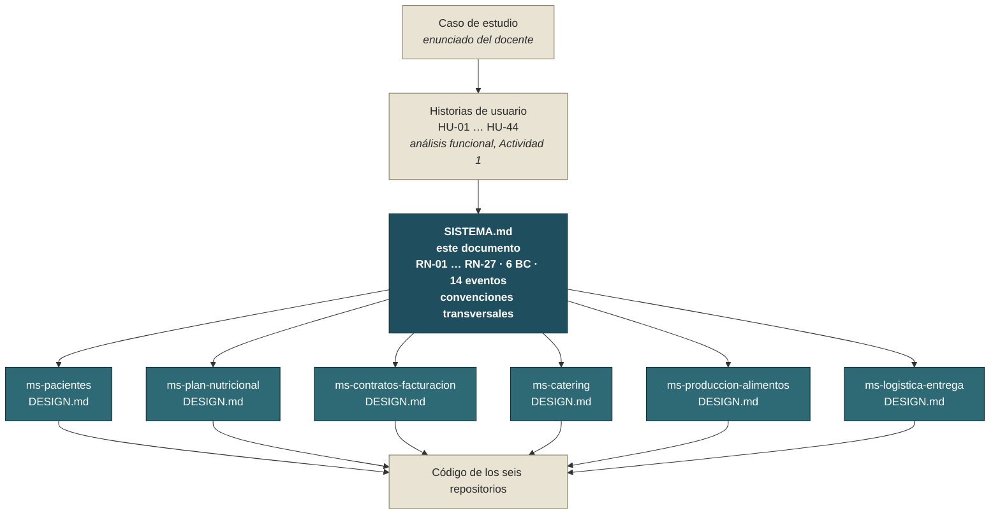

**La regla de precedencia es estricta y va en un solo sentido.** Lo que este documento establece es vinculante para los seis microservicios. Un `DESIGN.md` define el interior de su microservicio —agregados, invariantes numeradas, casos de uso, API, persistencia y pruebas— y **no puede contradecir** a este documento. Si algo debe cambiar en un contrato de integración o en una convención común, se cambia aquí primero y se propaga a los seis; nunca al revés. Ante cualquier duda de diseño durante la implementación, este documento se actualiza y luego se ajusta el código.

### 0.2 Códigos y su estabilidad

| Prefijo | Qué numera | Dónde se define | Regla |
|---|---|---|---|
| `RN-xx` | Regla de negocio canónica | §3 de este documento | No se reutiliza ni se renumera |
| `HU-xx` | Historia de usuario | §6.8 de este documento | No se reutiliza ni se renumera |
| `P`, `N`, `C`, `K`, `O`, `I` | Invariante de un microservicio | `DESIGN.md` del microservicio | No se reutiliza ni se renumera |

Toda invariante que implemente una regla de negocio cita su `RN-xx` en el `DESIGN.md`, en el comentario del código y en el nombre o la aserción del test. Esa cadena de citas es lo que hace auditable el sistema: desde una línea de test se llega al enunciado original del caso de estudio.

### 0.3 Índice

| § | Contenido |
|---|---|
| [1](#1-el-negocio) | El negocio, los actores y la trazabilidad desde el enunciado |
| [2](#2-subdominios-y-decisión-de-arquitectura) | Subdominios, consolidación de 7 a 6 bounded contexts |
| [3](#3-reglas-de-negocio-canónicas) | Reglas de negocio RN-01 … RN-27 y su distribución por contexto |
| [4](#4-línea-de-tiempo-operativa) | Línea de tiempo operativa D-2 / D-1 / D |
| [5](#5-recorrido-funcional-de-punta-a-punta) | Recorrido funcional completo y diagrama de secuencia |
| [6](#6-bounded-contexts-y-lenguaje-ubicuo) | Los seis bounded contexts, lenguaje ubicuo y cobertura HU-01 … HU-44 |
| [7](#7-context-map) | Context Map y patrones de relación DDD |
| [8](#8-tipos-compartidos-de-los-contratos) | Tipos compartidos: `DireccionGeo`, `Contacto`, `Money`, enumeraciones |
| [9](#9-contratos-de-eventos-de-integración) | Los catorce eventos de integración, campo a campo |
| [10](#10-base-de-comunicación-entre-microservicios) | Mecánica de publicación, endpoints de simulación e idempotencia |
| [11](#11-stack-técnico) | Stack y arquitectura de referencia de un microservicio |
| [12](#12-convenciones-técnicas-transversales) | Errores, colecciones, Value Objects, EF Core, CQRS, API, serialización |
| [13](#13-estrategia-de-pruebas) | Unit, integración, contrato con Pact, cobertura y andamiaje de IA para pruebas |
| [14](#14-plataforma-local) | Plataforma local, puertos y bases de datos |
| [15](#15-convenciones-de-repositorio-y-documentación) | Repositorios, orden de construcción y alcance de la entrega |
| [16](#16-matriz-de-trazabilidad-global) | Matriz de trazabilidad enunciado → RN → HU → BC |

---

## 1. El negocio

NUR-TRICENTER es un centro de nutrición que ofrece **tres servicios**, cada uno contratable y facturable por separado:

| Servicio | Contenido |
|---|---|
| **Evaluación corporal y consulta** | Medición antropométrica y de composición corporal + entrevista clínica → diagnóstico inicial. |
| **Asesoramiento nutricional** | Elaboración y asignación de un plan alimenticio personalizado de **15 o 30 días**. |
| **Catering** | Preparación y entrega diaria de la comida del plan, con la **misma duración que el plan activo**. |

### 1.1 Actores

| Actor | Rol | Contextos con los que interactúa |
|---|---|---|
| **Paciente** | Contrata servicios, asiste a consulta y evaluaciones, gestiona su calendario de entrega desde la app, recibe su comida. | BC1, BC2, BC3, BC4 |
| **Nutricionista** | Atiende la consulta inicial y las evaluaciones, diagnostica, elabora y personaliza el plan alimenticio. | BC1, BC2 |
| **Personal comercial / administrativo** | Registra pacientes, gestiona el catálogo de servicios y precios, contrata, cobra y factura. | BC1, BC3 |
| **Encargado de cocina** | Ejecuta la orden de producción: prepara, envasa por porción, arma y etiqueta los paquetes. | BC5 |
| **Repartidor** | Recibe el lote de paquetes y su ruta optimizada, entrega, registra constancias o reporta incidencias. | BC6 |
| **Administrador / supervisor** | Consulta el estado de entregas y el historial de constancias ante reclamos. | BC4, BC5, BC6 |

### 1.2 Del enunciado a las reglas

El caso de estudio es un texto en prosa. Esta tabla fija, párrafo a párrafo, qué regla canónica de §3 lo formaliza y qué contexto la implementa. Sirve para defender que **ninguna afirmación del enunciado quedó sin traducir** y que ninguna regla del sistema es una invención sin respaldo.

| Afirmación del enunciado | Regla | Contexto |
|---|---|---|
| «servicios integrales de asesoramiento nutricional, control de peso y catering personalizado» | RN-01 | BC3 |
| «evaluación del paciente donde se realizan medición corporal como antropometría, y peso» | RN-02 | BC1 |
| «elaboración de un plan de alimentación de 15 días basado en las necesidades del paciente» | RN-01 | BC2 |
| «Los planes pueden tener una duración de 15 o 30 días» | RN-01, RN-01b | BC2, BC3 |
| «Este servicio incluye evaluaciones quincenales según la duración del plan elegido» | RN-06 | BC1, BC3 |
| *(nota)* La duración del plan **acota** cuántas quincenales caben, no impone una cuota que haya que contar: la regla se hace cumplir comprobando vigencia, no llevando un contador. | RN-06 | BC3 |
| «consulta inicial … peso, altura, composición corporal … entrevista … diagnóstico inicial» | RN-02 | BC1 |
| «En base al plan, el paciente puede elegir si toma el servicio de catering o no» | RN-03 | BC3 |
| «evaluaciones periódicas … análisis clínicos que el profesional puede solicitar» | RN-04 | BC1 |
| «Cada servicio tiene un costo definido el cual es facturado al momento de la contratación» | RN-05, RN-18, RN-25, RN-26 | BC3 |
| «Los controles se cobran a parte si es que no se contrató servicio de catering» | RN-06 | BC3 |
| «planes alimentarios … compuestos un número determinado de tiempos de comida por día … a cada tiempo se le asigna una o más recetas» | RN-07 | BC2 |
| «Las recetas pueden estar presentes en diferentes planes alimentarios» | RN-07 | BC2 |
| «A cada paciente se le crea un calendario de entrega en base a los días contratados» | RN-08 | BC4 |
| «Cada día se le asigna una dirección de entrega la cual puede variar dependiendo del día» | RN-08 | BC4 |
| «el paciente puede marcar ciertos días para no recibir su alimentación» | RN-21 | BC4 |
| «Cualquier cambio … debe hacerse con dos días de anticipación» | RN-09, RN-22 | BC4 |
| «la comida se prepara el día antes para ser entregado al inicio del día programado» | RN-10 | BC5 |
| «se crea una Orden de Producción que contiene todas las recetas que deben ser preparadas» | RN-11 | BC5 |
| «cada receta se envasa en la porción correspondiente para luego ir armando los paquetes» | RN-11 | BC5 |
| «Estos paquetes están etiquetados los datos del paciente, la dirección de entrega y un número de identificación» | RN-12, RN-17 | BC5 |
| «se tiene personal especializado … recibe un conjunto de paquetes … junto con un listado … realiza su ruta de entrega» | RN-13 | BC6 |
| «una aplicación que permita a los pacientes realizar la modificación de su calendario de entrega y … consultar el seguimiento de la evolución de sus mediciones» | RN-14 | BC1, BC4 |
| «agregar la geolocalización a las direcciones y en base a eso, se pueda determinar las rutas de entrega» | RN-15 | BC4, BC6 |
| «contar un mecanismo de seguimiento para contar con un respaldo de las entregas … no se tienen constancias de las entregas» | RN-16 | BC6 |

**Reglas derivadas, no literales.** RN-19, RN-20, RN-23 y RN-24 no están escritas en el enunciado: son decisiones que el enunciado obliga a tomar pero no resuelve. Cada una está justificada en §3 y marcada como derivada, para que en la defensa quede claro qué es interpretación del equipo y qué es requisito del cliente.

---

## 2. Subdominios y decisión de arquitectura

### 2.1 Mapa de subdominios

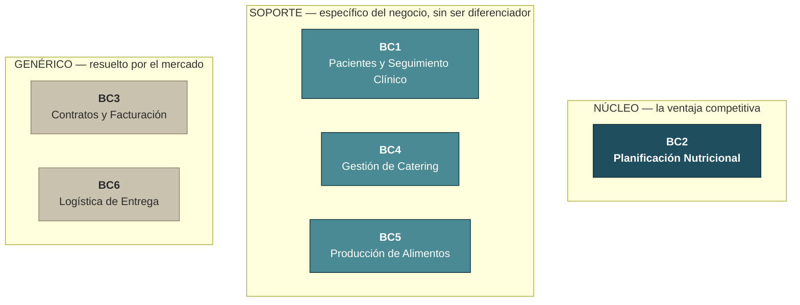

| Tipo | Bounded Context | Razón |
|---|---|---|
| **Núcleo (Core Domain)** | **BC2 — Planificación Nutricional** | Es donde vive la ventaja competitiva: el criterio clínico para elaborar un plan alimenticio personalizado y la reutilización de recetas entre planes. Es lo que el paciente paga y lo que distingue a Nur-Tricenter de un catering genérico. |
| **Soporte** | BC1 — Gestión de Pacientes y Seguimiento Clínico | Provee el insumo clínico (diagnóstico, evolución) que alimenta al núcleo. |
| **Soporte** | BC4 — Gestión de Catering | Traduce el plan del núcleo en una operación diaria de entregas. |
| **Soporte** | BC5 — Producción de Alimentos | Ejecución de cocina ligada al plan, pero es un proceso operativo replicable, no el conocimiento experto. |
| **Genérico** | BC3 — Contratos y Facturación | Contratación, facturación y cobro son un problema resuelto por el mercado; no aporta ventaja competitiva. |
| **Genérico** | BC6 — Logística de Entrega | Optimización de rutas y gestión de repartidores es un problema genérico con soluciones de mercado (TMS, APIs de ruteo). |

**Consecuencia para el diseño.** BC2 recibe el mayor cuidado de modelado: invariantes ricas, lenguaje ubicuo preciso, y es el único contexto con tres aggregate roots que se coordinan entre sí. BC3 y BC6 se diseñan con patrones simples y estandarizados, porque un reemplazo futuro por una solución de terceros es una opción legítima y no debe estar bloqueado por acoplamiento con el resto del sistema. Por eso su comunicación con los demás contextos es estrictamente a través de eventos de integración (§9), nunca por acceso directo a su modelo interno.

### 2.2 De siete bounded contexts a seis

El análisis funcional inicial (Actividad 1) identificó **siete** bounded contexts. El diseño final trabaja con **seis**. El cambio es una sola fusión, y conviene tenerla presente porque las historias de usuario conservan su numeración original.

| Análisis inicial | Diseño final | Decisión |
|---|---|---|
| BC1 – Gestión de Pacientes | **BC1 — Gestión de Pacientes y Seguimiento Clínico** | **Fusionados.** |
| BC2 – Evaluación y Seguimiento | ⬑ | |
| BC3 – Planificación Nutricional | BC2 — Planificación Nutricional | Renumerado |
| BC4 – Contratos y Facturación | BC3 — Contratos y Facturación | Renumerado |
| BC5 – Gestión de Catering | BC4 — Gestión de Catering | Renumerado |
| BC6 – Producción de Alimentos | BC5 — Producción de Alimentos | Renumerado |
| BC7 – Logística de Entrega | BC6 — Logística de Entrega | Renumerado |

**Por qué se fusionaron «Gestión de Pacientes» y «Evaluación y Seguimiento».** La evaluación corporal no existe sin un paciente, y la consulta inicial **ya es en sí misma la primera evaluación** del historial: el enunciado la describe como «una medición inicial para capturar datos, como peso, altura, composición corporal». Separarlos habría creado dos microservicios donde el primero no puede completar su caso de uso central sin llamar al segundo, y el segundo no puede existir sin el primero — una dependencia circular a cambio de cero autonomía. Un bounded context se justifica cuando tiene un lenguaje propio y un ciclo de vida propio; aquí el lenguaje es el mismo y el ciclo de vida es uno solo.

**Consecuencia práctica:** las historias HU-07 a HU-12, asignadas en el análisis a `ms-evaluación-seguimiento`, se implementan en `ms-pacientes`. Los códigos no se renumeraron.

---

## 3. Reglas de negocio canónicas

Estas reglas se citan por su código desde los `DESIGN.md`, desde los comentarios del código y desde los tests. **El código de una regla nunca se reutiliza ni se renumera.**

La columna **Origen** distingue lo que el enunciado dice literalmente de lo que el equipo tuvo que decidir: `E` = explícita en el enunciado, `D` = derivada (el enunciado obliga a resolver el punto pero no lo resuelve).

| RN | Origen | Regla |
|---|---|---|
| **RN-01** | E | La empresa ofrece 3 servicios: **Evaluación corporal y consulta**, **Asesoramiento nutricional** y **Catering**. El **plan alimenticio** (creado en el asesoramiento) tiene una duración de **15 o 30 días**, elegida por el nutricionista al crearlo. El caso típico es 15 días. |
| **RN-01b** | D | La duración del catering **no se elige por separado**: se deriva del plan alimenticio activo del paciente. Un plan de 15 días solo admite catering de 15 días; uno de 30, catering de 30. Esto garantiza que nunca se venda un día de catering sin recetas asignadas para ese día. |
| **RN-02** | E | La consulta inicial captura medición (peso, altura, composición corporal) + entrevista (hábitos, antecedentes clínicos, necesidades) → diagnóstico inicial → habilita la asignación del plan alimenticio. |
| **RN-03** | E | Con el plan asignado, el paciente decide si toma o no el servicio de catering. |
| **RN-04** | E | El paciente puede tener evaluaciones periódicas (mediciones de control); el nutricionista puede solicitar análisis clínicos. |
| **RN-05** | E | Cada servicio tiene un costo definido y se **factura al momento de la contratación**. |
| **RN-06** | E | Los controles se cobran aparte **solo si no hay catering vigente en la fecha de la evaluación**. Es una **lectura binaria, no un contador**: mientras el catering esté vigente, ninguna evaluación se cobra, sin importar cuántas lleve el paciente. El enunciado habla de «evaluaciones quincenales según la duración del plan», pero **no fija una cuota exigible**: 15 días de catering dan margen para una quincenal y 30 días para dos, así que la cuota es una consecuencia aritmética de la vigencia, no una regla aparte que haya que contar. Decidido el 5-sep-2026; la alternativa con contador está registrada y descartada en §18 de `ms-contratos-facturacion`. |
| **RN-07** | E | Un plan alimentario se compone de N tiempos de comida por día; cada tiempo tiene una o más recetas; **las recetas se reutilizan entre planes**. |
| **RN-08** | E | Cada paciente tiene un calendario de entrega según los días contratados; **la dirección puede variar por día** (por ejemplo, trabajo de lunes a viernes y domicilio los fines de semana). |
| **RN-09** | E | Todo cambio al calendario (dirección o día de no-entrega) requiere **mínimo 2 días de anticipación**: para el día D, hasta el fin de D-2. |
| **RN-10** | E | La comida se **prepara el día anterior (D-1)** y se entrega al inicio del día D. |
| **RN-11** | E | La Orden de Producción consolida recetas × cantidades del día; al completarse cada receta, se envasa por porción y se arman los paquetes por paciente según su plan. |
| **RN-12** | E | Cada paquete se etiqueta con **nombre del paciente, número de identificación del paciente, dirección de entrega, fecha e identificador único del paquete**. |
| **RN-13** | E | El repartidor recibe un conjunto de paquetes etiquetados más un listado, y en base a eso realiza su ruta de entrega. |
| **RN-14** | E | La app del paciente permite **modificar su calendario de entrega** y **consultar la evolución de sus mediciones**. |
| **RN-15** | E | Las direcciones llevan **geolocalización** (latitud/longitud) para determinar las rutas de entrega. |
| **RN-16** | E | Debe existir **constancia verificable de cada entrega** para resolver reclamos de pacientes que declaren no haber recibido su alimentación. |
| **RN-17** | E | Cada paquete tiene un **identificador único de tracking**, independiente del número de identificación del paciente. |
| **RN-18** | D | El pago es **al contado al momento de contratar**. La factura tiene estados `EMITIDA / PAGADA / ANULADA`. No hay cuotas. |
| **RN-19** | D | Un paciente tiene **como máximo 1 plan alimenticio activo, 1 contrato de catering activo y 1 calendario de entrega vigente** a la vez. Un calendario está **vigente mientras conserve días pendientes de entrega**, incluidos los días añadidos por reposición (RN-23); no basta con que haya pasado la fecha de fin nominal del contrato. |
| **RN-20** | D | El contrato de catering **no se renueva automáticamente**: termina en su vigencia (15 o 30 días) y el paciente recontrata. |
| **RN-21** | E | Un día que el **paciente marca voluntariamente como no-entrega se pierde**: no se repone, no extiende el calendario y no genera descuento. Es una decisión del paciente, no una falla del servicio. |
| **RN-22** | E | Los cambios al calendario para el día D se aceptan **hasta las 23:59 de D-2** (valor configurable). La interfaz debe informar al paciente la fecha límite vencida, no un rechazo genérico. |
| **RN-23** | D | **Reposición por incidencia de entrega:** cada incidencia de entrega **imputable a la empresa** dentro de un contrato de catering activo **repone automáticamente un día al final del calendario** de ese paciente (relación 1 a 1), usando la dirección por defecto vigente en ese momento. Sin descuentos ni otra compensación. Son imputables a la empresa los motivos `DIRECCION_NO_ENCONTRADA`, `PAQUETE_DANADO` y `OTRO`; **no** son imputables `PACIENTE_AUSENTE` ni `RECHAZADO_POR_PACIENTE`, que se tratan como RN-21. Solo se cuentan incidencias del mismo contrato de catering: si el paciente recontrató, las incidencias del contrato anterior no reponen días en el nuevo. |
| **RN-24** | D | **Dirección obligatoria al contratar catering:** no se crea un calendario de entrega sin al menos una dirección por defecto registrada en la libreta del paciente. No se permite eliminar la dirección por defecto si no hay otra que la reemplace. |
| **RN-25** | D | El total de una factura **siempre se calcula**, nunca se recibe: subtotal más impuesto. La tasa de impuesto es configurable, con valor por defecto **13%**. |
| **RN-26** | D | El contrato **copia el precio vigente** del catálogo en el momento de contratar. Un cambio posterior de precio no afecta a los contratos ya emitidos. |
| **RN-27** | D | **Capacidad de reparto.** Un repartidor tiene asociado **un vehículo con capacidad finita de paquetes** y puede tener **como máximo una ruta activa** a la vez. Una asignación que exceda la capacidad del vehículo o que se haga sobre un repartidor con ruta activa se rechaza. El enunciado no menciona vehículos; la regla se deriva de que «el repartidor recibe un conjunto de paquetes» (RN-13) y de que ese conjunto no puede ser infinito ni solaparse con otro reparto en curso. **Alcance deliberadamente mínimo:** `Vehiculo` existe para acotar la asignación, no para gestionar flota — nómina, turnos y mantenimiento siguen fuera de alcance (§6.10). Sostiene `I2` e `I11` de BC6. |

### 3.1 Distribución de las reglas por contexto

Una regla puede tocar más de un contexto. El **responsable** es quien la hace cumplir; los **participantes** la respetan o dependen de ella.

**Cómo se lee esta tabla.** Un contexto figura como participante cuando alguna de sus invariantes cita esa regla en su §6.1 — es decir, cuando la regla aparece en su código, no solo en su vocabulario. La columna se verifica recorriendo la columna «RN» de las seis tablas §6.1: si un `DESIGN.md` cita una RN y su BC no está en esta fila, una de las dos está mal.

| RN | Responsable | Participantes |
|---|---|---|
| RN-01 | BC2 | BC3, BC4 |
| RN-01b | BC3 | BC1, BC2, BC4 |
| RN-02 | BC1 | BC2, BC3 |
| RN-03 | BC3 | BC4 |
| RN-04 | BC1 | BC3 |
| RN-05 | BC3 | BC1, BC2 |
| RN-06 | BC3 | BC1 |
| RN-07 | BC2 | BC5 |
| RN-08 | BC4 | BC5 |
| RN-09 | BC4 | BC2, BC5 |
| RN-10 | BC5 | BC2, BC4, BC6 |
| RN-11 | BC5 | BC2 |
| RN-12 | BC5 | BC1, BC3, BC4, BC6 |
| RN-13 | BC6 | BC5 |
| RN-14 | BC1, BC4 | — |
| RN-15 | BC4 | BC6 |
| RN-16 | BC6 | BC1 |
| RN-17 | BC5 | BC6 |
| RN-18 | BC3 | — |
| RN-19 | BC2, BC3, BC4 | — |
| RN-20 | BC3 | BC2, BC4 |
| RN-21 | BC4 | BC6 |
| RN-22 | BC4 | BC2, BC5 |
| RN-23 | BC4 | BC6 |
| RN-24 | BC4 | BC3 |
| RN-25 | BC3 | — |
| RN-26 | BC3 | — |
| RN-27 | BC6 | — |

---

## 4. Línea de tiempo operativa

Todo el sistema gira sobre tres momentos fijos. Entender esta línea de tiempo es entender por qué el calendario se congela, por qué la orden de producción se genera cuando se genera, y por qué un cambio tardío tiene que rechazarse.

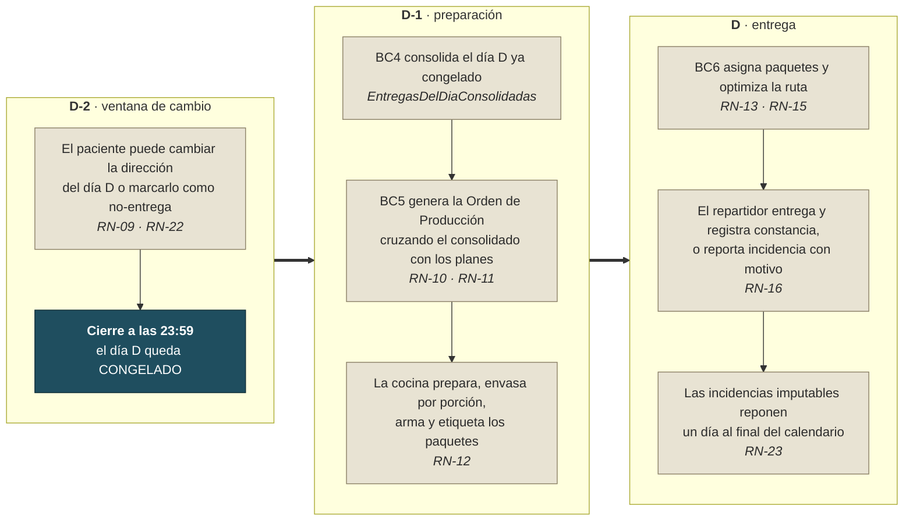

**Invariante transversal.** Ningún cambio de calendario para el día D se acepta después del cierre de D-2. Esto garantiza que la orden de producción de D-1 nunca trabaja con datos obsoletos: cuando la cocina empieza a preparar, la lista que tiene en la mano ya no puede cambiar.

**Por qué exactamente dos días y no uno.** El enunciado fija el plazo de dos días. La razón operativa se lee en el propio flujo: la comida del día D se prepara el día D-1, de modo que un plazo de un solo día dejaría la ventana de cambio abierta mientras la cocina ya está trabajando. Dos días dejan un día completo de margen entre el último cambio posible y el inicio de la preparación.

---

## 5. Recorrido funcional de punta a punta

### 5.1 Narrativa

La cadena de contratación es **estricta y ordenada**. Cada paso está bloqueado hasta que se completa el anterior.

**1. Alta del paciente.** El personal comercial registra al paciente con sus datos personales y de contacto.

**2. Contratación de la evaluación.** Se contrata el servicio de *Evaluación corporal y consulta*, se factura y se cobra al contado (RN-05). Sin esta contratación, la consulta inicial está bloqueada.

**3. Consulta inicial.** El nutricionista mide y entrevista al paciente y emite un diagnóstico inicial (RN-02). La consulta genera además la **primera evaluación** del historial, que es el punto de partida para medir la evolución.

**4. Contratación del asesoramiento.** El paciente contrata el servicio de *Asesoramiento nutricional*, que se factura. Elaborar el plan **es** el servicio: sin esta contratación, el plan no puede crearse.

**5. Elaboración y asignación del plan.** El nutricionista crea el plan de 15 o 30 días (RN-01) copiando una plantilla y personalizándolo: qué se come cada día, en qué tiempos de comida y con qué recetas (RN-07). Al activarlo, el plan queda asignado al paciente.

**6. Decisión de catering.** Con el plan asignado, el paciente decide si contrata además la preparación y entrega de la comida (RN-03). Si contrata, la **vigencia del catering se deriva del plan activo** (fecha de inicio y duración, RN-01b), de modo que nunca se vende un día de catering sin recetas asignadas.

**7. Configuración del calendario.** Al contratar el catering se crea automáticamente un calendario con un día por cada día contratado, apuntando todos a la dirección por defecto del paciente (RN-24). Desde la app, el paciente puede asignar una dirección distinta a cada día o marcarlo como no-entrega, siempre dentro de la ventana de dos días (RN-09, RN-22).

**8. Producción.** La tarde de D-1, con el día D ya congelado, se genera automáticamente la Orden de Producción: recetas × cantidades. La cocina prepara, envasa por porción y arma los paquetes, cada uno etiquetado según RN-12.

**9. Entrega.** El día D el repartidor recibe su lote y su ruta optimizada. Parada por parada: si entrega, registra una constancia con evidencia real (foto o firma) y las coordenadas donde confirmó; si no puede entregar, reporta una incidencia con motivo. Toda entrega o incidencia queda con respaldo verificable (RN-16). Las incidencias imputables a la empresa reponen un día al final del calendario (RN-23).

**10. Seguimiento.** En paralelo, el paciente tiene evaluaciones periódicas donde se vuelve a medir y comparar contra las anteriores; la app le muestra su evolución. Sin catering vigente, cada control se cobra aparte; con catering vigente, ninguna evaluación se cobra (RN-06).

**11. Cierre del ciclo.** El catering termina en su fecha de vigencia y el paciente decide si recontrata. No hay renovación ni cobro automático (RN-20).

### 5.2 El recorrido como diagrama de secuencia

Este diagrama muestra el mismo recorrido con los eventos de integración reales de §9. Cada flecha punteada es un evento; cada flecha continua es una llamada de un actor a una API.

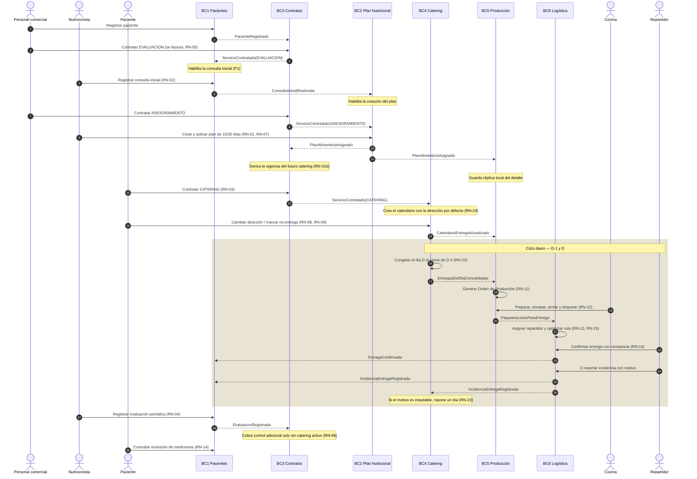

---

## 6. Bounded Contexts y lenguaje ubicuo

El sistema se divide en **seis bounded contexts**, cada uno implementado como un microservicio autónomo con su propia base de datos. Cada uno define su lenguaje ubicuo — los términos que el código, los eventos y el `DESIGN.md` local deben usar **sin traducir ni abreviar**.

### 6.1 Vista de conjunto

| BC | Microservicio | Subdominio | Aggregate Roots | Invariantes | Historias | Base de datos | Puerto |
|---|---|---|---|---|---|---|---|
| BC1 | `ms-pacientes` | Soporte | `Paciente`, `Evaluacion` | `P` | HU-01 – HU-12 | `pacientes_db` | 5010 |
| BC2 | `ms-plan-nutricional` | **Núcleo** | `Receta`, `PlanAlimentario`, `PlanAlimenticio` | `N` | HU-13 – HU-18 | `plannutricional_db` | 5020 |
| BC3 | `ms-contratos-facturacion` | Genérico | `ServicioCatalogo`, `Contrato`, `Factura`, `ControlAdicional` | `C` | HU-19 – HU-24 | `contratos_db` | 5030 |
| BC4 | `ms-catering` | Soporte | `CalendarioEntrega`, `LibretaDirecciones` | `K` | HU-25 – HU-30 | `catering_db` | 5040 |
| BC5 | `ms-produccion-alimentos` | Soporte | `OrdenProduccion` | `O` | HU-31 – HU-36 | `produccion_db` | 5050 |
| BC6 | `ms-logistica-entrega` | Genérico | `Repartidor`, `RutaEntrega` | `I` | HU-37 – HU-44 | `logistica_db` | 5060 |

### 6.2 BC1 — Gestión de Pacientes y Seguimiento Clínico · `ms-pacientes`

Ciclo de vida del paciente, consulta inicial, anamnesis, evaluaciones corporales, análisis clínicos, historial y evolución de mediciones. Un único contexto, por la razón desarrollada en §2.2.

- **Aggregate Roots:** `Paciente`, `Evaluacion` — **independientes entre sí**. `Evaluacion` nunca es una colección hija de `Paciente`.
- **Prefijo de invariantes:** `P` · **Base de datos:** `pacientes_db` · **Puerto:** 5010

| Término | Definición |
|---|---|
| Paciente | Persona que recibe servicios nutricionales de la empresa. |
| Consulta Inicial | Primera interacción formal donde se capturan datos antropométricos, hábitos y antecedentes clínicos, y que genera además la primera evaluación del historial. |
| Ficha de Paciente | Registro consolidado de datos personales, clínicos y de contacto del paciente. |
| Anamnesis | Entrevista estructurada para conocer los antecedentes alimenticios y clínicos del paciente. |
| Antecedentes Clínicos | Historial médico relevante del paciente que influye en la planificación nutricional. |
| Diagnóstico Inicial | Valoración realizada en la consulta inicial para identificar necesidades y problemas específicos. |
| Evaluación Corporal | Proceso de medición de parámetros físicos como peso, altura y composición corporal. |
| Antropometría | Conjunto de medidas corporales (perímetros, pliegues, IMC) registradas en cada evaluación. |
| Composición Corporal | Distribución de masa grasa, masa muscular y agua corporal del paciente. |
| Evaluación Quincenal | Control de seguimiento del paciente con catering. **El nombre es histórico, no una cadencia exigible:** ningún contexto verifica que hayan pasado quince días desde la anterior. Lo que decide si se cobra es la vigencia del catering en la fecha (RN-06). |
| Análisis Clínico | Examen de laboratorio solicitado por el nutricionista para complementar la evaluación. |
| Evolución | Progreso medible del paciente en relación a los objetivos planteados en su plan alimenticio. |
| Historial de Mediciones | Registro cronológico de todas las evaluaciones del paciente. |

### 6.3 BC2 — Planificación Nutricional · `ms-plan-nutricional`

Catálogo de recetas, plantillas de plan alimentario, planes alimenticios asignados y personalizados, tiempos de comida. **Subdominio núcleo.**

- **Aggregate Roots:** `Receta`, `PlanAlimentario` (plantilla), `PlanAlimenticio` (asignado)
- **Prefijo de invariantes:** `N` · **Base de datos:** `plannutricional_db` · **Puerto:** 5020

| Término | Definición |
|---|---|
| Plan Alimenticio | Programa nutricional asignado a un paciente concreto, con duración de 15 o 30 días (RN-01), creado a partir de una plantilla y personalizable. |
| Plan Alimentario | Plantilla base reutilizable de un programa nutricional, con tiempos de comida y recetas predefinidas, de la que se derivan los planes alimenticios asignados. |
| Tiempo de Comida | Cada una de las ingestas diarias definidas en el plan (desayuno, media mañana, almuerzo, merienda, cena, extra). |
| Receta | Preparación culinaria específica asignada a un tiempo de comida; se reutiliza entre distintos planes (RN-07). |
| Porción | Cantidad específica de una receta asignada a un paciente según su plan. |
| Recomendación Nutricional | Indicaciones del profesional que guían la composición del plan alimenticio. |
| Necesidades Nutricionales | Requerimientos calóricos y de macronutrientes específicos de cada paciente. |

**La distinción `PlanAlimentario` / `PlanAlimenticio` es el corazón del lenguaje ubicuo de este contexto** y la fuente de error más común al leer el código. `PlanAlimentario` es la **plantilla** reutilizable; `PlanAlimenticio` es el **plan asignado a un paciente concreto**. Los dos términos vienen del análisis funcional original y no se renombran, aunque se parezcan: renombrarlos rompería la trazabilidad con el documento de Actividad 1.

### 6.4 BC3 — Contratos y Facturación · `ms-contratos-facturacion`

Catálogo de servicios y precios, contratación, facturación al contratar, pagos y controles adicionales. Subdominio genérico.

- **Aggregate Roots:** `ServicioCatalogo`, `Contrato`, `Factura`, `ControlAdicional`
- **Prefijo de invariantes:** `C` · **Base de datos:** `contratos_db` · **Puerto:** 5030

| Término | Definición |
|---|---|
| Contratación | Proceso formal mediante el cual el paciente adquiere uno de los tres servicios de la empresa. |
| Servicio | Oferta comercial de la empresa: Evaluación Corporal, Asesoramiento Nutricional o Catering. |
| Costo | Precio definido para cada servicio contratado, copiado al contrato en el momento de contratar (RN-26). |
| Factura | Documento que registra los servicios y montos, emitido al momento de la contratación (RN-05). Estados: `EMITIDA / PAGADA / ANULADA`. |
| Control Adicional | Evaluación de seguimiento cobrada por separado cuando el paciente no tiene catering activo (RN-06). |
| Pago | Registro del abono realizado por el paciente al momento de la contratación; único, al contado. |
| Vigencia | Par de fechas inicio/fin que delimita un contrato; en el catering se deriva del plan activo (RN-01b). |

### 6.5 BC4 — Gestión de Catering · `ms-catering`

Calendario de entregas por paciente, libreta de direcciones geolocalizadas, días de no-entrega, ventana de dos días, congelamiento en D-2, consolidación del día y reposición por incidencias. Subdominio de soporte.

- **Aggregate Roots:** `CalendarioEntrega`, `LibretaDirecciones`
- **Prefijo de invariantes:** `K` · **Base de datos:** `catering_db` · **Puerto:** 5040

| Término | Definición |
|---|---|
| Calendario de Entrega | Planificación de los días en que el paciente recibirá su alimentación. |
| Dirección de Entrega | Ubicación física, con coordenadas, donde se entregará el paquete en un día específico. |
| Cambio de Dirección | Modificación de la dirección de entrega para un día particular, con al menos dos días de anticipación. |
| Día de No Entrega | Día marcado por el paciente en el que no desea recibir su alimentación; se pierde, no se repone (RN-21). |
| Anticipación Mínima | Plazo de dos días requerido para registrar cualquier cambio en el calendario (RN-09, RN-22). |
| Día Congelado | Día del calendario que ya cerró su ventana de cambio (D-2 23:59) y del que Producción puede partir sin riesgo de datos obsoletos. |
| Reposición por Incidencia | Día añadido al final del calendario cuando una entrega falla por causa imputable a la empresa (RN-23). |
| Libreta de Direcciones | Conjunto de direcciones habituales del paciente, con una marcada por defecto (RN-24). |

### 6.6 BC5 — Producción de Alimentos · `ms-produccion-alimentos`

Réplica local de planes y recetas, generación de la orden de producción de D-1, preparación, envasado por porción, armado y etiquetado de paquetes. Subdominio de soporte.

- **Aggregate Roots:** `OrdenProduccion`
- **Prefijo de invariantes:** `O` · **Base de datos:** `produccion_db` · **Puerto:** 5050

| Término | Definición |
|---|---|
| Orden de Producción | Listado de recetas y cantidades consolidadas que el equipo de cocina debe preparar para el día de entrega. |
| Preparación | Proceso de cocción y elaboración de las recetas indicadas en la orden de producción. |
| Envasado | Acción de empacar cada receta en la porción correspondiente al paciente. |
| Armado de Paquetes | Proceso de agrupar las porciones envasadas en el conjunto que corresponde a cada paciente. |
| Etiqueta | Identificación estructurada adherida al paquete: nombre, número de identificación, dirección, fecha e id único (RN-12). |
| Lote de Producción | Conjunto de paquetes preparados en una misma jornada de cocina. |
| Paquete de Alimentación | Conjunto de preparaciones diarias envasadas y etiquetadas listas para ser entregadas a un paciente. |

### 6.7 BC6 — Logística de Entrega · `ms-logistica-entrega`

Repartidores y vehículos, recepción y asignación de paquetes, optimización de rutas con geolocalización, constancias de entrega con evidencia real e incidencias. Subdominio genérico.

- **Aggregate Roots:** `Repartidor`, `RutaEntrega`
- **Prefijo de invariantes:** `I` · **Base de datos:** `logistica_db` · **Puerto:** 5060

| Término | Definición |
|---|---|
| Repartidor | Personal especializado encargado de transportar y entregar los paquetes a los pacientes. |
| Ruta de Entrega | Secuencia optimizada de paradas que el repartidor sigue para entregar sus paquetes del día. |
| Optimización de Ruta | Cálculo de la secuencia de paradas que minimiza distancia y tiempo de recorrido (vecino más cercano sobre distancia haversine). |
| Geolocalización | Coordenadas asociadas a una dirección de entrega, insumo de la optimización (RN-15). |
| Listado de Entrega | Detalle de los paquetes asignados al repartidor con los datos de cada destinatario. |
| Constancia de Entrega | Registro que evidencia que el paquete fue recibido: tipo (foto/firma), evidencia, receptor, fecha/hora y coordenadas de confirmación (RN-16). |
| Incidencia de Entrega | Reporte de una entrega no efectuada, con un motivo — algunos imputables a la empresa (reponen día, RN-23), otros no (RN-21). |
| Parada | Unidad de la ruta correspondiente a un paquete/paciente concreto. |
| Estado de Entrega | Situación de una parada de la ruta: **pendiente**, **en camino**, **entregado** o **no entregado**. `EN_CAMINO` marca el tramo en el que el repartidor ya salió hacia esa dirección y todavía no hay desenlace; sin él no se distingue una parada que aún no se ha intentado de una que está en curso, que es lo que la consulta de seguimiento de HU-42 necesita. |

### 6.8 Mapa global de agregados

Un solo diagrama con los once aggregate roots del sistema y las referencias que cruzan fronteras de contexto. **Ninguna de esas referencias es una relación de objetos**: son identificadores que viajan por evento. Un agregado nunca contiene una instancia de otro agregado, ni siquiera dentro del mismo contexto.

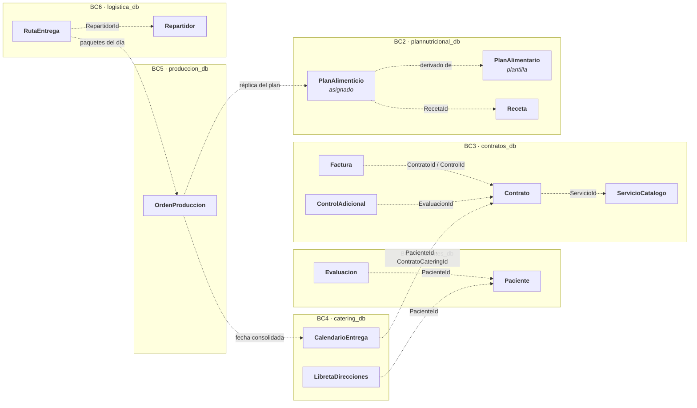

### 6.9 Cobertura funcional — historias de usuario HU-01 a HU-44

Cada código pertenece a **un único microservicio**. Los `DESIGN.md` citan estos códigos exactamente como aparecen aquí: no se renumeran, no se reutilizan y no se inventan códigos nuevos sin agregarlos primero a esta tabla.

La columna **BC original** registra a qué bounded context pertenecía la historia en el análisis de Actividad 1, para que la consolidación de §2.2 quede trazada.

| HU | Microservicio | BC original | Historia |
|---|---|---|---|
| HU-01 | `ms-pacientes` | BC1 | Como paciente, quiero registrarme en el sistema para poder acceder a los servicios nutricionales. |
| HU-02 | `ms-pacientes` | BC1 | Como nutricionista, quiero realizar y registrar la consulta inicial de un paciente para capturar sus datos antropométricos y antecedentes. |
| HU-03 | `ms-pacientes` | BC1 | Como nutricionista, quiero registrar la anamnesis del paciente para documentar sus hábitos alimenticios y antecedentes clínicos. |
| HU-04 | `ms-pacientes` | BC1 | Como administrador, quiero consultar el listado completo de pacientes activos para gestionar la carga de trabajo. |
| HU-05 | `ms-pacientes` | BC1 | Como paciente, quiero actualizar mis datos de contacto desde la aplicación móvil. |
| HU-06 | `ms-pacientes` | BC1 | Como nutricionista, quiero asignar un paciente a mi cartera para gestionar su seguimiento. |
| HU-07 | `ms-pacientes` | BC2 → fusionado | Como nutricionista, quiero registrar una evaluación corporal con los datos de peso, altura y composición para documentar el estado del paciente. |
| HU-08 | `ms-pacientes` | BC2 → fusionado | Como nutricionista, quiero solicitar análisis clínicos complementarios y registrar sus resultados en el historial del paciente. |
| HU-09 | `ms-pacientes` | BC2 → fusionado | Como paciente, quiero consultar mi historial de mediciones desde la app para ver mi evolución a lo largo del tiempo. |
| HU-10 | `ms-pacientes` | BC2 → fusionado | Como paciente, quiero visualizar gráficos de mi evolución (peso, masa grasa, masa muscular) para motivarme en mi proceso. |
| HU-11 | `ms-pacientes` | BC2 → fusionado | Como nutricionista, quiero comparar evaluaciones consecutivas de un paciente para determinar ajustes en su plan alimenticio. |
| HU-12 ⚠ | `ms-pacientes` | BC2 → fusionado | Como sistema, quiero generar automáticamente un recordatorio de evaluación quincenal para pacientes con catering activo. |
| HU-13 | `ms-plan-nutricional` | BC3 | Como nutricionista, quiero crear un plan alimenticio personalizado de 15 días para un paciente, asignando recetas a cada tiempo de comida. |
| HU-14 | `ms-plan-nutricional` | BC3 | Como nutricionista, quiero gestionar el catálogo de recetas disponibles para poder reutilizarlas en distintos planes. |
| HU-15 | `ms-plan-nutricional` | BC3 | Como nutricionista, quiero asignar un plan alimentario base a un paciente y luego personalizarlo según sus necesidades. |
| HU-16 | `ms-plan-nutricional` | BC3 | Como nutricionista, quiero consultar qué recetas están incluidas en un plan para un día específico. |
| HU-17 | `ms-plan-nutricional` | BC3 | Como administrador, quiero gestionar los planes alimentarios base (plantillas) disponibles en el sistema. |
| HU-18 | `ms-plan-nutricional` | BC3 | Como paciente, quiero consultar mi plan de alimentación actual desde la app para saber qué comeré cada día. |
| HU-19 | `ms-contratos-facturacion` | BC4 | Como administrador, quiero registrar la contratación de un servicio para un paciente y generar automáticamente su factura. |
| HU-20 | `ms-contratos-facturacion` | BC4 | Como administrador, quiero gestionar el catálogo de servicios y sus precios para mantenerlos actualizados. |
| HU-21 | `ms-contratos-facturacion` | BC4 | Como paciente, quiero consultar mis facturas emitidas para llevar un registro de mis gastos. |
| HU-22 | `ms-contratos-facturacion` | BC4 | Como administrador, quiero registrar el pago de un control de seguimiento para pacientes sin catering. |
| HU-23 | `ms-contratos-facturacion` | BC4 | Como administrador, quiero consultar el listado de contratos activos por período para análisis financiero. |
| HU-24 | `ms-contratos-facturacion` | BC4 | Como sistema, quiero generar automáticamente el cobro de controles adicionales cuando un nutricionista programa una evaluación a un paciente sin catering. |
| HU-25 | `ms-catering` | BC5 | Como paciente, quiero consultar mi calendario de entregas desde la app para ver mis entregas programadas. |
| HU-26 | `ms-catering` | BC5 | Como paciente, quiero cambiar la dirección de entrega de un día específico con al menos 2 días de anticipación. |
| HU-27 | `ms-catering` | BC5 | Como paciente, quiero marcar un día como «sin entrega» cuando no estaré disponible para recibirla. |
| HU-28 | `ms-catering` | BC5 | Como sistema, quiero validar que cualquier modificación al calendario se realice con un mínimo de 2 días de anticipación y rechazar cambios tardíos. |
| HU-29 | `ms-catering` | BC5 | Como administrador, quiero visualizar el calendario consolidado de todos los pacientes para planificar la producción del día siguiente. |
| HU-30 | `ms-catering` | BC5 | Como paciente, quiero registrar múltiples direcciones habituales (trabajo, domicilio) para seleccionarlas fácilmente en el calendario. |
| HU-31 | `ms-produccion-alimentos` | BC6 | Como encargado de cocina, quiero recibir la orden de producción del día con el listado de recetas y cantidades a preparar. |
| HU-32 | `ms-produccion-alimentos` | BC6 | Como sistema, quiero generar automáticamente la orden de producción consolidada la tarde anterior a cada día de entrega. |
| HU-33 | `ms-produccion-alimentos` | BC6 | Como encargado de cocina, quiero registrar el inicio y fin de preparación de cada receta para tener trazabilidad del proceso. |
| HU-34 | `ms-produccion-alimentos` | BC6 | Como encargado de cocina, quiero marcar una orden de producción como completada una vez que todos los paquetes estén armados. |
| HU-35 | `ms-produccion-alimentos` | BC6 | Como sistema, quiero generar automáticamente las etiquetas de identificación de cada paquete con los datos del paciente y dirección. |
| HU-36 | `ms-produccion-alimentos` | BC6 | Como administrador, quiero consultar el historial de órdenes de producción para auditoría interna. |
| HU-37 | `ms-logistica-entrega` | BC7 | Como administrador, quiero asignar lotes de paquetes a repartidores para que conozcan su ruta del día. |
| HU-38 | `ms-logistica-entrega` | BC7 | Como sistema, quiero geolocalizar automáticamente cada dirección de entrega para poder calcular rutas optimizadas. |
| HU-39 | `ms-logistica-entrega` | BC7 | Como repartidor, quiero recibir mi listado de entregas del día con ruta optimizada para organizar mi recorrido. |
| HU-40 | `ms-logistica-entrega` | BC7 | Como repartidor, quiero registrar la entrega de cada paquete (foto o firma) como constancia de que fue recibido. |
| HU-41 | `ms-logistica-entrega` | BC7 | Como repartidor, quiero reportar una incidencia cuando no pueda entregar un paquete para que el sistema lo notifique. |
| HU-42 | `ms-logistica-entrega` | BC7 | Como administrador, quiero consultar el estado en tiempo real de todas las entregas del día para monitorear el servicio. |
| HU-43 ⚠ | `ms-logistica-entrega` | BC7 | Como paciente, quiero recibir una notificación cuando mi paquete ha sido entregado para confirmar su recepción. |
| HU-44 | `ms-logistica-entrega` | BC7 | Como administrador, quiero consultar el historial de constancias de entregas para resolver reclamos de pacientes. |

⚠ **HU-12 y HU-43 están fuera de alcance** (§6.10, notificaciones). Se documentan igualmente en el `DESIGN.md` del microservicio que las habilita, indicando el evento ya publicado que las haría posibles y que no se implementa hoy.

### 6.10 Fuera del alcance del sistema

- **Notificaciones.** Ningún microservicio notifica hoy al paciente, al repartidor ni al administrador. Los eventos que habilitarían esas notificaciones (`FacturaEmitida`, `RutaOptimizadaGenerada`, `EntregaConfirmada`, `IncidenciaEntregaRegistrada`) ya están publicados con su contrato definitivo, listos para que un consumidor externo los tome. Esto cubre HU-12 y HU-43.
- **Autenticación, autorización y roles.** Los identificadores y roles viajan como datos en las APIs. La solución natural es un API Gateway más un proveedor de identidad: es una preocupación transversal, no un bounded context de dominio.
- **Gestión de inventario e insumos de cocina.** El enunciado no la menciona. La orden de producción dice qué preparar, no si hay ingredientes.
- **Nómina, turnos y vehículos del personal de reparto.** `Repartidor` existe como agregado para poder asignarle una ruta, no para gestionar recursos humanos ni flota.

---

## 7. Context Map

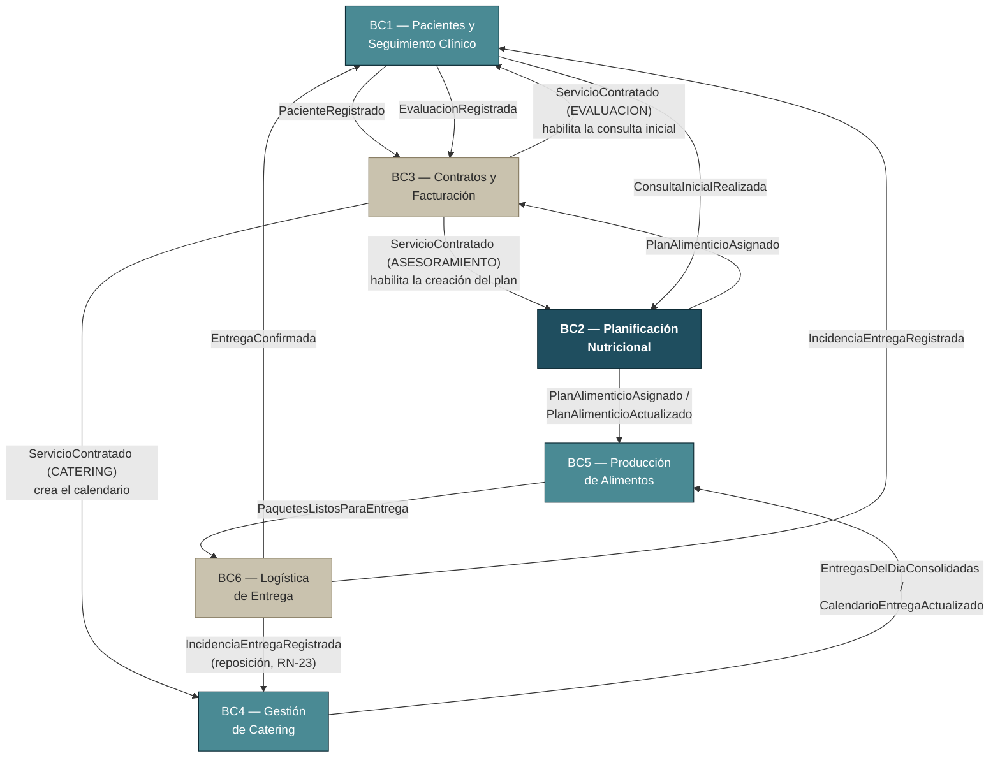

| Upstream | Downstream | Patrón DDD | Qué habilita |
|---|---|---|---|
| BC1 | BC3 | Customer/Supplier | BC3 conoce al paciente para poder contratar y facturar. |
| BC3 | BC1 | Customer/Supplier | La contratación de la evaluación habilita la consulta inicial. |
| BC3 | BC2 | Customer/Supplier | La contratación del asesoramiento habilita la creación del plan. |
| BC3 | BC4 | Customer/Supplier | La contratación del catering crea el calendario de entregas. |
| BC1 | BC2 | Customer/Supplier | El diagnóstico de la consulta inicial habilita la asignación del plan. |
| BC1 | BC3 | Conformist | La evaluación registrada dispara el cobro del control adicional cuando corresponde. |
| BC2 | BC3 | Published Language | BC3 deriva la vigencia del catering del plan activo. |
| BC2 | BC5 | Published Language | BC5 replica el detalle de planes y recetas para consolidar la orden. |
| BC4 | BC5 | Published Language | BC5 recibe el día congelado con pacientes y direcciones. |
| BC5 | BC6 | Customer/Supplier | BC6 recibe los paquetes etiquetados listos para rutear. |
| BC6 | BC1 | Event Notification | BC1 conoce el desenlace de cada entrega para el historial del paciente. |
| BC6 | BC4 | Event Notification | BC4 cuenta las incidencias imputables y repone días (RN-23). |

**Sobre la ausencia de Anti-Corruption Layers.** Todas las integraciones son in-process (§10) y comparten el mismo lenguaje de eventos definido en este documento, por lo que ningún contexto necesita una ACL hoy: el publicador y el consumidor acuerdan el contrato aquí, en un solo lugar, y ambos lo cumplen. Al migrar a un bus real hay que evaluar caso por caso si algún consumidor externo al equipo necesita una ACL frente a cambios no controlados en el modelo del publicador. Los candidatos naturales son BC3 y BC6, que son los subdominios genéricos y por tanto los que un tercero podría reemplazar.

---

## 8. Tipos compartidos de los contratos

Estos tipos aparecen embebidos en varios eventos. Su forma es **idéntica en los seis microservicios**: publicador y consumidor serializan y deserializan exactamente esta estructura.

### `DireccionGeo`

```json
{
  "calle": "Av. Banzer #345",
  "zona": "Equipetrol",
  "ciudad": "Santa Cruz de la Sierra",
  "referencia": "Edificio Torre Sur, piso 4",
  "coordenadas": { "latitud": -17.7654, "longitud": -63.1821 }
}
```

| Campo | Tipo | Obligatorio |
|---|---|---|
| `calle` | string | Sí |
| `zona` | string | Sí |
| `ciudad` | string | Sí |
| `referencia` | string | No |
| `coordenadas.latitud` | decimal (-90 a 90) | Sí |
| `coordenadas.longitud` | decimal (-180 a 180) | Sí |

Las coordenadas van **anidadas**, no aplanadas: el objeto refleja el Value Object del dominio y permite validar la coordenada como una unidad. Una latitud sin su longitud no es un dato válido, y aplanarlas invitaría a construir estados imposibles.

### `Contacto`

```json
{ "telefono": "+591 70011223", "email": "paciente@correo.com", "direccion": "Av. Banzer #345" }
```

La `direccion` de `Contacto` es texto libre de referencia administrativa. **No** se usa para entregas: la dirección de entrega es siempre un `DireccionGeo` gestionado por BC4. Confundir ambas es el error que la separación de tipos previene.

### `Money`

```json
{ "monto": 350.00, "moneda": "BOB" }
```

`monto` y `moneda` viajan siempre como dos campos, nunca como uno solo. El Value Object `Money` **valida su moneda contra la lista cerrada `{ BOB, USD }`** y rechaza cualquier otro código al construirse. Esta validación vive en `ms-contratos-facturacion`, único microservicio que maneja montos.

**`tasaImpuesto` es un porcentaje, no una fracción.** Viaja como decimal en el rango cerrado **`[0, 100]`**: el 13 % de IVA es `13`, nunca `0.13`. Igual que `Money` lleva su moneda explícita, una tasa lleva su unidad fijada en el contrato, porque el nombre del campo no la comunica y las dos convenciones producen resultados que difieren en un factor de cien. `Factura` se compone siempre de **líneas** (`Factura.lineas`, §12.2) y la tasa se aplica sobre la suma de sus líneas; nunca se recibe un subtotal suelto (INC-S11).

### Enumeraciones

| Enum | Valores | Contexto propietario |
|---|---|---|
| `TipoServicio` | `EVALUACION`, `ASESORAMIENTO`, `CATERING` | BC3 |
| `TipoEvaluacion` | `INICIAL`, `QUINCENAL`, `CONTROL` | BC1 |
| `TipoComida` | `DESAYUNO`, `MEDIA_MANANA`, `ALMUERZO`, `MERIENDA`, `CENA`, `EXTRA` | BC2 |
| `OrigenFactura` | `CONTRATACION`, `CONTROL_ADICIONAL` | BC3 |
| `EstadoFactura` | `EMITIDA`, `PAGADA`, `ANULADA` | BC3 |
| `TipoConstancia` | `FOTO`, `FIRMA` | BC6 |
| `MotivoIncidencia` | `PACIENTE_AUSENTE`, `DIRECCION_NO_ENCONTRADA`, `PAQUETE_DANADO`, `RECHAZADO_POR_PACIENTE`, `OTRO` | BC6 |
| `TipoCambioCalendario` | `CAMBIO_DIRECCION`, `NO_ENTREGA`, `REPOSICION_POR_INCIDENCIA` | BC4 |
| `Moneda` | `BOB`, `USD` | BC3 |

Los enums viajan **como string en mayúsculas**, nunca como número ordinal. Un ordinal ata el contrato al orden de declaración en C#, de modo que insertar un valor en medio rompería silenciosamente a todos los consumidores.

---

## 9. Contratos de eventos de integración

**Convención:** nombre en PascalCase y en tiempo pasado. **Ese es el nombre del contrato** —el que se usa en este documento, en el log del publicador y en los tests de §13.3—. El **tipo C#** puede llevar el sufijo `IntegrationEvent` cuando un evento de dominio del mismo microservicio se llama igual y las dos clases coexistirían en el mismo espacio de nombres; es el caso de `OrdenProduccionGenerada` y `PaquetesListosParaEntrega` en BC5. El sufijo es del tipo, nunca del contrato. El payload es mínimo pero suficiente: el consumidor nunca debe volver a preguntar por un dato crítico. Los nombres de campo son **exactamente** los de estas tablas, tanto en el publicador como en el consumidor. **Todo campo listado aquí, incluidos los opcionales, debe existir en el DTO del consumidor**, aunque hoy ese consumidor no use su valor — un campo opcional en el valor no es un campo opcional en la forma del contrato.

Reglas de nomenclatura uniformes:

- El identificador del paciente es siempre `pacienteId` y su nombre siempre `pacienteNombre`.
- La dirección donde se entrega la comida es siempre `direccionEntrega`, de tipo `DireccionGeo`.
- El identificador del contrato de catering es siempre `contratoCateringId` y viaja sin transformarse por toda la cadena BC4 → BC5 → BC6 → BC4.
- Una fecha de calendario es un `date` (`YYYY-MM-DD`); una marca temporal es un `datetime` ISO-8601 **UTC**.
- **Un campo cuyo tipo es una enumeración de §8 se declara con ese enum en el DTO**, tanto en el publicador como en el consumidor. `JsonStringEnumConverter` se encarga del string en mayúsculas del cable (§12.11), y un valor desconocido se rechaza con **400** en el binding, antes de llegar al handler. Declararlo como `string` y convertirlo a mano es la puerta por la que entra el `Enum.Parse` sin guarda que §12.1.1 prohíbe, y hace que el test de contrato de §13.3 compare tipos distintos a cada lado. **Excepción**, que se declara caso por caso en el §9 del `DESIGN.md`: un contexto que no quiera modelar vocabulario ajeno puede recibir el campo como `string` — entonces el `TryParse` con guarda es **obligatorio**, y el motivo se escribe ahí mismo.

### 9.0 Mapa de eventos

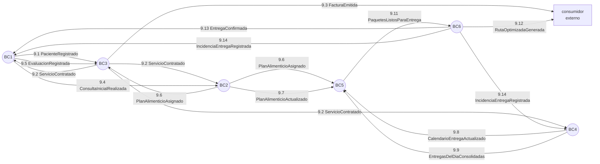

`OrdenProduccionGenerada` (9.10) no aparece en el mapa porque no cruza ninguna frontera: es interno de BC5 y su consumidor es la cocina a través de la propia API de BC5.

### 9.1 `PacienteRegistrado` — BC1 → BC3

| Campo | Tipo | Notas |
|---|---|---|
| `pacienteId` | guid | |
| `nombre` | string | Nombre completo |
| `nroIdentificacion` | string | Único en el sistema |
| `contacto` | `Contacto` | Objeto anidado |

### 9.2 `ServicioContratado` — BC3 → BC1, BC2, BC4

| Campo | Tipo | Notas |
|---|---|---|
| `contratoId` | guid | |
| `pacienteId` | guid | |
| `pacienteNombre` | string | Evita que BC4 tenga que consultar a BC1 para la etiqueta |
| `nroIdentificacion` | string | Idem, requerido por RN-12 |
| `tipoServicio` | `TipoServicio` | |
| `duracionDias` | int? | Solo con `CATERING`: 15 o 30. Nulo en los demás |
| `fechaInicio` | date | **Obligatorio, nunca nulo.** BC4 no puede crear el calendario sin él |

**Reacción de cada consumidor.** BC1 con `EVALUACION` habilita la consulta inicial, y con `CATERING` registra la vigencia del catering del paciente. BC2 con `ASESORAMIENTO` habilita la creación del plan. BC4 con `CATERING` crea el calendario de entregas, **rechazando el evento si el paciente ya tiene un calendario vigente** (RN-19) o si no tiene dirección por defecto en su libreta (RN-24).

### 9.3 `FacturaEmitida` — BC3 → (consumidor externo)

| Campo | Tipo | Notas |
|---|---|---|
| `facturaId` | guid | |
| `pacienteId` | guid | |
| `origen` | `OrigenFactura` | |
| `referenciaId` | guid | `contratoId` o `controlId` según el origen |
| `monto` | decimal | |
| `moneda` | string | `BOB` o `USD` |
| `fecha` | date | |

### 9.4 `ConsultaInicialRealizada` — BC1 → BC2

| Campo | Tipo |
|---|---|
| `pacienteId` | guid |
| `fecha` | date |
| `diagnosticoResumen` | string |
| `nutricionistaId` | guid |

### 9.5 `EvaluacionRegistrada` — BC1 → BC3

| Campo | Tipo | Notas |
|---|---|---|
| `pacienteId` | guid | |
| `evaluacionId` | guid | Clave de idempotencia: un control adicional por evaluación |
| `fecha` | date | |
| `tipo` | `TipoEvaluacion` | |

BC3 genera el `ControlAdicional` cobrable solo si el paciente no tiene catering activo en esa fecha (RN-06).

### 9.6 `PlanAlimenticioAsignado` — BC2 → BC3, BC5

Se publica **al activar** el plan, no al crearlo.

| Campo | Tipo | Notas |
|---|---|---|
| `planId` | guid | |
| `pacienteId` | guid | |
| `fechaInicio` | date | |
| `duracionDias` | int | 15 o 30 (RN-01). BC3 deriva de aquí la vigencia del catering |
| `detalle` | `DiaDetalle[]` | Detalle completo del plan |

**`DiaDetalle`**

| Campo | Tipo | Notas |
|---|---|---|
| `dia` | date | **Fecha absoluta**, no número relativo |
| `tiempos` | `TiempoDetalle[]` | |

**`TiempoDetalle`**

| Campo | Tipo |
|---|---|
| `tipo` | `TipoComida` |
| `orden` | int |
| `recetas` | `RecetaDetalle[]` |

**`RecetaDetalle`**

| Campo | Tipo |
|---|---|
| `recetaId` | guid |
| `nombreReceta` | string |
| `cantidad` | decimal |
| `unidad` | string |

La estructura conserva los **tres niveles** (día → tiempo de comida → receta) y usa **fechas absolutas**. BC5 cruza el plan contra el calendario del día D, que también trabaja con fechas absolutas; aplanar la estructura o usar días relativos obligaría a BC5 a recalcular el offset contra la fecha de inicio del plan, y perdería el tiempo de comida, que la etiqueta y el armado de paquetes necesitan.

**Reacción de cada consumidor.** BC3 deriva de `fechaInicio` y `duracionDias` la vigencia del futuro contrato de catering. BC5 guarda una réplica local del detalle para consolidar la orden de producción.

### 9.7 `PlanAlimenticioActualizado` — BC2 → BC5

| Campo | Tipo | Notas |
|---|---|---|
| `planId` | guid | |
| `pacienteId` | guid | |
| `diasModificados` | `DiaDetalle[]` | Misma estructura que en `PlanAlimenticioAsignado` |

Solo se pueden ajustar días con fecha mayor o igual a hoy + 2, en coherencia con RN-09.

### 9.8 `CalendarioEntregaActualizado` — BC4 → BC5

| Campo | Tipo | Notas |
|---|---|---|
| `calendarioId` | guid | |
| `pacienteId` | guid | |
| `dia` | date | Día afectado |
| `direccionEntrega` | `DireccionGeo`? | Nulo si el cambio es marcar no-entrega |
| `noEntrega` | bool | |
| `tipoCambio` | `TipoCambioCalendario` | |

BC5 solo recalcula si el día todavía no está congelado.

### 9.9 `EntregasDelDiaConsolidadas` — BC4 → BC5

Se emite al consolidar el día ya congelado. Es el disparador de la orden de producción.

| Campo | Tipo |
|---|---|
| `fecha` | date |
| `entregas` | `EntregaConsolidada[]` |

**`EntregaConsolidada`**

| Campo | Tipo | Notas |
|---|---|---|
| `pacienteId` | guid | |
| `pacienteNombre` | string | Requerido por RN-12 |
| `nroIdentificacion` | string | Requerido por RN-12 |
| `direccionEntrega` | `DireccionGeo` | Coordenadas ya resueltas por BC4 |
| `contratoCateringId` | guid | |

Los días marcados como no-entrega quedan **excluidos** del consolidado. No existe el caso de un día sin dirección asignada: RN-24 bloquea la creación del calendario en el origen si el paciente no tiene una dirección por defecto, así que todo día de `CalendarioEntrega` nace con una dirección válida y la conserva siempre.

### 9.10 `OrdenProduccionGenerada` — BC5 (interno / cocina)

| Campo | Tipo |
|---|---|
| `ordenId` | guid |
| `fecha` | date |
| `lineas` | `LineaProduccion[]` |

**`LineaProduccion`**

| Campo | Tipo | Notas |
|---|---|---|
| `recetaId` | guid | |
| `nombreReceta` | string | La cocina trabaja con nombres, no con guids |
| `cantidadTotal` | decimal | Suma de porciones de esa receta para el día |
| `unidad` | string | |

### 9.11 `PaquetesListosParaEntrega` — BC5 → BC6

| Campo | Tipo |
|---|---|
| `fecha` | date |
| `paquetes` | `PaqueteListo[]` |

**`PaqueteListo`**

| Campo | Tipo | Notas |
|---|---|---|
| `paqueteId` | guid | Identificador de tracking (RN-17) |
| `pacienteId` | guid | |
| `pacienteNombre` | string | |
| `direccionEntrega` | `DireccionGeo` | |
| `contratoCateringId` | guid | Obligatorio: BC6 lo devuelve a BC4 en la incidencia |
| `etiqueta` | `Etiqueta` | Objeto estructurado |

**`Etiqueta`**

| Campo | Tipo | Notas |
|---|---|---|
| `paqueteId` | guid | |
| `nombrePaciente` | string | |
| `nroIdentificacion` | string | |
| `direccionEntrega` | `DireccionGeo` | |
| `fecha` | date | |
| `codigoQR` | string? | |

La etiqueta viaja como **objeto estructurado, no como texto**. RN-12 exige que la etiqueta lleve datos identificables por campo; serializarla como una sola cadena impediría que BC6 los use para mostrar, buscar o auditar.

### 9.12 `RutaOptimizadaGenerada` — BC6 → (consumidor externo)

| Campo | Tipo |
|---|---|
| `rutaId` | guid |
| `repartidorId` | guid |
| `fecha` | date |
| `paradas` | `ParadaOrdenada[]` |

**`ParadaOrdenada`**

| Campo | Tipo |
|---|---|
| `paradaId` | guid |
| `orden` | int |
| `paqueteId` | guid |
| `pacienteId` | guid |
| `pacienteNombre` | string |
| `direccionEntrega` | `DireccionGeo` |

### 9.13 `EntregaConfirmada` — BC6 → BC1

| Campo | Tipo |
|---|---|
| `rutaId` | guid |
| `paradaId` | guid |
| `paqueteId` | guid |
| `pacienteId` | guid |
| `pacienteNombre` | string |
| `constancia` | `Constancia` |

**`Constancia`**

| Campo | Tipo | Notas |
|---|---|---|
| `tipo` | `TipoConstancia` | |
| `urlEvidencia` | string | Archivo real subido, servido como estático |
| `receptorNombre` | string | Quién recibió el paquete |
| `fechaHora` | datetime | |
| `coordenadasConfirmacion` | `{latitud, longitud}`? | Dónde se confirmó físicamente la entrega. El campo debe existir en el DTO del consumidor (BC1) aunque su valor sea opcional. |

### 9.14 `IncidenciaEntregaRegistrada` — BC6 → BC1, BC4

| Campo | Tipo | Notas |
|---|---|---|
| `rutaId` | guid | |
| `paradaId` | guid | Clave de idempotencia para el conteo de BC4 |
| `paqueteId` | guid | |
| `pacienteId` | guid | |
| `pacienteNombre` | string | |
| `contratoCateringId` | guid | Se transporta tal como llegó en `PaquetesListosParaEntrega`; BC6 nunca lo resuelve consultando a otro microservicio |
| `motivo` | `MotivoIncidencia` | |
| `descripcion` | string | |
| `fechaHora` | datetime | |
| `urlFoto` | string? | Evidencia fotográfica opcional de la incidencia. El campo debe existir en el DTO de ambos consumidores (BC1 y BC4) aunque su valor sea opcional. |

BC6 **propaga `pacienteId`** hasta la parada de entrega. Correlacionar por nombre es frágil: dos pacientes pueden llamarse igual y BC1/BC4 necesitan una clave estable para imputar la incidencia al historial y al contrato correctos. `pacienteNombre` se conserva únicamente para presentación.

BC4 aplica RN-23 solo si el `motivo` es imputable a la empresa.

### 9.15 Matriz de integración

| Evento | Publica | Consume | Clave de idempotencia | RN que sostiene |
|---|---|---|---|---|
| `PacienteRegistrado` | BC1 | BC3 | `pacienteId` | RN-05 |
| `ConsultaInicialRealizada` | BC1 | BC2 | `pacienteId` | RN-02 |
| `EvaluacionRegistrada` | BC1 | BC3 | `evaluacionId` | RN-04, RN-06 |
| `PlanAlimenticioAsignado` | BC2 | BC3, BC5 | `planId` + `dia` | RN-01, RN-01b, RN-07 |
| `PlanAlimenticioActualizado` | BC2 | BC5 | `planId` + `dia` | RN-07, RN-09 |
| `ServicioContratado` | BC3 | BC1, BC2, BC4 | `contratoId` | RN-03, RN-05, RN-24 |
| `FacturaEmitida` | BC3 | — (externo) | — | RN-05, RN-18 |
| `CalendarioEntregaActualizado` | BC4 | BC5 | `calendarioId` + `dia` | RN-08, RN-09 |
| `EntregasDelDiaConsolidadas` | BC4 | BC5 | `fecha` | RN-10, RN-11 |
| `OrdenProduccionGenerada` | BC5 | — (interno) | — | RN-11 |
| `PaquetesListosParaEntrega` | BC5 | BC6 | `paqueteId` | RN-12, RN-13, RN-17 |
| `RutaOptimizadaGenerada` | BC6 | — (externo) | — | RN-13, RN-15 |
| `EntregaConfirmada` | BC6 | BC1 | `paradaId` | RN-16 |
| `IncidenciaEntregaRegistrada` | BC6 | BC1, BC4 | `paradaId` | RN-16, RN-21, RN-23 |

**La clave de esta tabla es la del evento, no la de cada consumidor.** Identifica de forma única una emisión, que es lo que el publicador garantiza. **Un evento con varios consumidores tiene tantas unidades de idempotencia como consumidores**, porque cada uno decide qué significa «ya lo procesé» según lo que guarda: BC3 aplica `ServicioContratado` sobre `pacienteId + planId` porque su réplica es del paciente, no del contrato; BC5 indexa `PlanAlimenticioAsignado` por `(pacienteId, fecha)` porque su réplica se consulta por día de producción. **Cada consumidor declara su clave efectiva en el §9 de su `DESIGN.md`, y esa declaración es la vinculante para su tabla de procesados.** Lo que esta columna sí obliga es que reprocesar la misma emisión no duplique efecto en ninguno de ellos.

---

## 10. Base de comunicación entre microservicios

Los seis microservicios publican eventos **solo in-process, con MediatR (`IPublisher`)**. No hay bus de mensajería; la comunicación real entre procesos es una fase posterior. Este diseño deja preparado el punto de corte para que esa migración no toque el dominio ni la aplicación.

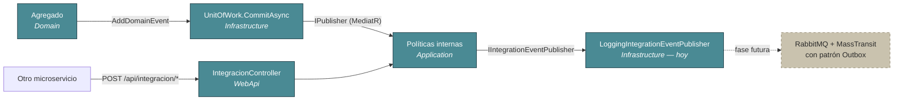

### 10.1 Domain events dentro de cada microservicio
 Los agregados registran sus eventos con `AddDomainEvent`; al confirmar el `UnitOfWork`, se publican vía MediatR y los handlers internos reaccionan en el mismo proceso.

### 10.2 Eventos de integración como contratos explícitos
 Cada microservicio declara en `Application/IntegrationEvents/` los records de los eventos que publica y consume, con los nombres y tipos exactos de §9, aunque hoy nadie los transporte entre procesos.

### 10.3 Puerto de salida `IIntegrationEventPublisher`
 Vive en la capa Application. Su única implementación actual es `LoggingIntegrationEventPublisher`, que serializa el evento a JSON y lo registra en el log. Los handlers de dominio que cruzarían una frontera de contexto llaman a este puerto.

### 10.4 Simulación de entrada por endpoint
 Donde un microservicio depende de un evento externo, expone un endpoint bajo `POST /api/integracion/*` cuyo cuerpo es **exactamente** el contrato del evento de §9. Esto permite ejecutar la demo de punta a punta manualmente.

| Microservicio | Endpoints de integración entrante |
|---|---|
| `ms-pacientes` | `POST /api/integracion/servicio-contratado`, `POST /api/integracion/entrega-confirmada`, `POST /api/integracion/incidencia-entrega-registrada` |
| `ms-plan-nutricional` | `POST /api/integracion/consulta-inicial-realizada`, `POST /api/integracion/servicio-contratado` |
| `ms-contratos-facturacion` | `POST /api/integracion/paciente-registrado`, `POST /api/integracion/plan-asignado`, `POST /api/integracion/evaluacion-registrada` |
| `ms-catering` | `POST /api/integracion/servicio-contratado`, `POST /api/integracion/incidencia-entrega-registrada` |
| `ms-produccion-alimentos` | `POST /api/integracion/plan-asignado`, `POST /api/integracion/plan-actualizado`, `POST /api/integracion/entregas-consolidadas`, `POST /api/integracion/calendario-actualizado` |
| `ms-logistica-entrega` | `POST /api/integracion/paquetes-listos` |

### 10.5 Idempotencia obligatoria
 Todos los endpoints `/api/integracion/*` de los seis microservicios son idempotentes: procesar el mismo evento dos veces no duplica ni corrompe estado. Las claves están en la última columna de §9.15.

Cuando la operación es absoluta y determinista (habilitar una capacidad, fijar una vigencia), la idempotencia se logra sin detectar el duplicado, porque reprocesar deja el mismo estado (*last-write-wins*).

### 10.6 Camino de evolución
 Sustituir `LoggingIntegrationEventPublisher` por una implementación sobre RabbitMQ/MassTransit con patrón Outbox para garantizar atomicidad, y reemplazar los endpoints de simulación por consumers. Ni el dominio ni la aplicación cambian: ese es exactamente el punto de haber declarado el puerto en Application.

---

## 11. Stack técnico

| Elemento | Decisión |
|---|---|
| Plataforma | **.NET 10** (`TargetFramework: net10.0`) en los seis microservicios |
| Núcleo DDD | **`Joseco.DDD.Core` 1.0.2** (`net8.0`, consumible desde net10 sin cambios) |
| Arquitectura | **Clean Architecture**: `Domain ← Application ← Infrastructure ← WebApi`. La regla de dependencias apunta siempre hacia el dominio |
| Patrón de aplicación | **CQRS con MediatR** 12.5.0: una carpeta por caso de uso con su Command y su Handler. **La versión se pinea** — 13.0.0 en adelante exige licencia comercial y emite un aviso en cada `dotnet build`; 12.5.0 es la última bajo MIT y es además la rama que acompaña a `MediatR.Contracts` 2.0.1, de la que depende `Joseco.DDD.Core` 1.0.2. El proyecto no usa ninguna capacidad exclusiva de 13/14 (INC-S3) |
| Persistencia | **EF Core** 10.x con `Npgsql.EntityFrameworkCore.PostgreSQL` 10.x |
| Base de datos | **PostgreSQL 16**, una base de datos por microservicio |
| API | ASP.NET Core Web API con Swagger/OpenAPI (Swashbuckle 10.x) |
| Pruebas | **xUnit** 2.9 con `Assert` de xUnit · cobertura con `coverlet.collector` + ReportGenerator · integración con `Microsoft.AspNetCore.Mvc.Testing` + `Testcontainers.PostgreSql` · contrato con **PactNet 5** (message pacts). Ver §13 |
| Contenedores | **Solo PostgreSQL se contenedoriza.** Los microservicios corren localmente con `dotnet run`. Ninguno lleva `Dockerfile` propio en esta fase |

### 11.1 Arquitectura de referencia de un microservicio

Los seis repositorios tienen exactamente esta forma. Las flechas son referencias de proyecto y **nunca apuntan hacia afuera del dominio**.

```mermaid
flowchart RL
    subgraph WEBAPI["<b>WebApi</b> — adaptador de entrada"]
        CTRL["Controllers finos"]
        MID["Middleware de excepciones"]
        PROG["Program.cs · composition root"]
    end
    subgraph INFRA["<b>Infrastructure</b> — adaptadores de salida"]
        DBC["DbContext + Configurations"]
        REPO["Repositorios"]
        UOW["UnitOfWork"]
        QRY["Queries/ · handlers de lectura"]
        PUB["LoggingIntegrationEventPublisher"]
    end
    subgraph APP["<b>Application</b> — casos de uso"]
        CMD["Commands + Handlers"]
        QRC["Queries (records)"]
        POL["Policies · reaccionan a eventos de dominio"]
        IE["IntegrationEvents/ · contratos"]
        PORT["Puertos: IRepository&lt;T&gt;, IUnitOfWork,<br/>IIntegrationEventPublisher"]
    end
    subgraph DOM["<b>Domain</b> — el modelo"]
        AR["Aggregate Roots"]
        ENT["Entidades"]
        VO["Value Objects"]
        DE["Domain Events"]
        ERR["Errors catalogados"]
    end

    WEBAPI --> APP
    INFRA --> APP
    APP --> DOM

    classDef dom fill:#1f4e5f,stroke:#0d2b35,color:#fff
    classDef app fill:#4a8a94,stroke:#0d2b35,color:#fff
    classDef inf fill:#8ab0b5,stroke:#0d2b35,color:#12333d
    classDef web fill:#c9c2ae,stroke:#8a7f66,color:#2b2b2b
    class AR,ENT,VO,DE,ERR dom
    class CMD,QRC,POL,IE,PORT app
    class DBC,REPO,UOW,QRY,PUB inf
    class CTRL,MID,PROG web
```

**Paquetes por capa.** `Domain` referencia únicamente `Joseco.DDD.Core` — nada de EF Core, HTTP ni MediatR, con la sola excepción de los `record : DomainEvent`, que son parte del contrato del dominio. `Application` añade `MediatR`. `Infrastructure` añade `Microsoft.EntityFrameworkCore` y `Npgsql.EntityFrameworkCore.PostgreSQL`. `WebApi` añade `Swashbuckle.AspNetCore`.

**Qué aporta `Joseco.DDD.Core`:** `AggregateRoot`, `Entity`, `DomainEvent`, `IRepository<T>`, `IUnitOfWork` y el par `Result` / `Error` con su `DomainException`.

**La única excepción a «una capa, una responsabilidad».** Los handlers de las queries viven en `Infrastructure/Queries/`, no en `Application`, porque necesitan LINQ y EF Core directos. El `record` de la query sí vive en `Application`. Es una desviación consciente del reparto canónico, justificada en §12.8.

---

## 12. Convenciones técnicas transversales

Aplican por igual a los seis microservicios. Cada `DESIGN.md` las referencia; ninguno las redefine.

### 12.1 Manejo de errores

Todos los agregados lanzan **`DomainException(Error)`**, nunca excepciones nativas de .NET. Cada microservicio incluye un **middleware de excepciones** que traduce el `Error.Type` a un código HTTP una sola vez, en lugar de repetir la comprobación del resultado en cada controller.

| `ErrorType` | HTTP | Uso |
|---|---|---|
| `Validation` / `Failure` | 400 | Invariante de dominio violada, dato de entrada inválido |
| `NotFound` | 404 | Recurso referenciado inexistente |
| `Conflict` | 409 | Conflicto de unicidad o de estado |
| `Problem` | 422 | Regla de negocio de orden superior (uso puntual) |

El middleware captura **`DomainException`** y, como **única excepción documentada**, `ArgumentException`, que traduce a 400 con el mismo formato `{codigo, mensaje}`. No hay catch-all: cualquier otra excepción cae al manejo por defecto de ASP.NET Core. Si una ruta de código puede fallar por algo que no es una invariante de negocio, igualmente debe lanzar `DomainException(Error)`.

**Por qué existe la rama de `ArgumentException`.** `Joseco.DDD.Core.Abstractions.Entity(Guid id)` lanza `ArgumentException` cuando recibe `Guid.Empty`, y el paquete no se puede modificar. Sin esa rama, un identificador vacío atraviesa el contrato de errores del sistema y sale como **HTTP 500 sin cuerpo**, en los seis microservicios por igual. Es una red de seguridad para lo que viene del núcleo, no una licencia para dejar de lanzar `DomainException` desde el código propio (INC-S2).

### 12.1.1 Excepciones nativas de .NET

Ninguna ruta de código propia produce una excepción nativa que llegue al cliente. Tres reglas:

1. **Nunca `Parse`, siempre `TryParse`.** Toda conversión de texto a enum, número, `Guid`, `DateOnly` o `DateTime` —binding de un DTO, mapeo de un evento de integración entrante, lectura de configuración— usa `TryParse`. `Enum.Parse<T>(...)` sin guarda es la forma más frecuente de este fallo: un valor desconocido lanza `ArgumentException` y el endpoint devuelve **500** donde debía devolver 400.
2. **La conversión fallida lanza `DomainException` con código de catálogo**, no una excepción genérica ni un `null` silencioso.
3. **Por construcción, ningún `Guid` externo llega al constructor de un agregado.** Los identificadores se generan con `Guid.NewGuid()` dentro de los factories, y los DTO validan el `Guid` antes de construir el command.

```csharp
if (!Enum.TryParse<TipoComida>(valor, ignoreCase: true, out var tipo))
    throw new DomainException(new Error(
        "O13_TIEMPO_COMIDA_DESCONOCIDO",
        $"El tiempo de comida '{valor}' no es valido",
        ErrorType.Validation));
```

Un 500 en un endpoint de integración es peor que un 400: el emisor lo interpreta como fallo transitorio y reintenta indefinidamente un evento que nunca va a entrar (INC-S9).

### 12.1.2 Errores múltiples y `ValidationError`

`ValidationError` hereda de `Error` fijando `code = "Validation.General"` y guarda los errores originales en su propiedad `Errors`. Devolverlo tal cual a la API hace que el cliente reciba `Validation.General` en vez del código del catálogo de §13 —`P8_PACIENTE_INACTIVO` y compañía— y la trazabilidad se pierde justo donde más se usa.

**Regla:** `ValidationError.FromResults(...)` se usa **solo dentro de `Application`**, para agrupar varios fallos de una misma petición. Al cruzar a la API, el middleware devuelve el array `Errors` con sus códigos originales, nunca el envoltorio:

```json
{ "errores": [ {"codigo":"C15_SERVICIO_NOMBRE_REQUERIDO","mensaje":"..."},
               {"codigo":"C18_MONEY_MONEDA_INVALIDA","mensaje":"..."} ] }
```

Una respuesta de error único conserva la forma `{codigo, mensaje}`.

**Hoy ninguno de los seis microservicios agrupa errores**, así que la forma `{codigo, mensaje}` es la única que sus APIs emiten, y así lo declara el §11 de cada `DESIGN.md`. Esta subsección fija **por adelantado** cuál es la forma correcta el día que un handler agrupe —para que no se invente entonces— y prohíbe la alternativa incorrecta, que es devolver el envoltorio `Validation.General` y perder los códigos del catálogo. Un microservicio que empiece a agrupar debe añadir la segunda forma a su §11 y un test de contrato que la cubra (INC-S6).

**`ErrorType` según quién lo produce, no según el nombre del código.** El dominio nunca sabe si un dato faltante es culpa de quien llama o un problema interno, así que `Domain` solo usa `Validation` y `Conflict`. `Application` añade `NotFound` cuando el dato faltante vino de un identificador que el cliente HTTP proporcionó, y `Failure` cuando es una referencia interna que el sistema debería garantizar.

**Cuando un método del agregado recibe el id de una entidad hija y no la encuentra dentro de sus propios límites** —por ejemplo, `LibretaDirecciones.MarcarPorDefecto(direccionId)` con un id que no está entre sus direcciones, o `PlanAlimenticio.PersonalizarDia(dia)` con una fecha que el plan no tiene— **no** es una búsqueda de repositorio: es una precondición del comando sobre el agregado, así que el código de error correspondiente se lanza desde `Domain` con `ErrorType.Validation`, nunca `NotFound`. `NotFound` queda reservado para cuando `Application` busca la **raíz del agregado** por repositorio y no la encuentra, o para consultas de solo lectura sobre un recurso puntual.

**El mismo código de error puede tener `ErrorType` distinto según quién lo lanza.** Un código `DIA_NO_ENCONTRADO` es `Validation` cuando lo lanza un comando sobre el agregado (`PersonalizarDia`) y `NotFound` cuando lo lanza una query de lectura pura sobre un día puntual. Esto se decide explícitamente para cada uso; nunca se copia del `ErrorType` de un código "parecido" declarado antes en el mismo catálogo — reutilizar el tipo sin evaluar el contexto produce el HTTP equivocado, y un comando que viola una precondición de negocio devolvería 404 en vez de 400.

**Nomenclatura de códigos de error:** `<INVARIANTE>_<SLUG_EN_MAYUSCULAS>`, por ejemplo `K3_FUERA_DE_VENTANA`, `C6_ESTADO_FACTURA_INVALIDO`, `O5_LINEAS_INCOMPLETAS`, `P7_QUINCENAL_REQUIERE_CATERING`. El mensaje va en español y debe ser accionable: cuando la regla depende de una fecha límite, el mensaje la incluye.

**Errores catalogados que no lanza el dominio.** Es válido que un `*Errors` declare errores que solo se lanzan desde handlers de Application (validaciones que cruzan agregados o repositorios). Que un error esté catalogado en el dominio **no** significa que el agregado lo garantice; cada `DESIGN.md` debe decir explícitamente dónde vive cada invariante.

### 12.2 Colecciones dentro de un agregado

Campo privado `_items` + propiedad pública `IReadOnlyCollection<T>` + configuración EF Core con `builder.HasMany(typeof(TEntity), "_items")`. Nunca `HasMany(x => x.Items)`, que exigiría exponer un setter público y rompería el encapsulamiento.

**Hay que ignorar además la propiedad pública:** `builder.Ignore(x => x.Items)`. EF Core descubre `Items` por convención y le asigna `_items` como backing field, de modo que la navegación explícita por string choca con ella y el modelo falla en tiempo de diseño. Aplica a `CalendarioEntrega.diasEntrega`, `LibretaDirecciones.direcciones`, `PlanAlimenticio.diasPlan`, `PlanAlimentario.dias`, `Factura.lineas`, `OrdenProduccion.lineas` y `.paquetes`, `RutaEntrega.paradas`, `Evaluacion.analisis` y `Paciente.entregas`.

### 12.3 Value Objects

- **VO de un solo valor** (IDs tipados, cantidades, enums): `ValueConverter` directo a una columna.
- **VO de varios campos** (`Money`, `Contacto`, `DireccionGeo` + `Coordenadas`, `Anamnesis`, `MedidasAntropometricas`, `ComposicionCorporal`, `Vigencia`, `Pago`, `ConstanciaEntrega`, `IncidenciaEntrega`): `OwnsOne`. `Money` siempre tiene monto y moneda: dos columnas, nunca una sola, y valida la moneda contra la lista cerrada de §8.
- **VO opcionales** (`ConstanciaEntrega` e `IncidenciaEntrega` en `ParadaEntrega`, ambos 0..1): sin configuración especial. EF Core trata una fila con todas las columnas del owned type en `null` como "sin instancia".

**Regla crítica de owned types.** Una instancia de un owned type **no puede compartirse entre dos dueños**. Asignar la misma referencia de VO a dos entidades hijas distintas, o reasignar el VO de una entidad existente a otra, corrompe silenciosamente el `SaveChanges`: las columnas quedan en `null` para todos los dueños menos uno, y el error no aparece hasta que PostgreSQL rechaza el `NOT NULL`. Ningún test unitario en memoria lo detecta.

**Mitigación obligatoria:** todo VO de varios campos expone un método `Clonar()` que hace copia profunda, incluidos sus VO anidados. Cuando un VO pasa a pertenecer a un nuevo dueño (constructor de la entidad o método que lo reasigna), se clona primero.

**Excepción — VO inmutable mapeado con `OwnsMany(...).ToJson()`.** La regla crítica protege el tracking relacional de `OwnsOne`/`OwnsMany` sobre columnas propias, donde el `ChangeTracker` asocia cada instancia de owned type con una fila y no admite que la misma instancia pertenezca a dos padres. Ese riesgo **no existe** cuando el VO es un `record` inmutable mapeado con `OwnsMany(...).ToJson()` (§12.4): ese mapeo no trackea instancias como filas propias, sino que serializa el árbol completo a una única columna `jsonb` por dueño en cada `SaveChanges`. Dos dueños que retienen la misma instancia CLR no compiten por ninguna fila compartida, porque no hay fila: cada uno serializa su propia copia de valores en su propia columna. Para este caso, `Clonar()` no es necesario y no se implementa. Caso real: `TiempoComida` y `RecetaAsignada` de `ms-plan-nutricional` se comparten por referencia entre `DiaPlantilla` y `DiaPlan` al copiar una plantilla a un plan, sin `Clonar()` (INC-1, cerrada — ver `ms-plan-nutricional/docs/INCOHERENCIAS.md` y `docs/DESIGN.md` §5.4 de ese microservicio). La excepción aplica únicamente a VOs **inmutables** mapeados de esta forma; un VO mutable, o uno de la lista de `OwnsOne` de arriba, sigue exigiendo `Clonar()`.

### 12.4 Estructuras profundamente anidadas

Donde el modelo anida tres niveles (`PlanAlimenticio` / `PlanAlimentario` → Día → TiempoComida → RecetaAsignada) o contiene una colección de VO dentro de una entidad hija (`Paquete.contenido`), se mapea con **`OwnsMany(...).ToJson()`**, que Npgsql traduce a una columna `jsonb` nativa de PostgreSQL. Ese detalle siempre se lee y escribe completo y nunca se consulta suelto, de modo que replicar tablas relacionales por cada nivel solo añadiría migraciones frágiles y tracking pesado.

Dentro de un `OwnsMany(...).ToJson()` se usa siempre **`HasJsonPropertyName(...)`, nunca `HasColumnName(...)`**.

### 12.5 Claves primarias e índices

**`ValueGeneratedNever()` es obligatorio en toda clave primaria `Guid` generada por el cliente**, que es el caso de todos los agregados y entidades hijas del sistema. Sin esto, EF Core puede tratar una entidad hija nueva agregada a la colección de un agregado ya trackeado como `Modified` en vez de `Added`, y lanza `DbUpdateConcurrencyException` por un `UPDATE` que afecta cero filas.

**Índice único filtrado como respaldo físico.** Toda invariante del tipo "máximo un X activo por paciente" (RN-19, que aplica en BC2 al plan y en BC3 al contrato) se valida en el handler **y además** se respalda con un índice único filtrado en base de datos, del estilo `HasIndex(...).IsUnique().HasFilter("estado = 'ACTIVO'")`. La validación en el handler da el mensaje de error correcto; el índice cubre la condición de carrera entre dos operaciones concurrentes.

**Excepción — BC4 y el calendario de entrega.** El índice único filtrado exige un predicado inmutable evaluado por fila, del tipo `estado = 'ACTIVO'` sobre una columna de estado. `CalendarioEntrega` no tiene esa columna: "vigente" se define como `hoy <= MAX(dias_entrega.fecha)`, una comparación contra la fecha actual y un agregado sobre la tabla hija, no expresable como filtro estático de un índice parcial de Postgres. BC4 respalda la unicidad del calendario vigente por paciente con un índice plano (no único) sobre `pacienteId`, que solo acelera la consulta; la unicidad real la garantiza el handler evaluando la vigencia en memoria contra esos calendarios.

**Defensa en profundidad entre contextos.** Que un contexto upstream ya valide una regla no exime al downstream de validarla. BC3 no emite un contrato de catering si el paciente tiene otro activo, y aun así BC4 comprueba por su cuenta que el paciente no tenga un calendario vigente antes de crear uno nuevo. Un microservicio nunca asume que el evento que recibe es válido: es la misma razón por la que todos los endpoints de integración son idempotentes.

**IDs tipados en consultas LINQ: comparar el tipo completo, nunca su `.Value`.** Con un id tipado (`PacienteId`, `EvaluacionId`, etc.) mapeado con `HasConversion(id => id.Value, value => TipoId.From(value))`, una consulta que compara `entidad.Id.Value == guidSuelto` dentro de un `Where` lanza `InvalidOperationException` en tiempo de ejecución («could not be translated»): el `ValueConverter` está registrado sobre el tipo completo, no sobre el acceso a `.Value` después de la conversión. La forma correcta es comparar el id tipado completo contra otro id tipado completo: `entidad.Id == TipoId.From(guidSuelto)`. Este error **no aparece al compilar ni en tests con repositorios fake** (§13.2): solo se manifiesta ejecutando la query contra una base de datos real, por lo que los endpoints de lectura se cubren con los tests de integración de §13.4, que corren contra PostgreSQL real.

### 12.6 Unidad de trabajo y eventos de dominio

`UnitOfWork.CommitAsync` recorre el `ChangeTracker`, recoge los `DomainEvents` de las entidades, los limpia y **los publica por MediatR antes de `SaveChangesAsync`**. Las políticas que reaccionan mutan entidades ya trackeadas por el mismo `DbContext`, de modo que sus cambios entran en el mismo `SaveChanges`.

**Consecuencia a tener presente:** una política que necesite que los datos **ya estén persistidos** —por ejemplo, consultar algo recién guardado— no funcionará con este orden. Si aparece esa necesidad, la solución no es reordenar el commit, sino mover el efecto a un handler posterior o al patrón Outbox de la fase futura.

### 12.7 Repositorios

`IRepository<T>` del núcleo solo define `GetByIdAsync` y `AddAsync`. Cualquier invariante que cruce agregados —unicidad, "máximo 1 activo por paciente", búsqueda por un identificador que no es el propio— exige un método adicional declarado explícitamente en la interfaz específica del microservicio, por ejemplo `ICalendarioEntregaRepository.GetByContratoIdAsync` o `IPlanRepository.ExisteActivoParaPacienteAsync`. No se declaran dos métodos distintos con la misma firma semántica y el mismo comportamiento: antes de añadir un método, se revisa si ya existe uno que resuelve la misma pregunta.

### 12.8 CQRS y lectura

- Una **carpeta por caso de uso** en `Application`, con el Command y su Handler juntos.
- **Las queries son la excepción a la regla anterior:** el `record` de la query vive en `Application`, pero su `IRequestHandler` vive en **`Infrastructure/Queries/`**, porque necesita LINQ y EF Core directos. Poner ese handler en `Application` obligaría a que la capa de casos de uso conociera EF Core, que es exactamente lo que la regla de dependencias prohíbe.
- Toda consulta de lectura usa `AsNoTracking()`.
- La API devuelve **DTOs**, nunca entidades de dominio.

### 12.9 Read models de integración

Un microservicio que necesita datos de otro contexto mantiene una **réplica local de solo lectura**, alimentada exclusivamente por eventos de integración y actualizada por upsert idempotente. Nunca consulta al microservicio de origen.

| Microservicio | Read model | Alimentado por |
|---|---|---|
| `ms-plan-nutricional` | `PacienteHabilitado` | `ConsultaInicialRealizada`, `ServicioContratado` |
| `ms-contratos-facturacion` | `PacienteConocido` | `PacienteRegistrado`, `PlanAlimenticioAsignado` |
| `ms-produccion-alimentos` | `PlanPacienteReplica` | `PlanAlimenticioAsignado`, `PlanAlimenticioActualizado` |
| `ms-logistica-entrega` | `PaqueteRecibido` | `PaquetesListosParaEntrega` |

Un read model **no es un agregado**: vive entre `Application` e `Infrastructure`, no tiene invariantes de dominio propias y su corrección depende enteramente de la idempotencia del evento que lo alimenta.

### 12.10 Convenciones de API

Los controllers son **finos**: arman el command o la query, lo envían por MediatR y devuelven el resultado. Nunca contienen lógica de negocio ni comprobaciones repetidas del resultado, que ya resuelve el middleware.

El happy path devuelve siempre **200 OK, incluidos los POST de creación**. No se usan `201 Created`, `204 NoContent` ni otros 2xx: se prioriza una convención uniforme y simple sobre la semántica REST estricta, aplicada por igual en los seis microservicios.

Rutas en plural y en minúsculas: `api/pacientes`, `api/rutas`, `api/integracion`. No hay CORS configurado.

### 12.11 Serialización

- Enums como **string en mayúsculas**, nunca como ordinal. `JsonStringEnumConverter` se registra en **dos lugares independientes**: en `AddJsonOptions` de `Program.cs`, para el binding HTTP entrante, y en el `JsonSerializerOptions` propio de `LoggingIntegrationEventPublisher`, para el JSON del evento en el log. Sin el primero, un cuerpo como `{"tipo":"DESAYUNO"}` se rechaza con 400 antes de llegar al handler.
- Fechas de calendario como `DateOnly` serializado `YYYY-MM-DD`.
- Marcas temporales como `DateTime` en ISO-8601 **UTC**, con sufijo `Z`. `DomainEvent.OccuredOn` del núcleo usa `DateTime.Now` —hora local, `Kind = Local`, que serializa sin desplazamiento de zona—, así que **todo evento de integración fija `DateTime.UtcNow` explícitamente al construirse**, sin depender de la marca del evento de dominio. Detalle de escritura: el nombre es `OccuredOn`, con una sola `r`; `OccurredOn` no compila (INC-S4).
- Nombres de propiedad en **camelCase** sobre el cable.

### 12.12 Migraciones

Cada microservicio **aplica sus migraciones automáticamente al arrancar**, resolviendo el migrador desde un scope antes de configurar el pipeline HTTP. No hay un paso manual de `dotnet ef database update` en el flujo normal. La aplicación automática se limita al entorno de desarrollo.

---

## 13. Estrategia de pruebas

Desde el módulo 4 (Testing) se prueban **cuatro niveles**, cada uno con su herramienta, su proyecto de test y su criterio de cierre. El criterio común no cambia: se prueba lo que protege una regla de negocio, un contrato o un caso de idempotencia, y cada test es trazable a un código de `DESIGN.md` (invariante, error de §13 o flujo de §12).

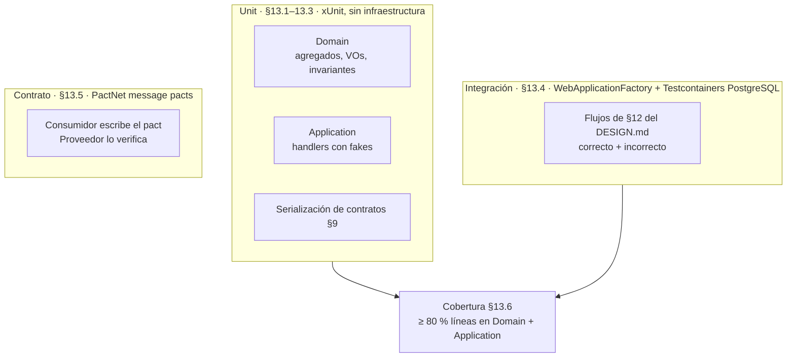

| Nivel | Proyecto de test | `Trait("Capa", …)` | Se ejecuta con |
|---|---|---|---|
| Unit (§13.1–13.3) | los existentes: `<Nombre>.Domain.Tests` y `<Nombre>.Application.Tests` (en BC1, `Pacientes.Tests`) | `Unit` | `dotnet test --filter Capa=Unit` |
| Integración (§13.4) | `<Nombre>.IntegrationTests` | `Integracion` (+ `Flujo`) | `dotnet test --filter Capa=Integracion` — requiere Docker |
| Contrato (§13.5) | `<Nombre>.ContractTests` | `Contrato` | `dotnet test --filter Capa=Contrato` |

**Aserciones con `Assert` de xUnit en los cuatro niveles.** FluentAssertions 8 pasó a licencia de Xceed y no se usa (INC-S38).

### 13.1 Domain — obligatorio

Tests unitarios puros, sin repositorio ni base de datos, sobre los agregados y los Value Objects. **Como mínimo un test por invariante declarada**, con su caso negativo y su caso positivo. El nombre del test cita el código de la invariante, de modo que una invariante sin test es visible por ausencia. Cada error se afirma por `Error.Code` **y** por `Error.Type`, exactamente como los declara el §13 del `DESIGN.md`.

### 13.2 Application — con fakes

Los command handlers, con repositorios *fake* en memoria. No se levanta PostgreSQL ni Testcontainers en este nivel. Se cubren con prioridad:

- Validaciones que cruzan agregados o requieren consultar un repositorio (unicidad, "máximo 1 activo por paciente").
- **Idempotencia de los endpoints de integración**: reprocesar el mismo evento no duplica el efecto.
- Políticas que reaccionan a eventos de dominio, cuando el efecto no está en el handler del comando.
- El camino feliz y **cada rama de error** de cada handler, afirmando en los fallos que no hubo efectos (repositorio sin cambios, sin commit).

### 13.3 Contratos de eventos — serialización

Por cada evento de integración de §9, un test liviano de serialización que verifique que el publicador serializa y el consumidor deserializa exactamente los campos documentados, **incluidos los opcionales**. No requiere PostgreSQL ni bus real: solo instanciar el DTO y comparar contra la tabla del evento en §9. Es la defensa **dentro** de cada repositorio; la defensa **entre** repositorios es §13.5.

### 13.4 Integración — por flujos, contra PostgreSQL real

Cierra el hueco que antes se aceptaba como el más importante: mapeos EF Core, índices, `jsonb`, IDs tipados en LINQ (§12.5), owned types compartidos (§12.3), binding de enums, rutas y la traducción `ErrorType` → HTTP del middleware.

- **Herramientas:** `Microsoft.AspNetCore.Mvc.Testing` (`WebApplicationFactory<Program>`) y `Testcontainers.PostgreSql` (imagen `postgres:16`). El contenedor lo levanta el test; **no** se usa `nur-tricenter-postgres`.
- **Aislamiento:** un contenedor por colección de xUnit (`ICollectionFixture`), migraciones aplicadas al arrancar y base limpia por clase de test. Los tests no dependen del orden.
- **Frontera:** el `IIntegrationEventPublisher` se sustituye en la factory por un publicador que **captura** los eventos, para afirmar qué se publicó. Los eventos entrantes se simulan llamando a `POST /api/integracion/*` (§10.4). No se llama a otros microservicios.
- **Agrupación por flujo.** Cada flujo del §12 del `DESIGN.md` es una clase de test con `[Trait("Flujo", "F<n>-<nombre>")]`. El §15.4 de cada `DESIGN.md` fija los flujos del microservicio.
- **Mínimo por microservicio: dos flujos completos, y en ellos al menos un camino correcto y uno incorrecto.** El incorrecto afirma el HTTP **y** el `codigo` del cuerpo `{codigo, mensaje}` (§12.10), y que el estado persistido no cambió.
- `demo/demo.http` se conserva como demostración manual y material del video; ya no es la única verificación de extremo a extremo.

### 13.5 Contrato entre microservicios — Pact

La comunicación entre contextos es por eventos (§9, §10), así que el contrato se prueba con **message pacts de PactNet 5** (INC-S39):

- El **consumidor** declara, en su `<Nombre>.ContractTests`, el mensaje que espera recibir de cada evento de §9 que consume, con *matchers* por tipo y los campos opcionales incluidos, y lo pasa por su handler real. El resultado es `pacts/<Consumidor>-<Proveedor>.json` en su repositorio.
- El **proveedor** verifica ese archivo en su `<Nombre>.ContractTests`: para cada interacción, produce el evento con su traductor real y lo serializa con las mismas `JsonSerializerOptions` del publicador.
- **Intercambio de archivos:** multi-repo sin broker. `scripts/publicar-pacts.ps1` del consumidor copia sus pacts a la carpeta `pacts/` del proveedor (repositorios hermanos); ambos repositorios los versionan.
- **Mínimo de la actividad:** un par consumidor-proveedor con **dos interacciones** verificadas. **Objetivo del sistema:** los once pares de la tabla, que son exactamente la matriz de §9.15.

| # | Consumidor | Proveedor | Interacciones (eventos de §9) |
|---|---|---|---|
| 1 | `ms-contratos-facturacion` | `ms-pacientes` | `PacienteRegistrado`, `EvaluacionRegistrada` — **par mínimo** |
| 2 | `ms-plan-nutricional` | `ms-pacientes` | `ConsultaInicialRealizada` |
| 3 | `ms-pacientes` | `ms-contratos-facturacion` | `ServicioContratado` |
| 4 | `ms-plan-nutricional` | `ms-contratos-facturacion` | `ServicioContratado` |
| 5 | `ms-catering` | `ms-contratos-facturacion` | `ServicioContratado` |
| 6 | `ms-contratos-facturacion` | `ms-plan-nutricional` | `PlanAlimenticioAsignado` |
| 7 | `ms-produccion-alimentos` | `ms-plan-nutricional` | `PlanAlimenticioAsignado`, `PlanAlimenticioActualizado` |
| 8 | `ms-produccion-alimentos` | `ms-catering` | `CalendarioEntregaActualizado`, `EntregasDelDiaConsolidadas` |
| 9 | `ms-logistica-entrega` | `ms-produccion-alimentos` | `PaquetesListosParaEntrega` |
| 10 | `ms-pacientes` | `ms-logistica-entrega` | `EntregaConfirmada`, `IncidenciaEntregaRegistrada` |
| 11 | `ms-catering` | `ms-logistica-entrega` | `IncidenciaEntregaRegistrada` |

Un pact que el proveedor no verifica es un contrato roto: se corrige en el lado que se desvió de §9, nunca editando el `.json` a mano.

### 13.6 Cobertura

- **Herramientas:** `coverlet.collector` (ya presente en los proyectos de test) y `dotnet-reportgenerator-globaltool`. `scripts/test-cobertura.ps1` ejecuta, genera el reporte en `docs/testing/coverage/` y falla si no se alcanza el umbral.
- **Reporte oficial de unit tests: ≥ 80 % de líneas sobre `Domain` + `Application`** (INC-S40). Es donde viven las reglas y es lo que un unit test puede alcanzar sin infraestructura. Se filtra con `coverage.runsettings`.
- **Reporte combinado (unit + integración)** sobre todos los ensamblados salvo `Migrations` y código generado: informativo, se adjunta en la entrega final para mostrar que Infrastructure y WebApi quedan cubiertos por §13.4.
- Se excluye con `[ExcludeFromCodeCoverage]` solo lo que no tiene lógica, y cada exclusión lleva comentario con el motivo.

### 13.7 Andamiaje de IA para escribir y verificar pruebas

Los tests se generan y se verifican con Claude Code, con el mismo patrón en los tres niveles: **un agente que escribe y otro que verifica**, sin permiso de edición, contra reglas escritas (INC-S42).

| Nivel | Reglas | Skills | Agentes | Orquestador |
|---|---|---|---|---|
| Unit | `.claude/rules/unit-tests.md` | `test-generator`, `test-verifier` | `test-writer`, `test-reviewer` | `/unit-tests` |
| Integración | `.claude/rules/integration-tests.md` | `integration-test-generator`, `integration-test-verifier` | `integration-test-writer`, `integration-test-reviewer` | `/integration-tests` |
| Contrato | `.claude/rules/contract-tests.md` | `pact-generator`, `pact-verifier` | `pact-writer`, `pact-reviewer` | `/contract-tests` |

- **Genérico e idéntico en los seis repositorios:** reglas, skills, agentes y scripts. No nombran agregados ni códigos: los leen de `docs/DESIGN.md` en tiempo de ejecución.
- **Específico de cada repositorio:** `docs/testing/MAPA-*.md`, el inventario de qué hay que probar y su estado.
- El verificador **no corrige**: devuelve incumplimientos regla por regla y el escritor los corrige, con un máximo de dos vueltas.
- Un test nunca se hace pasar tocando `src/`. Si revela una contradicción con `DESIGN.md`, se aplica el protocolo de incoherencias.
- Si el servidor MCP de CodeGraph está conectado, los agentes lo usan para localizar código y dependencias. No es requisito.

### 13.8 Fuera de alcance

- Tests end-to-end con los seis microservicios corriendo y un bus real: llegan con RabbitMQ en el módulo 5 (§10.6).
- Pruebas de carga y de concurrencia. La concurrencia sigue defendida por los índices únicos de cada `DESIGN.md` §14.
- Pact Broker: los pacts se intercambian por archivo mientras no haya CI compartido.

---

## 14. Plataforma local

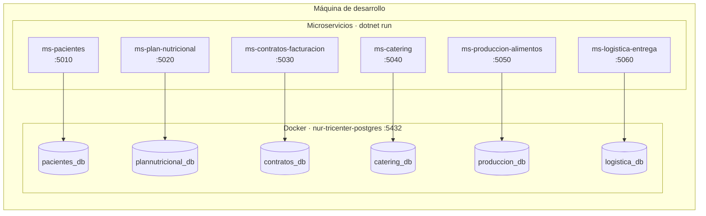

**Organización del código:** multi-repo, un repositorio Git por microservicio dentro de la carpeta de plataforma.

**Bases de datos:** un único contenedor PostgreSQL 16 —definido en `plataforma-local/docker-compose.yml` bajo el nombre `nur-tricenter-postgres`— con seis bases creadas por script de inicialización. **No se instala PostgreSQL en la máquina de desarrollo: la única infraestructura contenerizada del proyecto es la base de datos.** Los microservicios corren con `dotnet run` y apuntan a `localhost:5432`. La autonomía lógica se preserva porque cada microservicio solo conoce su propia cadena de conexión y jamás consulta una tabla ajena. En un entorno productivo serían instancias separadas.

| Microservicio | Base de datos | Puerto |
|---|---|---|
| `ms-pacientes` | `pacientes_db` | 5010 |
| `ms-plan-nutricional` | `plannutricional_db` | 5020 |
| `ms-contratos-facturacion` | `contratos_db` | 5030 |
| `ms-catering` | `catering_db` | 5040 |
| `ms-produccion-alimentos` | `produccion_db` | 5050 |
| `ms-logistica-entrega` | `logistica_db` | 5060 |
| PostgreSQL | — | 5432 |

La cadena de conexión sigue el patrón `Host=localhost;Port=5432;Database=<base>;Username=postgres;Password=postgres`.

Comandos equivalentes en los seis repositorios:

```bash
docker compose up -d                           # desde plataforma-local/
dotnet build <Solucion>.sln
dotnet test                                    # antes de cerrar cualquier fase con lógica
dotnet test --filter Capa=Unit                 # solo unit (§13.1–13.3)
dotnet test --filter Capa=Integracion          # integración (§13.4) — requiere Docker en marcha
dotnet test --filter Capa=Contrato             # Pact (§13.5)
powershell -File scripts/test-cobertura.ps1    # unit + reporte en docs/testing/coverage/ (§13.6)
dotnet run --project src/<Nombre>.WebApi       # Swagger en /swagger
dotnet ef migrations add <Nombre> --project src/<Nombre>.Infrastructure --startup-project src/<Nombre>.WebApi
```

---

## 15. Convenciones de repositorio y documentación

Cada repositorio de microservicio contiene:

| Archivo | Contenido |
|---|---|
| `CLAUDE.md` | Guía de trabajo del repositorio: stack, estructura, convenciones y comandos |
| `docs/DESIGN.md` | Diseño táctico completo del microservicio |
| `docs/SISTEMA.md` | Copia literal de este documento. No se edita localmente: si algo debe cambiar, se cambia aquí y se propaga a los seis |
| `README.md` | Descripción, funcionalidades, diagrama de clases del dominio y puesta en marcha |
| `demo/demo.http` | Flujo de demostración de punta a punta, incluidos los casos negativos |
| `tests/` | Un proyecto por nivel de §13: unit (los existentes), `<Nombre>.IntegrationTests` y `<Nombre>.ContractTests` |
| `pacts/` | Pacts de §13.5: los que este repositorio escribe como consumidor y los que recibe para verificar como proveedor |
| `docs/testing/` | Mapas de pruebas por nivel (`MAPA-*.md`), reporte de cobertura y evidencias del andamiaje de IA (§13.7) |
| `scripts/` | `test-cobertura.ps1` y `publicar-pacts.ps1` |

**Numeración de invariantes.** Cada microservicio numera sus invariantes con su propio prefijo: `P` (pacientes), `N` (plan nutricional), `C` (contratos), `K` (catering), `O` (producción), `I` (logística). Los códigos no se reutilizan ni se renumeran.

**Trazabilidad.** Toda invariante que implemente una regla de negocio cita su código `RN-xx` en el `DESIGN.md`, en el comentario del código y en el nombre o la aserción del test correspondiente.

**Decisiones de diseño.** Cada `DESIGN.md` cierra con una sección de decisiones tácticas que registra, para cada una, la alternativa descartada y el motivo. Una decisión sin alternativa descartada no es una decisión: es una descripción.

**Lenguaje ubicuo.** El dominio se escribe **en español**, con los nombres exactos de §6 y del `DESIGN.md` local: clases, métodos, eventos y códigos de error. No se traducen ni se abrevian.

**Commits.** En español, siguiendo Conventional Commits (`feat:`, `fix:`, `test:`, `docs:`, `refactor:`, `chore:`), describiendo qué cambia en términos de dominio.

**Sincronización de la documentación.** Toda decisión tomada durante la construcción que se desvíe o refine lo diseñado se refleja en el documento correspondiente **en la misma sesión**, no solo en el código. Si la decisión afecta a un solo microservicio, va a su `DESIGN.md`; si afecta a más de uno o a un contrato de integración, va a este documento y se propaga a los seis.

**Contratos congelados.** Los payloads de §9 no se modifican de forma unilateral desde un microservicio. Un cambio de contrato se decide aquí y se propaga a publicador y consumidores a la vez.

### 15.1 Orden de construcción

Los contratos de §9 están congelados, así que un microservicio puede construirse sin que existan sus vecinos: consume y publica contra el payload, no contra el otro servicio. Aun así el orden recomendado sigue el recorrido funcional de §5, porque cada microservicio hereda vocabulario y datos de demo del anterior:

`ms-pacientes` → `ms-plan-nutricional` → `ms-contratos-facturacion` → `ms-catering` → `ms-produccion-alimentos` → `ms-logistica-entrega`

Dentro de cada repositorio la construcción avanza en fases, y **ninguna fase empieza antes de que la anterior compile y sus tests pasen**:

| Fase | Contenido | Cierre |
|---|---|---|
| 1 | Solución, proyectos, referencias, paquetes | `dotnet build` |
| 2 | `Domain`: IDs tipados, Value Objects, agregados, invariantes, eventos de dominio, errores | `dotnet test` con un test por invariante |
| 3 | `Application`: commands, queries, handlers, policies, traductores a eventos de integración | `dotnet test` con los casos de §13.2 |
| 4 | `Infrastructure`: `DbContext`, configuraciones EF Core, repositorios, `UnitOfWork`, migración inicial, publicador de eventos | `dotnet ef migrations add` sin errores |
| 5 | `WebApi`: controllers, composition root, Swagger, middleware de excepciones | La API levanta y responde |
| 6 | `demo/demo.http` y `README.md` | El flujo completo corre de punta a punta contra PostgreSQL real |
| 7 | Unit tests regenerados con `/unit-tests` (§13.1–13.3, §13.7) | `scripts/test-cobertura.ps1` ≥ 80 % de líneas en Domain + Application |
| 8 | Tests de integración por flujo con `/integration-tests` (§13.4) | Los flujos del §15.4 del `DESIGN.md` en verde contra Testcontainers, con su camino incorrecto |
| 9 | Contract tests con `/contract-tests` (§13.5) | Pacts de consumidor generados y verificados por el proveedor |

El `DESIGN.md` del microservicio se escribe **antes** de la fase 2 y se actualiza al cerrar cada fase con lo que la implementación haya refinado.

### 15.2 Alcance de la entrega

Los seis microservicios viven cada uno en **su propio repositorio Git**, con su historia, su `README.md` renderizado y su `docs/` completo. Ninguno es una carpeta dentro de otro repositorio: la autonomía del microservicio también es autonomía del repositorio.

El `README.md` de cada repositorio es parte de la entrega, no un accesorio. Contiene, como mínimo: la descripción del microservicio —propósito y funcionalidades—, el **diagrama de clases de su propia capa de dominio** en Mermaid, para que GitHub lo renderice, y la puesta en marcha. El diagrama es solo de ese microservicio: no se dibuja el sistema completo.

| | Actividad 3 | Actividad 4 | Módulo 4 · Testing |
|---|---|---|---|
| Alcance | Solo la capa de dominio: agregados y entidades, modelo rico, sin anemia | Microservicio completo con DDD, Arquitectura Limpia y CQRS, exponiendo una API | Capa de testing completa: unit (≥ 80 % de cobertura), integración por flujos y contrato con Pact, más el andamiaje de IA que los genera y verifica |
| Entregable | Repositorio con el código y un `README.md` que incluya el diagrama de clases renderizado en GitHub | Repositorio con el código y un `README.md` con la descripción del microservicio, sus funcionalidades y el diagrama de clases de **su propia** capa de dominio | Repositorio con los tests, `.claude/` (reglas, skills, agentes), el reporte de cobertura en `docs/testing/coverage/` y la sección «Testing» del `README.md` |
| Defensa | — | Demo del funcionamiento más exposición del código demostrando la estructura solicitada | Video individual: qué se entrega, cómo se ejecuta cada nivel y el reporte de cobertura |

---

## 16. Matriz de trazabilidad global

Una sola tabla que recorre el sistema en el sentido en que hay que defenderlo: del enunciado del cliente a la línea de código. Cada fila es una capacidad completa y verificable.

| Capacidad | Enunciado | RN | HU | BC | Evento que la cruza |
|---|---|---|---|---|---|
| Alta y ficha del paciente | «se realiza una consulta inicial del paciente» | RN-02 | HU-01, HU-04, HU-05 | BC1 | `PacienteRegistrado` |
| Consulta inicial con anamnesis y diagnóstico | «se entrevista al paciente para obtener un diagnóstico inicial» | RN-02 | HU-02, HU-03 | BC1 | `ConsultaInicialRealizada` |
| Evaluaciones periódicas y análisis clínicos | «evaluaciones periódicas … análisis clínicos» | RN-04 | HU-07, HU-08 | BC1 | `EvaluacionRegistrada` |
| Evolución del paciente en la app | «les permita consultar el seguimiento de la evolución de sus mediciones» | RN-14 | HU-09, HU-10, HU-11 | BC1 | — |
| Catálogo de recetas reutilizables | «Las recetas pueden estar presentes en diferentes planes» | RN-07 | HU-14 | BC2 | — |
| Plantillas de plan alimentario | «distintos planes alimentarios … compuestos un número determinado de tiempos de comida» | RN-07 | HU-15, HU-17 | BC2 | — |
| Plan asignado de 15 o 30 días | «plan de alimentación de 15 días» / «duración de 15 o 30 días» | RN-01 | HU-13, HU-16, HU-18 | BC2 | `PlanAlimenticioAsignado` |
| Contratación con factura en el acto | «Cada servicio tiene un costo definido el cual es facturado al momento de la contratación» | RN-05, RN-18, RN-25, RN-26 | HU-19, HU-20, HU-21, HU-23 | BC3 | `ServicioContratado`, `FacturaEmitida` |
| Cobro de controles sin catering | «Los controles se cobran a parte si es que no se contrató servicio de catering» | RN-06 | HU-22, HU-24 | BC3 | `EvaluacionRegistrada` |
| Calendario de entrega por paciente | «A cada paciente se le crea un calendario de entrega en base a los días contratados» | RN-08, RN-24 | HU-25 | BC4 | `ServicioContratado` |
| Dirección variable por día | «puede recibir de lunes a viernes su alimentación en su lugar de trabajo y los fines de semana en su domicilio» | RN-08, RN-15 | HU-26, HU-30 | BC4 | `CalendarioEntregaActualizado` |
| Días de no-entrega | «el paciente puede marcar ciertos días para no recibir su alimentación» | RN-21 | HU-27 | BC4 | `CalendarioEntregaActualizado` |
| Ventana de dos días | «debe hacerse con dos días de anticipación» | RN-09, RN-22 | HU-28 | BC4 | — |
| Consolidado del día para cocina | «la comida se prepara el día antes» | RN-10 | HU-29 | BC4 | `EntregasDelDiaConsolidadas` |
| Orden de producción | «se crea una Orden de Producción que contiene todas las recetas que deben ser preparadas» | RN-11 | HU-31, HU-32, HU-36 | BC5 | `OrdenProduccionGenerada` |
| Preparación, envasado y armado | «cada receta se envasa en la porción correspondiente … armando los paquetes» | RN-11 | HU-33, HU-34 | BC5 | — |
| Etiquetado del paquete | «Estos paquetes están etiquetados los datos del paciente, la dirección de entrega y un número de identificación» | RN-12, RN-17 | HU-35 | BC5 | `PaquetesListosParaEntrega` |
| Asignación de lotes a repartidores | «recibe un conjunto de paquetes para entregar … junto con un listado» | RN-13 | HU-37, HU-39 | BC6 | `PaquetesListosParaEntrega` |
| Ruta optimizada con geolocalización | «agregar la geolocalización a las direcciones y en base a eso, se pueda determinar las rutas» | RN-15 | HU-38 | BC6 | `RutaOptimizadaGenerada` |
| Constancia verificable de entrega | «contar un mecanismo de seguimiento para contar con un respaldo de las entregas» | RN-16 | HU-40, HU-42, HU-44 | BC6 | `EntregaConfirmada` |
| Incidencias y reposición | «se han reportado de que el paciente no recibió su alimentación» | RN-16, RN-21, RN-23 | HU-41 | BC6 → BC4 | `IncidenciaEntregaRegistrada` |
| Notificación al paciente | *(no está en el enunciado)* | — | HU-12, HU-43 | fuera de alcance | `EntregaConfirmada` disponible |
| Cartera del nutricionista | «el nutricionista … realiza una consulta inicial» (el paciente se asigna a quien lo atiende) | RN-04 | HU-06 | BC1 | — |
| Unicidad y vigencia de lo activo | *(derivada: el enunciado no dice qué pasa si se contrata dos veces)* | RN-01b, RN-03, RN-19, RN-20 | HU-13, HU-19, HU-25 | BC2, BC3, BC4 | `ServicioContratado` |
| Capacidad de reparto | *(derivada de «recibe un conjunto de paquetes»: el conjunto es finito y el repartidor no se solapa)* | RN-27 | HU-37, HU-38 | BC6 | — |

---

**Cobertura de esta tabla.** Cubre las 44 historias y las 27 reglas. Las cuatro reglas **derivadas** de unicidad y vigencia (RN-01b, RN-03, RN-19, RN-20) y la de capacidad de reparto (RN-27) no nacen de una frase del enunciado, sino de decisiones que el equipo tuvo que tomar porque el enunciado no las resolvía; llevan fila propia y marca de derivadas, porque son justamente las que un evaluador pregunta. RN-14 y RN-17 se ejercen dentro de las capacidades de etiquetado y de constancia, sin fila propia.

---

*Fin del documento maestro. El diseño interno de cada microservicio continúa en su `DESIGN.md`.*
